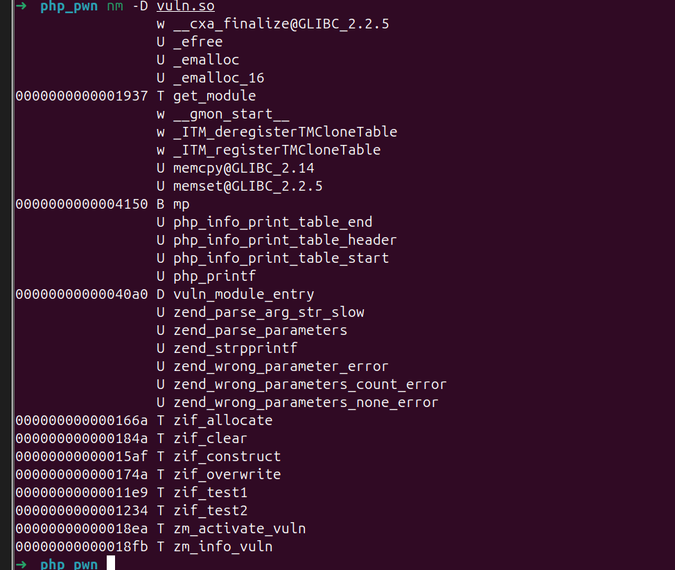
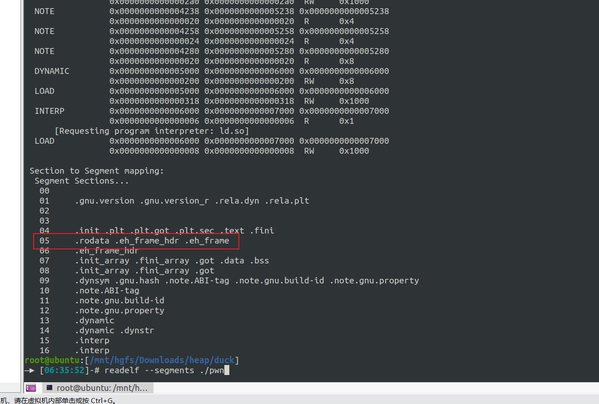

# ELF-Tools

‍

## nm

### 动态符号表

nm 是一个常用的工具，可以列出目标文件中的符号表。对于 .so 文件，我们需要加上 -D 参数来查看动态符号表（即导出和导入的符号）。

输出中，带有 `T`​ 的符号表示导出的函数，`U`​ 表示未定义的（需要从其他库导入的）符号。

```bash
nm -D vuln.so
```



‍

### 导出的符号

如果想只看导出的符号，可以结合 --defined-only：

```bash
nm -D --defined-only vuln.so

0000000000001937 T get_module
0000000000004150 B mp
00000000000040a0 D vuln_module_entry
000000000000166a T zif_allocate
000000000000184a T zif_clear
00000000000015af T zif_construct
000000000000174a T zif_overwrite
00000000000011e9 T zif_test1
0000000000001234 T zif_test2
00000000000018ea T zm_activate_vuln
00000000000018fb T zm_info_vuln
```

‍

- --demangle：如果符号名被混淆（mangled，例如 C++ 函数），可以用这个选项解码。

‍

```bash
nm -D --demangle vuln.so
```

‍

## readelf

‍

### segments

```python
readelf --segments ./elf
```



‍

### 显示符号表

‍

- -s：显示符号表。
- 输出中，GLOBAL 和 FUNC 表示导出的函数，UND 表示未定义的符号。

```bash
readelf -s vuln.so
```

‍

## objdump

### 动态符号表

- -T：显示动态符号表。
- 输出中，DF 表示导出的函数，DO 表示导出的变量。

```bash
objdump -T vuln.so
```

- g 表示全局符号，DF 表示函数。
- 加上 --demangle 解码 C++ 符号：
