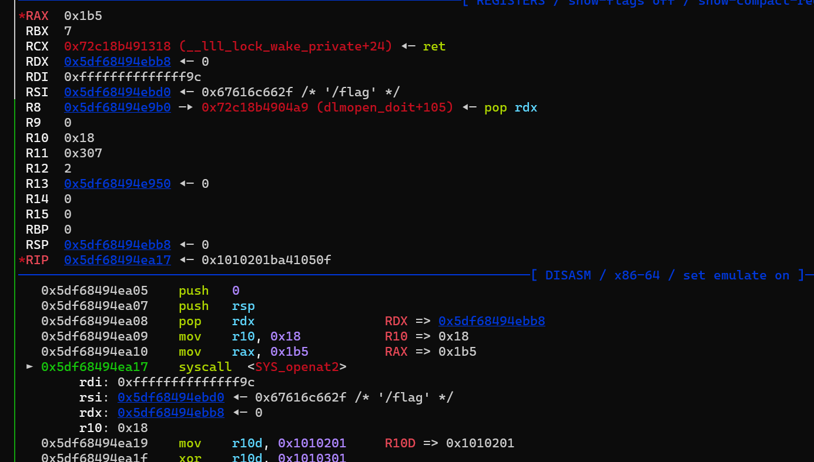

# Linux-SYS_call-Regs-Sc

## 寄存器


## 系统调用号

```python
/usr/include/x86_64-linux-gnu/asm/unistd_64.h
/usr/include/x86_64-linux-gnu/asm/unistd_32.h

/usr/include/asm/unistd_64.h
/usr/include/asm/unistd_32.h
```

‍

## 寄存器传参顺序

‍

前六个整数或指针类型的参数依次通过RDI、RSI、RDX、RCX、R8、R9寄存器传递。

‍

‍

## 系统调用表

‍

```bash
https://gpages.juszkiewicz.com.pl/syscalls-table/syscalls.html
```

‍

‍

## syscall-x64

### read

```python
read(fd,buf,size);
```

- libc 函数调用

```python
rdi = 0    # fd 0 标准输入
rsi = buf  # 写入的地址
rdx = 0x20 # 写入的size
read_addr
```

- 直接syscall调用

```python
rax 0   # 系统调用号
rdi 0   # fd 0 标准输入
rsi buf # 输入存放的地址
rdx 0x20# 写入的size
syscall
```

### write

```python
write(fd,buf,size);
```

- libc 函数调用

```python
rdi = 1    # fd 1 标准输出
rsi = buf  # 输出buf里
rdx = 0x20 # 输出的size
write_addr
```

- 直接syscall调用

```python
rax 1   # 系统调用号
rdi 1   # fd 0 标准输出
rsi buf # 泄露的地址
rdx 0x20# 输出多少个字节
syscall
```

### execve

```c
execve("/bin/sh",0,0);
```

- libc 函数调用

```python
rdi = bin_sh_addr
rsi = 0
rdx = 0
execve_addr
```

- 直接syscall调用

```python
rax 0x3b # execve
rdi 0    # path
rsi 0
rdx 0
syscall
```

### open

```python
mov rax,SYS_OPEN 2
mov rdi, filename
mov rsi, 0
mov rdx, 0664
```

```python
mov rax,2
mov rdi, filename
mov rsi, 0
mov rdx, 0
```

```python
rop = p64(rdi) + p64(flag) + p64(rsi) + p64(0) + p64(open_)
```

### SYS_openat

[Ptrace测试sys_openat系统调用-CSDN博客](https://blog.csdn.net/qq_42045349/article/details/108895124)

```python
#include <fcntl.h>
int open(const char *pathname, int flags);
int open(const char *pathname, int flags, mode_t mode);
int openat(int dirfd, const char *pathname, int flags);
int openat(int dirfd, const char *pathname, int flags, mode_t mode);

```

```python
asm(shellcraft.openat(-1, '/flag'))

asm(shellcraft.openat(-100, '/flag'))
```


```python
mov rax, 0x101  
mov rdi, 0xffffffffffffff9c # -100  
mov rsi, filename  
mov rdx, 0  
syscall
```

‍

### openat2

‍

```python
# #define __NR_openat2 437
long syscall(SYS_openat2, int dirfd, const char *pathname,
                    struct open_how *how, size_t size);

       Note: glibc provides no wrapper for openat2(), necessitating the
       use of syscall(2).
```

‍

```c
#include <fcntl.h>
#include <unistd.h>
#include <sys/types.h>
#include <sys/stat.h>
#include <linux/openat2.h>

int main() {
    int dirfd = AT_FDCWD;  // Current working directory
    struct open_how how = {
        .flags = O_RDONLY, //
        .mode = 0,
        .resolve = RESOLVE_BENEATH,
    };

    int fd = openat2(dirfd, "example.txt", &how, sizeof(how));
    if (fd == -1) {
        perror("openat2 failed");
        return 1;
    }

    // File operations
    close(fd);
    return 0;
}

```



‍

```python
sc1 = '''
add rsp,0x200
'''
sc2 = shellcraft.pushstr('/flag') + '''
push rsp
pop rsi

/* dirfd (AT_FDCWD) */
mov rdi, -100

/* how 结构体的指针 */
push 0
push 0
push 0
push rsp
pop rdx

/* 结构体大小 */
mov r10, 0x18
mov rax, 437
syscall
'''
```

‍

### sendfile

```python
rax,0x28
rdi,out_fd # 1 stdout 标准输出
rsi,in_fd # file 2
rdx,0
syscall


send_file(out_fd, in_fd, offset, count);
```

```python
 ► 0x7ffee1f883a3    syscall  <SYS_sendfile>
        out_fd: 0x1   #rdi
        in_fd: 0x3    #rsi  # sys_open 获取的fd
        offset: 0x0    # ??? rdx
        count: 0x7fffffff
```

```python
asm(shellcraft.sendfile(1,'rax',0,0x50))
```

### 		mprotect

```python
#include <sys/mman.h>
# rdi   rsi    rdx
int mprotect(void *addr, size_t len, int prot);
addr：修改保护属性区域的起始地址，addr必须是一个内存页的起始地址，简而言之为页大小（一般是 4KB == 4096字节）整数倍。
len：被修改保护属性区域的长度,最好为页大小整数倍。修改区域范围[addr, addr+len-1]。
prot：可以取以下几个值，并可以用“|”将几个属性结合起来使用：
1）PROT_READ：内存段可读；
2）PROT_WRITE：内存段可写；
3）PROT_EXEC：内存段可执行；
4）PROT_NONE：内存段不可访问。
返回值：0；成功，-1；失败（并且errno被设置）
1）EACCES：无法设置内存段的保护属性。当通过 mmap(2) 映射一个文件为只读权限时，接着使用 mprotect() 标志为 PROT_WRITE这种情况就会发生。
2）EINVAL：addr不是有效指针，或者不是系统页大小的倍数。
3）ENOMEM：内核内部的结构体无法分配。
这里的参数prot：
			r:4????
			w:2????
			x:1????
prot为7（1+2+4）就是rwx可读可写可执行，与linux文件属性用法类似


-   prot 的取值如下，通过 `|` 可以将几个属性结合使用（值相加）：
    -   PROT_READ：可写，值为 1
    -   PROT_WRITE：可读， 值为 2
    -   PROT_EXEC：可执行，值为 4
    -   PROT_NONE：不允许访问，值为 0


```

- 汇编形式

```python
  0x7f0949453c50 <mprotect>            endbr64 
   0x7f0949453c54 <mprotect+4>          mov    eax, 0xa
 ► 0x7f0949453c59 <mprotect+9>          syscall  <SYS_mprotect>
        addr: 0x7f0949551000 # rdi addr
        len: 0x1000          # rsi length
        prot: 0x7            # rdx per


 0x7f0949453c50 <mprotect>            endbr64 
   0x7f0949453c54 <mprotect+4>          mov    eax, 0xa
 ► 0x7f0949453c59 <mprotect+9>          syscall  <SYS_mprotect>
        addr: 0x7f0949551000 # rdi addr
        len: 0x1000          # rsi length
        prot: 0x7            # rdx per

rax,0xa
rdi,addr
rsi,len
rdx,per
```

‍

‍

### mmap

‍

```c
#include <sys/mman.h>

       void *mmap(void addr[.length], size_t length, int prot, int flags,
                  int fd, off_t offset);
       int munmap(void addr[.length], size_t length);
```

‍

‍

- **MAP_SHARED**

  - **作用**：共享映射，映射内存的修改会写回到文件中，并对其他映射该文件的进程可见。
  - **数值**：`0x01`​（十进制：1）
- **MAP_PRIVATE**

  - **作用**：私有映射，对映射内存的修改不会影响原文件（使用写时复制机制）。
  - **数值**：`0x02`​（十进制：2）
- **MAP_FIXED**

  - **作用**：固定映射，强制映射在指定地址进行，若该地址已有映射，则会覆盖。
  - **数值**：`0x10`​（十进制：16）
- **MAP_ANONYMOUS**（或 **MAP_ANON**）

  - **作用**：匿名映射，不与任何文件关联，此时参数 `fd`​ 被忽略（通常传 -1）。
  - **数值**：`0x20`​（十进制：32）
- **MAP_NORESERVE**

  - **作用**：映射时不预留交换空间，适用于某些内存使用策略。
  - **数值**：`0x4000`​（十进制：16384）
- **MAP_POPULATE**

  - **作用**：在创建映射时立即预先加载页面，减少缺页中断（仅对 MAP_SHARED 映射有效）。
  - **数值**：`0x8000`​（十进制：32768）
- **MAP_HUGETLB**

  - **作用**：使用大页内存进行映射（需要系统支持大页）。
  - **数值**：`0x40000`​（十进制：262144）

‍

‍

‍

- mmap 映射文件

```python
shellcraft.mmap(0,0x50,7,2,3,0) # flags = 2,fd = 3
```

‍

- 自定义生成一段地址

```c
mmap(0x123000, 0x2000, 3, 33, -1, 0LL);
```

‍

```c
#include <sys/mman.h>  // 包含 mmap 函数原型
#include <stdio.h>     // 包含 perror 函数原型
#include <stdlib.h>    // 包含 exit 函数原型
#include <unistd.h>    // 包含 sysconf 函数原型

int main() {
    size_t size = 0x2000;  // 需要映射的内存大小
    void *addr = mmap(NULL, size, PROT_READ | PROT_WRITE, MAP_PRIVATE | MAP_ANONYMOUS, -1, 0);

    if (addr == MAP_FAILED) {
        perror("mmap");
        exit(EXIT_FAILURE);
    }

    printf("Allocated memory at: %p\n", addr);

    // 使用内存区域 ...

    // 映射的内存不需要时，应该使用 munmap 释放
    if (munmap(addr, size) == -1) {
        perror("munmap");
        exit(EXIT_FAILURE);
    }

    printf("Memory released\n");

    return 0;
}
```

这段代码执行了以下步骤：

1. 包含了必要的头文件。
2. 定义了要分配的内存大小 `size`​。
3. 调用 `mmap`​ 来分配内存：

    - 第一个参数 `NULL`​ 表示让系统选择映射区域的地址。
    - 第二个参数是大小，设置为 `0x2000`​。
    - 第三个参数 `PROT_READ | PROT_WRITE`​ 表示映射的内存区域需要可读可写。
    - 第四个参数 `MAP_PRIVATE | MAP_ANONYMOUS`​ 表示创建一个私有的匿名内存映射，这意味着这块内存不与任何文件关联。
    - 第五个参数 `-1`​ 表示不与特定文件关联。
    - 第六个参数 `0`​ 表示文件偏移量，因为这是一个匿名映射，所以这个值通常设置为0。
4. 检查 `mmap`​ 是否成功。如果失败，`mmap`​ 会返回 `MAP_FAILED`​，此时会打印错误并退出程序。
5. 使用分配的内存区域。
6. 使用 `munmap`​ 来释放之前分配的内存区域。

‍

‍

- flags

在 Linux 系统中，`mmap`​ 函数的 `flags`​ 参数的标志位及其对应的数字（宏定义值）如下：

- **MAP_SHARED**: 通常定义为 0x0001。允许映射区域可共享，写入时会反映到文件或共享映射区域。
- **MAP_PRIVATE**: 通常定义为 0x0002。建立一个写时复制的私有映射。
- **MAP_ANONYMOUS**: 通常定义为 0x0001000。创建匿名映射，不与文件关联。
- **MAP_FIXED**: 通常定义为 0x00010。固定映射区域的地址。
- **MAP_STACK**: 可用性取决于系统，某些系统可能没有定义此标志。
- **MAP_NORESERVE**: 通常定义为 0x0000400。不保留交换空间。
- **MAP_GROWSDOWN**: 可用性取决于系统，某些系统可能没有定义此标志。
- **MAP_DENYWRITE**: 可用性取决于系统，某些系统可能没有定义此标志。
- **MAP_EXECUTABLE**: 可用性取决于系统，某些系统可能没有定义此标志。
- **MAP_LOCKED**: 通常定义为 0x00080。锁定映射区域在内存中。
- **MAP_POPULATE**: 通常定义为 0x01000。为映射区域分配页面表条目。
- **MAP_NONBLOCK**: 通常定义为 0x000200。映射时不阻塞。
- **MAP_FILE**: 这个宏定义通常不单独使用，它是用于与文件相关的映射，与匿名映射相对。

请注意，这些值可能因不同的系统和编译环境而有所不同。在使用 `mmap`​ 时，应该包括 `<sys/mman.h>`​ 头文件，该文件定义了这些宏。

‍

‍

‍

### mmap2

- `mmap2 - 将文件或设备映射到内存中`​

‍

‍

‍

### lseek

‍

```bash
#include <unistd.h>
#include <sys/types.h>

off_t lseek(int fd, off_t offset, int whence);
```

‍

### `lseek`​ 的 `whence`​ 参数

​`lseek`​ 的第三个参数 `whence`​ 决定了文件指针移动的参考点。它可以是以下三个值之一：

1. ​**​`SEEK_SET`​**​（值为 `0`​）：

    - 文件指针的移动是相对于文件的**开头**。
    - 例如：`lseek(fd, 100, SEEK_SET)`​ 将文件指针移动到距离文件开头 100 字节的位置。
2. ​**​`SEEK_CUR`​**​（值为 `1`​）：

    - 文件指针的移动是相对于**当前位置**。
    - 例如：`lseek(fd, 50, SEEK_CUR)`​ 将文件指针从当前位置向前移动 50 字节。
3. ​**​`SEEK_END`​**​（值为 `2`​）：

    - 文件指针的移动是相对于文件的**末尾**。
    - 例如：`lseek(fd, -20, SEEK_END)`​ 将文件指针移动到距离文件末尾 20 字节的位置。

‍

‍

## syscall-x86

### execve

```python
eax 11          # execve
ebx bin_sh_addr # path
ecx 0
edx 0
int 80

eax 11
ebx text# .bss bin_sh_addr
ecx 0
edx 0
```

- 详情

```python
*EAX  0xb
 EBX  0xfff44780 ◂— '/bin///sh'
 ECX  0xfff44774 —▸ 0xfff4477c ◂— 0x6873 /* 'sh' */
 EDX  0x0
 EDI  0x0
 ESI  0x0
 EBP  0x0
*ESP  0xfff44774 —▸ 0xfff4477c ◂— 0x6873 /* 'sh' */
*EIP  0x80ea02a ◂— int    0x80 /* 0x100a80cd */
───────────────[ DISASM ]──────────────────────────────────────────────────
   0x80ea022    push   ecx
   0x80ea023    mov    ecx, esp
   0x80ea025    xor    edx, edx
   0x80ea027    push   0xb
   0x80ea029    pop    eax
 ► 0x80ea02a    int    0x80 <SYS_execve>
        path: 0xfff44780 ◂— '/bin///sh'                     # EBX
        argv: 0xfff44774 —▸ 0xfff4477c ◂— 0x6873 /* 'sh' */ # ECX
        envp: 0x0
   0x80ea02c    or     dl, byte ptr [eax]
   0x80ea02e    add    dword ptr [ebx + eax*2], 0xe
   0x80ea032    and    byte ptr [ecx + 0xe], ah
   0x80ea035    sub    al, 0x4a
   0x80ea037    push   cs
──────────────────[ STACK ]───────────────────────────────────────────────────
00:0000│ ecx esp 0xfff44774 —▸ 0xfff4477c ◂— 0x6873 /* 'sh' */
01:0004│         0xfff44778 ◂— 0x0
02:0008│         0xfff4477c ◂— 0x6873 /* 'sh' */
03:000c│ ebx     0xfff44780 ◂— '/bin///sh'
04:0010│         0xfff44784 ◂— '///sh'
05:0014│         0xfff44788 ◂— 0x68 /* 'h' */
06:0018│         0xfff4478c ◂— 0x0
07:001c│         0xfff44790 ◂— 0x0
```

### read

```python
# 汇编形式
eax 3 # read
ebx 0 # 0
ecx addr # .bss write text
edx 8 #length
int 0x80

# 直接调用call形式
```

### write

```python
# 

write@.plt + return + 1 + write@.got + length


   0x80487ad    push   8            # length
   0x80487af    push   0x804892e    # text
   0x80487b4    push   1            # stdout
 ► 0x80487b6    call   write@plt 

00:0000│ esp 0xffa46aa0 ◂— 0x1
01:0004│     0xffa46aa4 —▸ 0x804892e ◂— inc    ebx /* 'Correct\n' */
02:0008│     0xffa46aa8 ◂— 0x8  // length
```

```python
eax, 4 # sys_write
ebx, 1 # 1 表示 stdout标准输出
ecx, text
edx, len
int 0x80
```

### system

plt

```python
ret


system
ret
argv[0] # /bin/sh
....

打远程可以尝试 sh\x00

system@plt
p32(0xbeefbeef) + p32(system) + p32(exit) + p32(sh_addr)
```

### open

```python
mov eax,5
mov esi,1 # 1 read 2 write
mov edi,#filename
mov edx,

```

‍

‍

## ALL

‍

### fstat

‍

​`fstat`​ 是一个系统调用，用于获取一个已打开文件的状态信息。在 Linux 或 Unix 系统中，`fstat`​ 可以用来获取关于文件描述符（已打开的文件）的信息，比如文件的大小、权限、文件类型等。

#### 原型：

```c
int fstat(int fd, struct stat *statbuf);
```

- ​`fd`​：一个文件描述符，通常是通过 `open`​、`socket`​ 或其他类似系统调用获得的。
- ​`statbuf`​：一个指向 `struct stat`​ 类型的指针，系统调用会将文件的状态信息填充到这个结构体中。

#### `struct stat`​ 结构体：

```c
struct stat {
    dev_t     st_dev;     /* 文件的设备编号 */
    ino_t     st_ino;     /* 文件的inode编号 */
    mode_t    st_mode;    /* 文件的访问权限和类型 */
    nlink_t   st_nlink;   /* 文件的硬链接数量 */
    uid_t     st_uid;     /* 文件所有者的用户ID */
    gid_t     st_gid;     /* 文件所有者的组ID */
    dev_t     st_rdev;    /* 设备文件的设备编号 */
    off_t     st_size;    /* 文件的大小（字节） */
    time_t    st_atime;   /* 上次访问时间 */
    time_t    st_mtime;   /* 上次修改时间 */
    time_t    st_ctime;   /* 上次状态更改时间 */
    blksize_t st_blksize; /* 文件的块大小 */
    blkcnt_t  st_blocks;  /* 文件所占的块数 */
};
```

#### 常见用途：

1. **获取文件信息**：`fstat`​ 返回的 `struct stat`​ 可以用来检查文件的大小、类型（例如，普通文件、目录、符号链接等）和权限等。
2. **判断文件是否存在或是否为目录**：通过检查 `st_mode`​ 字段，您可以判断文件是否为目录（`S_IFDIR`​）或符号链接（`S_IFLNK`​）等。
3. **性能优化**：在需要对已打开文件进行多次操作时，使用 `fstat`​ 可以避免每次都使用 `stat`​ 系统调用，从而提高效率，因为 `fstat`​ 不需要再次查找文件的路径。

#### 示例：

```c
#include <stdio.h>
#include <sys/stat.h>
#include <fcntl.h>
#include <unistd.h>

int main() {
    int fd = open("example.txt", O_RDONLY);
    if (fd == -1) {
        perror("open");
        return 1;
    }

    struct stat statbuf;
    if (fstat(fd, &statbuf) == -1) {
        perror("fstat");
        close(fd);
        return 1;
    }

    printf("File size: %ld bytes\n", statbuf.st_size);
    printf("File permissions: %o\n", statbuf.st_mode & 0777); // 打印文件权限

    close(fd);
    return 0;
}
```

#### 返回值：

- 成功时，`fstat`​ 返回 0。
- 失败时，返回 -1，错误原因可以通过 `errno`​ 变量查询。

通过 `fstat`​，你可以轻松获取文件的详细信息，并且它是基于文件描述符的，因此在已打开的文件上工作时比 `stat`​ 系统调用更加高效。

‍

‍

### dup2
