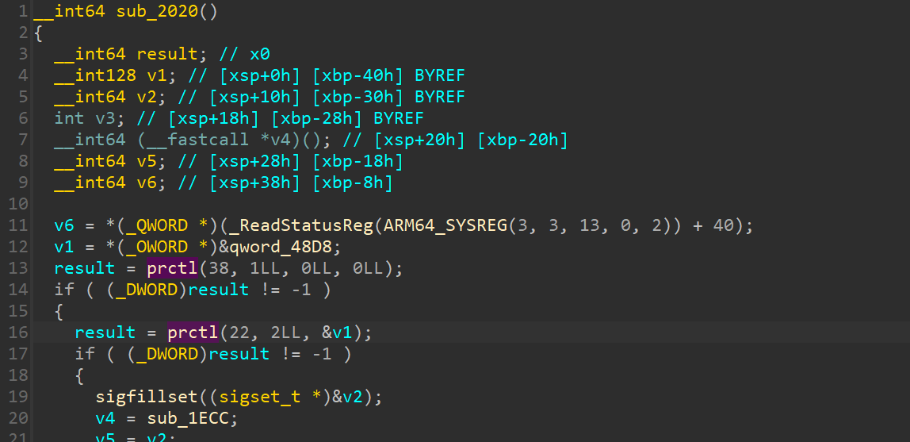
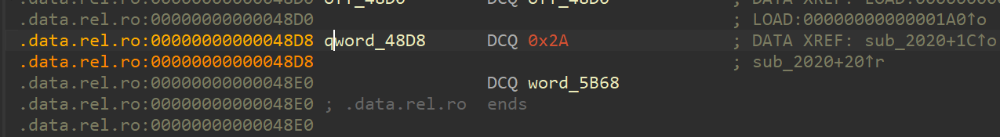
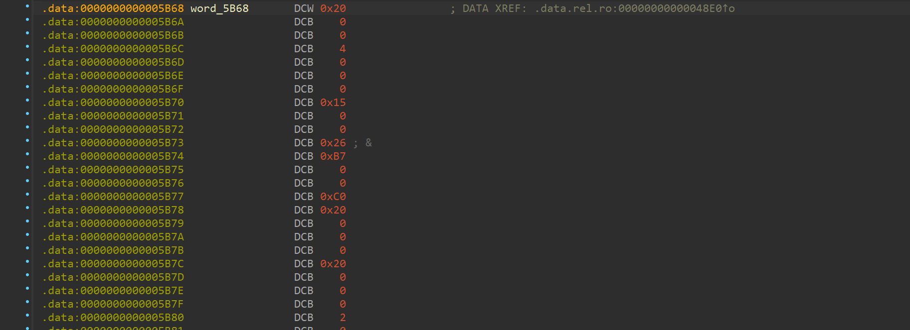
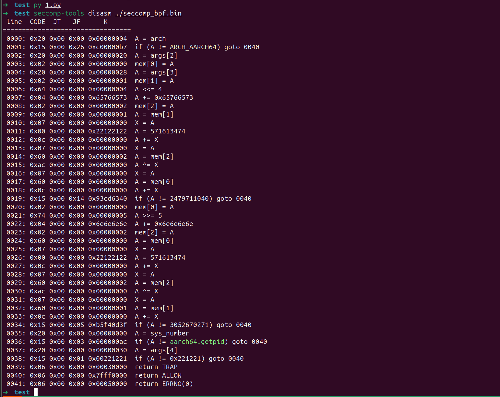
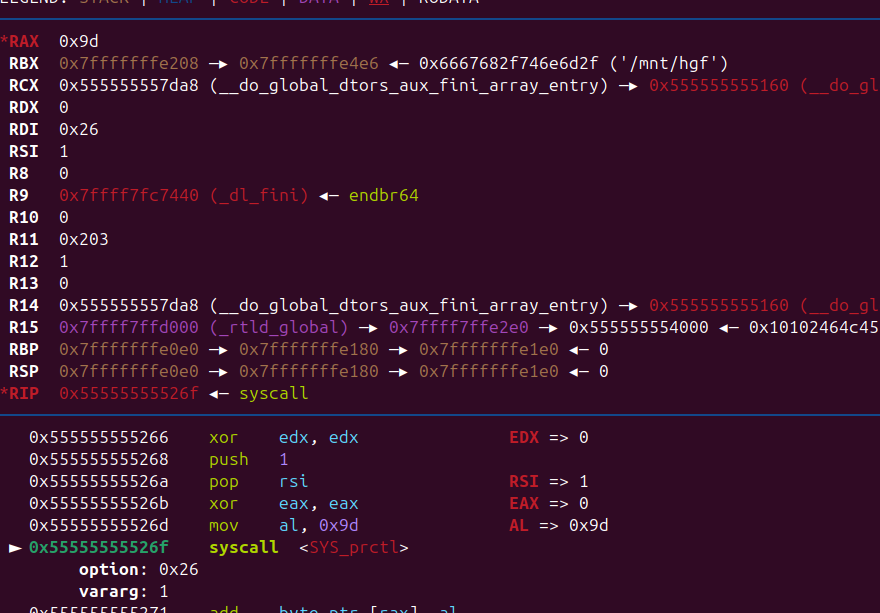

# Linux-沙箱-sandbox

‍

‍

## 限制 SYS 参数

‍

‍

‍

```c
seccomp_rule_add(ctx, SCMP_ACT_ALLOW, SCMP_SYS(open), 1, SCMP_A0(SCMP_CMP_LT, 10));

```

‍

‍

```bash
SCMP_CMP_EQ：等于（equal）
SCMP_CMP_NE：不等于（not equal）
SCMP_CMP_LT：小于（less than）
SCMP_CMP_LE：小于或等于（less than or equal）
SCMP_CMP_GE：大于或等于（greater than or equal）
SCMP_CMP_MASKED_EQ：在给定掩码下等于（equal with mask）
```

‍

## 默认禁止

```bash
void sandbox(){
    scmp_filter_ctx ctx;// Init the filter
    ctx = seccomp_init(SCMP_ACT_KILL); // 默认禁止
    seccomp_rule_add(ctx, SCMP_ACT_ALLOW, SCMP_SYS(read), 0); // 设置允许
    seccomp_rule_add(ctx, SCMP_ACT_ALLOW, SCMP_SYS(write), 0);
    seccomp_rule_add(ctx, SCMP_ACT_ALLOW, SCMP_SYS(open), 0);
    seccomp_load(ctx);
}
```

‍

‍

## 默认允许

‍

```c
#include <linux/seccomp.h>
#include <sys/mman.h>
#include <seccomp.h>
#include<stdlib.h>
#include<stdint.h>
#include<stdio.h>


int sandbox(){
    // exec
    scmp_filter_ctx ctx; ctx = seccomp_init(SCMP_ACT_ALLOW); // 默认允许
    seccomp_rule_add(ctx, SCMP_ACT_KILL, SCMP_SYS(execve), 0); // 设置禁止
    seccomp_rule_add(ctx, SCMP_ACT_KILL, SCMP_SYS(execveat), 0);
    seccomp_rule_add(ctx, SCMP_ACT_KILL, SCMP_SYS(mmap), 0);
    seccomp_rule_add(ctx, SCMP_ACT_KILL, SCMP_SYS(mprotect), 0);
    seccomp_rule_add(ctx, SCMP_ACT_KILL, SCMP_SYS(pkey_mprotect), 0);
    seccomp_rule_add(ctx, SCMP_ACT_KILL, SCMP_SYS(seccomp), 0);
  
    // read
    seccomp_rule_add(ctx, SCMP_ACT_KILL, SCMP_SYS(readv), 0);
    seccomp_rule_add(ctx, SCMP_ACT_KILL, SCMP_SYS(pread64), 0);
    seccomp_rule_add(ctx, SCMP_ACT_KILL, SCMP_SYS(readlink), 0);
    seccomp_rule_add(ctx, SCMP_ACT_KILL, SCMP_SYS(preadv), 0);
    seccomp_rule_add(ctx, SCMP_ACT_KILL, SCMP_SYS(preadv2), 0);

    // send
    seccomp_rule_add(ctx, SCMP_ACT_KILL, SCMP_SYS(sendfile), 0);
    seccomp_rule_add(ctx, SCMP_ACT_KILL, SCMP_SYS(sendto), 0);
    seccomp_rule_add(ctx, SCMP_ACT_KILL, SCMP_SYS(sendmsg), 0);
    seccomp_rule_add(ctx, SCMP_ACT_KILL, SCMP_SYS(sendmmsg), 0);

    // write
    seccomp_rule_add(ctx, SCMP_ACT_KILL, SCMP_SYS(pwrite64), 0);
    seccomp_rule_add(ctx, SCMP_ACT_KILL, SCMP_SYS(pwrite64), 0);
    seccomp_rule_add(ctx, SCMP_ACT_KILL, SCMP_SYS(writev), 0);
    seccomp_rule_add(ctx, SCMP_ACT_KILL, SCMP_SYS(pwritev), 0);
    seccomp_rule_add(ctx, SCMP_ACT_KILL, SCMP_SYS(pwritev2), 0);


    // open
    seccomp_rule_add(ctx, SCMP_ACT_KILL, SCMP_SYS(openat), 0);
    seccomp_rule_add(ctx, SCMP_ACT_KILL, SCMP_SYS(mq_open), 0);
    seccomp_rule_add(ctx, SCMP_ACT_KILL, SCMP_SYS(fsopen), 0);
    seccomp_rule_add(ctx, SCMP_ACT_KILL, SCMP_SYS(openat2), 0);
    seccomp_rule_add(ctx, SCMP_ACT_KILL, SCMP_SYS(open_tree), 0);

    //dup
    seccomp_rule_add(ctx, SCMP_ACT_KILL, SCMP_SYS(dup), 0);
    seccomp_rule_add(ctx, SCMP_ACT_KILL, SCMP_SYS(dup3), 0);
    seccomp_rule_add(ctx, SCMP_ACT_KILL, 436, 0);

	// 参数
    seccomp_rule_add(ctx, SCMP_ACT_KILL, SCMP_SYS(read)  , 2, SCMP_A0(SCMP_CMP_NE, 0), SCMP_A2(SCMP_CMP_NE, 9));
    seccomp_rule_add(ctx, SCMP_ACT_KILL, SCMP_SYS(write) , 1, SCMP_A0(SCMP_CMP_NE, 1));
    // seccomp_rule_add(ctx, SCMP_ACT_KILL, SCMP_SYS(dup2) ,  1, SCMP_A0(SCMP_CMP_EQ, 0));
    seccomp_load(ctx);
    seccomp_release(ctx);
}
```

‍

‍

## 提取规则直接查看

- 可以看到他这里是使用的 prctl



‍

‍

```python
x = [
0x20, 0x00, 0x00, 0x00, 0x04, 0x00, 0x00, 0x00, 0x15, 0x00, 
0x00, 0x26, 0xB7, 0x00, 0x00, 0xC0, 0x20, 0x00, 0x00, 0x00, 
0x20, 0x00, 0x00, 0x00, 0x02, 0x00, 0x00, 0x00, 0x00, 0x00, 
0x00, 0x00, 0x20, 0x00, 0x00, 0x00, 0x28, 0x00, 0x00, 0x00, 
0x02, 0x00, 0x00, 0x00, 0x01, 0x00, 0x00, 0x00, 0x64, 0x00, 
0x00, 0x00, 0x04, 0x00, 0x00, 0x00, 0x04, 0x00, 0x00, 0x00, 
0x73, 0x65, 0x76, 0x65, 0x02, 0x00, 0x00, 0x00, 0x02, 0x00, 
0x00, 0x00, 0x60, 0x00, 0x00, 0x00, 0x01, 0x00, 0x00, 0x00, 
0x07, 0x00, 0x00, 0x00, 0x00, 0x00, 0x00, 0x00, 0x00, 0x00, 
0x00, 0x00, 0x22, 0x21, 0x12, 0x22, 0x0C, 0x00, 0x00, 0x00, 
0x00, 0x00, 0x00, 0x00, 0x07, 0x00, 0x00, 0x00, 0x00, 0x00, 
0x00, 0x00, 0x60, 0x00, 0x00, 0x00, 0x02, 0x00, 0x00, 0x00, 
0xAC, 0x00, 0x00, 0x00, 0x00, 0x00, 0x00, 0x00, 0x07, 0x00, 
0x00, 0x00, 0x00, 0x00, 0x00, 0x00, 0x60, 0x00, 0x00, 0x00, 
0x00, 0x00, 0x00, 0x00, 0x0C, 0x00, 0x00, 0x00, 0x00, 0x00, 
0x00, 0x00, 0x15, 0x00, 0x00, 0x14, 0x40, 0x63, 0xCD, 0x93, 
0x02, 0x00, 0x00, 0x00, 0x00, 0x00, 0x00, 0x00, 0x74, 0x00, 
0x00, 0x00, 0x05, 0x00, 0x00, 0x00, 0x04, 0x00, 0x00, 0x00, 
0x6E, 0x6E, 0x6E, 0x6E, 0x02, 0x00, 0x00, 0x00, 0x02, 0x00, 
0x00, 0x00, 0x60, 0x00, 0x00, 0x00, 0x00, 0x00, 0x00, 0x00, 
0x07, 0x00, 0x00, 0x00, 0x00, 0x00, 0x00, 0x00, 0x00, 0x00, 
0x00, 0x00, 0x22, 0x21, 0x12, 0x22, 0x0C, 0x00, 0x00, 0x00, 
0x00, 0x00, 0x00, 0x00, 0x07, 0x00, 0x00, 0x00, 0x00, 0x00, 
0x00, 0x00, 0x60, 0x00, 0x00, 0x00, 0x02, 0x00, 0x00, 0x00, 
0xAC, 0x00, 0x00, 0x00, 0x00, 0x00, 0x00, 0x00, 0x07, 0x00, 
0x00, 0x00, 0x00, 0x00, 0x00, 0x00, 0x60, 0x00, 0x00, 0x00, 
0x01, 0x00, 0x00, 0x00, 0x0C, 0x00, 0x00, 0x00, 0x00, 0x00, 
0x00, 0x00, 0x15, 0x00, 0x00, 0x05, 0x3F, 0x0D, 0xF4, 0xB5, 
0x20, 0x00, 0x00, 0x00, 0x00, 0x00, 0x00, 0x00, 0x15, 0x00, 
0x00, 0x03, 0xAC, 0x00, 0x00, 0x00, 0x20, 0x00, 0x00, 0x00, 
0x30, 0x00, 0x00, 0x00, 0x15, 0x00, 0x00, 0x01, 0x21, 0x12, 
0x22, 0x00, 0x06, 0x00, 0x00, 0x00, 0x00, 0x00, 0x03, 0x00, 
0x06, 0x00, 0x00, 0x00, 0x00, 0x00, 0xFF, 0x7F, 0x06, 0x00, 
0x00, 0x00, 0x00, 0x00, 0x05, 0x00
]

open('seccomp_bpf.bin','wb').write(bytes(x))


# seccomp-tools disasm ./seccomp_bpf.bin
```



‍

‍

- 失败（带复现）

```c
prctl(22, 2, seccomp_bpf_data);
prctl(PR_SET_SECCOMP, SECCOMP_MODE_FILTER, seccomp_bpf_data);

```

‍

## 使用seccomp-tools

‍

### 规则编写1

```x86asm
A = sys_number
A >= 0x40000000 ? dead : next
A == execve 	? dead : next
A == open 		? dead : next
A == openat 	? dead : next
return ALLOW
dead:
return KILL
```

‍

```asm
# check if arch is X86_64
A = arch
A == ARCH_X86_64 ? next : dead
A = sys_number
A >= 0x40000000 ? dead : next
A == write ? ok : next
A == close ? ok : next
A == dup ? ok : next
A == exit ? ok : next
return ERRNO(5)
ok:
return ALLOW
dead:
return KILL
```

### 规则编写2

```asm
```

‍

- 返回动作

```asm
return ALLOW
return KILL
return ERRNO
return TRAP


return ALLOW
dead:
return KILL
trap:
return TRAP
errno(n):
return ERRNO(n)
```

‍

### 生成 asm

```python
#➜  sandbox cat execv.asm
A = sys_number
A >= 0x40000000 ? dead : next
A == execve 	? dead : next
A == open 		? dead : next
A == openat 	? dead : next
return ALLOW
dead:
return KILL
#➜  sandbox seccomp-tools asm execv.asm  -a amd64
" \x00\x00\x00\x00\x00\x00\x005\x00\x04\x00\x00\x00\x00@\x15\x00\x03\x00;\x00\x00\x00\x15\x00\x02\x00\x02\x00\x00\x00\x15\x00\x01\x00\x01\x01\x00\x00\x06\x00\x00\x00\x00\x00\xFF\x7F\x06\x00\x00\x00\x00\x00\x03\x00"
#➜  sandbox seccomp-tools asm execv.asm  -a i386 
" \x00\x00\x00\x00\x00\x00\x005\x00\x04\x00\x00\x00\x00@\x15\x00\x03\x00\v\x00\x00\x00\x15\x00\x02\x00\x05\x00\x00\x00\x15\x00\x01\x00'\x01\x00\x00\x06\x00\x00\x00\x00\x00\xFF\x7F\x06\x00\x00\x00\x00\x00\x03\x00"

```

‍

### 应用

‍

```c
#include <linux/seccomp.h>
#include <stdio.h>
#include <stdlib.h>
#include <sys/prctl.h>

static void install_seccomp() {
  static unsigned char filter[] = {32,0,0,0,4,0,0,0,21,0,0,8,62,0,0,192,32,0,0,0,0,0,0,0,53,0,6,0,0,0,0,64,21,0,4,0,1,0,0,0,21,0,3,0,3,0,0,0,21,0,2,0,32,0,0,0,21,0,1,0,60,0,0,0,6,0,0,0,5,0,5,0,6,0,0,0,0,0,255,127,6,0,0,0,0,0,0,0};
  struct prog {
    unsigned short len;
    unsigned char *filter;
  } rule = {
    .len = sizeof(filter) >> 3,
    .filter = filter
  };
  if(prctl(PR_SET_NO_NEW_PRIVS, 1, 0, 0, 0) < 0) { perror("prctl(PR_SET_NO_NEW_PRIVS)"); exit(2); }
  if(prctl(PR_SET_SECCOMP, SECCOMP_MODE_FILTER, &rule) < 0) { perror("prctl(PR_SET_SECCOMP)"); exit(2); }
}
```

‍

```python
def inject_code_build(self):
        inject_code = asm(shellcraft.prctl(38, 1, 0, 0, 0))
        for i in self.ct:
            if i > 0x3fffffff:
                a = 'mov rax,' + str(i)
                inject_code += asm(a)
                inject_code += asm('push rax')
            else:
                a = 'push ' + str(i)
                inject_code += asm(a)
        inject_code += asm(shellcraft.push('rsp'))
        inject_code += asm(shellcraft.push(len(self.ct)))
        inject_code += asm('mov r10,rcx')
        inject_code += asm(shellcraft.prctl(0x16, 2, 'rsp'))
        tmp = len(self.ct) * 8 + 0x10
        inject_code += asm('add rsp,' + str(hex(tmp)))
        return inject_code


```

‍



‍

‍

# Seccomp Tools-官方文档

Provide powerful tools for seccomp analysis.

This project targets to (but is not limited to) analyze seccomp sandbox in CTF pwn challenges.  
Some features might be CTF-specific, but also useful for analyzing seccomp of real cases.

## Features

- Dump - Automatically dumps seccomp BPF from execution file(s).
- Disasm - Converts seccomp BPF to a human readable format.

  - With simple decompilation.
  - With syscall names and arguments whenever possible.
  - Colorful!
- Asm - Makes writing seccomp rules similar to writing codes.
- Emu - Emulates seccomp rules.
- Supports multi-architecture.

## Installation

Available on RubyGems.org!

```
$ gem install seccomp-tools
```

If you failed when compiling, try:

```
sudo apt install gcc ruby-dev make
```

and install seccomp-tools again.

## Command Line Interface

### seccomp-tools

```bash
$ seccomp-tools --help
# Usage: seccomp-tools [--version] [--help] <command> [<options>]
#
# List of commands:
#
# 	asm	Seccomp bpf assembler.
# 	disasm	Disassemble seccomp bpf.
# 	dump	Automatically dump seccomp bpf from execution file(s).
# 	emu	Emulate seccomp rules.
#
# See 'seccomp-tools <command> --help' to read about a specific subcommand.

$ seccomp-tools dump --help
# dump - Automatically dump seccomp bpf from execution file(s).
# NOTE : This function is only available on Linux.
#
# Usage: seccomp-tools dump [exec] [options]
#     -c, --sh-exec <command>          Executes the given command (via sh).
#                                      Use this option if want to pass arguments or do pipe things to the execution file.
#                                      e.g. use `-c "./bin > /dev/null"` to dump seccomp without being mixed with stdout.
#     -f, --format FORMAT              Output format. FORMAT can only be one of <disasm|raw|inspect>.
#                                      Default: disasm
#     -l, --limit LIMIT                Limit the number of calling "prctl(PR_SET_SECCOMP)".
#                                      The target process will be killed whenever its calling times reaches LIMIT.
#                                      Default: 1
#     -o, --output FILE                Output result into FILE instead of stdout.
#                                      If multiple seccomp syscalls have been invoked (see --limit),
#                                      results will be written to FILE, FILE_1, FILE_2.. etc.
#                                      For example, "--output out.bpf" and the output files are out.bpf, out_1.bpf, ...
#     -p, --pid PID                    Dump installed seccomp filters of the existing process.
#                                      You must have CAP_SYS_ADMIN (e.g. be root) in order to use this option.

```

### dump

Dumps the seccomp BPF from an execution file.  
This work is done by utilizing the `ptrace`​ syscall.

NOTICE: beware of the execution file will be executed.

```bash
$ file spec/binary/twctf-2016-diary
# spec/binary/twctf-2016-diary: ELF 64-bit LSB executable, x86-64, version 1 (SYSV), dynamically linked, interpreter /lib64/ld-linux-x86-64.so.2, for GNU/Linux 2.6.24, BuildID[sha1]=3648e29153ac0259a0b7c3e25537a5334f50107f, not stripped

$ seccomp-tools dump spec/binary/twctf-2016-diary
#  line  CODE  JT   JF      K
# =================================
#  0000: 0x20 0x00 0x00 0x00000000  A = sys_number
#  0001: 0x15 0x00 0x01 0x00000002  if (A != open) goto 0003
#  0002: 0x06 0x00 0x00 0x00000000  return KILL
#  0003: 0x15 0x00 0x01 0x00000101  if (A != openat) goto 0005
#  0004: 0x06 0x00 0x00 0x00000000  return KILL
#  0005: 0x15 0x00 0x01 0x0000003b  if (A != execve) goto 0007
#  0006: 0x06 0x00 0x00 0x00000000  return KILL
#  0007: 0x15 0x00 0x01 0x00000038  if (A != clone) goto 0009
#  0008: 0x06 0x00 0x00 0x00000000  return KILL
#  0009: 0x15 0x00 0x01 0x00000039  if (A != fork) goto 0011
#  0010: 0x06 0x00 0x00 0x00000000  return KILL
#  0011: 0x15 0x00 0x01 0x0000003a  if (A != vfork) goto 0013
#  0012: 0x06 0x00 0x00 0x00000000  return KILL
#  0013: 0x15 0x00 0x01 0x00000055  if (A != creat) goto 0015
#  0014: 0x06 0x00 0x00 0x00000000  return KILL
#  0015: 0x15 0x00 0x01 0x00000142  if (A != execveat) goto 0017
#  0016: 0x06 0x00 0x00 0x00000000  return KILL
#  0017: 0x06 0x00 0x00 0x7fff0000  return ALLOW

$ seccomp-tools dump spec/binary/twctf-2016-diary -f inspect
# "\x20\x00\x00\x00\x00\x00\x00\x00\x15\x00\x00\x01\x02\x00\x00\x00\x06\x00\x00\x00\x00\x00\x00\x00\x15\x00\x00\x01\x01\x01\x00\x00\x06\x00\x00\x00\x00\x00\x00\x00\x15\x00\x00\x01\x3B\x00\x00\x00\x06\x00\x00\x00\x00\x00\x00\x00\x15\x00\x00\x01\x38\x00\x00\x00\x06\x00\x00\x00\x00\x00\x00\x00\x15\x00\x00\x01\x39\x00\x00\x00\x06\x00\x00\x00\x00\x00\x00\x00\x15\x00\x00\x01\x3A\x00\x00\x00\x06\x00\x00\x00\x00\x00\x00\x00\x15\x00\x00\x01\x55\x00\x00\x00\x06\x00\x00\x00\x00\x00\x00\x00\x15\x00\x00\x01\x42\x01\x00\x00\x06\x00\x00\x00\x00\x00\x00\x00\x06\x00\x00\x00\x00\x00\xFF\x7F"

$ seccomp-tools dump spec/binary/twctf-2016-diary -f raw | xxd
# 00000000: 2000 0000 0000 0000 1500 0001 0200 0000   ...............
# 00000010: 0600 0000 0000 0000 1500 0001 0101 0000  ................
# 00000020: 0600 0000 0000 0000 1500 0001 3b00 0000  ............;...
# 00000030: 0600 0000 0000 0000 1500 0001 3800 0000  ............8...
# 00000040: 0600 0000 0000 0000 1500 0001 3900 0000  ............9...
# 00000050: 0600 0000 0000 0000 1500 0001 3a00 0000  ............:...
# 00000060: 0600 0000 0000 0000 1500 0001 5500 0000  ............U...
# 00000070: 0600 0000 0000 0000 1500 0001 4201 0000  ............B...
# 00000080: 0600 0000 0000 0000 0600 0000 0000 ff7f  ................

```

### disasm

Disassembles the seccomp from raw BPF.

```bash
$ xxd spec/data/twctf-2016-diary.bpf | head -n 3
# 00000000: 2000 0000 0000 0000 1500 0001 0200 0000   ...............
# 00000010: 0600 0000 0000 0000 1500 0001 0101 0000  ................
# 00000020: 0600 0000 0000 0000 1500 0001 3b00 0000  ............;...

$ seccomp-tools disasm spec/data/twctf-2016-diary.bpf
#  line  CODE  JT   JF      K
# =================================
#  0000: 0x20 0x00 0x00 0x00000000  A = sys_number
#  0001: 0x15 0x00 0x01 0x00000002  if (A != open) goto 0003
#  0002: 0x06 0x00 0x00 0x00000000  return KILL
#  0003: 0x15 0x00 0x01 0x00000101  if (A != openat) goto 0005
#  0004: 0x06 0x00 0x00 0x00000000  return KILL
#  0005: 0x15 0x00 0x01 0x0000003b  if (A != execve) goto 0007
#  0006: 0x06 0x00 0x00 0x00000000  return KILL
#  0007: 0x15 0x00 0x01 0x00000038  if (A != clone) goto 0009
#  0008: 0x06 0x00 0x00 0x00000000  return KILL
#  0009: 0x15 0x00 0x01 0x00000039  if (A != fork) goto 0011
#  0010: 0x06 0x00 0x00 0x00000000  return KILL
#  0011: 0x15 0x00 0x01 0x0000003a  if (A != vfork) goto 0013
#  0012: 0x06 0x00 0x00 0x00000000  return KILL
#  0013: 0x15 0x00 0x01 0x00000055  if (A != creat) goto 0015
#  0014: 0x06 0x00 0x00 0x00000000  return KILL
#  0015: 0x15 0x00 0x01 0x00000142  if (A != execveat) goto 0017
#  0016: 0x06 0x00 0x00 0x00000000  return KILL
#  0017: 0x06 0x00 0x00 0x7fff0000  return ALLOW

```

### asm

Assembles the seccomp rules into raw bytes.  
It's very useful when one wants to write custom seccomp rules.

Supports labels for jumping and uses syscall names directly. See examples below.

```bash
$ seccomp-tools asm
# asm - Seccomp bpf assembler.
#
# Usage: seccomp-tools asm IN_FILE [options]
#     -o, --output FILE                Output result into FILE instead of stdout.
#     -f, --format FORMAT              Output format. FORMAT can only be one of <inspect|raw|c_array|c_source|assembly>.
#                                      Default: inspect
#     -a, --arch ARCH                  Specify architecture.
#                                      Supported architectures are <aarch64|amd64|i386|s390x>.
#                                      Default: amd64

# Input file for asm
$ cat spec/data/libseccomp.asm
# # check if arch is X86_64
# A = arch
# A == ARCH_X86_64 ? next : dead
# A = sys_number
# A >= 0x40000000 ? dead : next
# A == write ? ok : next
# A == close ? ok : next
# A == dup ? ok : next
# A == exit ? ok : next
# return ERRNO(5)
# ok:
# return ALLOW
# dead:
# return KILL

$ seccomp-tools asm spec/data/libseccomp.asm
# " \x00\x00\x00\x04\x00\x00\x00\x15\x00\x00\b>\x00\x00\xC0 \x00\x00\x00\x00\x00\x00\x005\x00\x06\x00\x00\x00\x00@\x15\x00\x04\x00\x01\x00\x00\x00\x15\x00\x03\x00\x03\x00\x00\x00\x15\x00\x02\x00 \x00\x00\x00\x15\x00\x01\x00<\x00\x00\x00\x06\x00\x00\x00\x05\x00\x05\x00\x06\x00\x00\x00\x00\x00\xFF\x7F\x06\x00\x00\x00\x00\x00\x00\x00"

$ seccomp-tools asm spec/data/libseccomp.asm -f c_source
# #include <linux/seccomp.h>
# #include <stdio.h>
# #include <stdlib.h>
# #include <sys/prctl.h>
#
# static void install_seccomp() {
#   static unsigned char filter[] = {32,0,0,0,4,0,0,0,21,0,0,8,62,0,0,192,32,0,0,0,0,0,0,0,53,0,6,0,0,0,0,64,21,0,4,0,1,0,0,0,21,0,3,0,3,0,0,0,21,0,2,0,32,0,0,0,21,0,1,0,60,0,0,0,6,0,0,0,5,0,5,0,6,0,0,0,0,0,255,127,6,0,0,0,0,0,0,0};
#   struct prog {
#     unsigned short len;
#     unsigned char *filter;
#   } rule = {
#     .len = sizeof(filter) >> 3,
#     .filter = filter
#   };
#   if(prctl(PR_SET_NO_NEW_PRIVS, 1, 0, 0, 0) < 0) { perror("prctl(PR_SET_NO_NEW_PRIVS)"); exit(2); }
#   if(prctl(PR_SET_SECCOMP, SECCOMP_MODE_FILTER, &rule) < 0) { perror("prctl(PR_SET_SECCOMP)"); exit(2); }
# }

$ seccomp-tools asm spec/data/libseccomp.asm -f assembly
# install_seccomp:
#   push   rbp
#   mov    rbp, rsp
#   push   38
#   pop    rdi
#   push   0x1
#   pop    rsi
#   xor    eax, eax
#   mov    al, 0x9d
#   syscall
#   push   22
#   pop    rdi
#   lea    rdx, [rip + _filter]
#   push   rdx /* .filter */
#   push   _filter_end - _filter >> 3 /* .len */
#   mov    rdx, rsp
#   push   0x2
#   pop    rsi
#   xor    eax, eax
#   mov    al, 0x9d
#   syscall
#   leave
#   ret
# _filter:
# .ascii "\040\000\000\000\004\000\000\000\025\000\000\010\076\000\000\300\040\000\000\000\000\000\000\000\065\000\006\000\000\000\000\100\025\000\004\000\001\000\000\000\025\000\003\000\003\000\000\000\025\000\002\000\040\000\000\000\025\000\001\000\074\000\000\000\006\000\000\000\005\000\005\000\006\000\000\000\000\000\377\177\006\000\000\000\000\000\000\000"
# _filter_end:


# let's asm then disasm!
$ seccomp-tools asm spec/data/libseccomp.asm -f raw | seccomp-tools disasm -
#  line  CODE  JT   JF      K
# =================================
#  0000: 0x20 0x00 0x00 0x00000004  A = arch
#  0001: 0x15 0x00 0x08 0xc000003e  if (A != ARCH_X86_64) goto 0010
#  0002: 0x20 0x00 0x00 0x00000000  A = sys_number
#  0003: 0x35 0x06 0x00 0x40000000  if (A >= 0x40000000) goto 0010
#  0004: 0x15 0x04 0x00 0x00000001  if (A == write) goto 0009
#  0005: 0x15 0x03 0x00 0x00000003  if (A == close) goto 0009
#  0006: 0x15 0x02 0x00 0x00000020  if (A == dup) goto 0009
#  0007: 0x15 0x01 0x00 0x0000003c  if (A == exit) goto 0009
#  0008: 0x06 0x00 0x00 0x00050005  return ERRNO(5)
#  0009: 0x06 0x00 0x00 0x7fff0000  return ALLOW
#  0010: 0x06 0x00 0x00 0x00000000  return KILL

```

Since v1.6.0 [not released yet], `asm`​ has switched to using a yacc-based syntax parser, hence supports more flexible and intuitive syntax!

```bash
$ cat spec/data/example.asm
# # An example of supported assembly syntax
# if (A == X)
#   goto next # 'next' is a reserved label, means the next statement ("A = args[0]" in this example)
# else
#   goto err_label # custom defined label
# A = args[0]
# if (
#   A # put a comment here is also valid
#     == 0x123
#   ) goto disallow
# if (! (A & 0x1337)) # support bang in if-conditions
#   goto 0 # equivalent to 'goto next'
# else goto 2 # goto $ + 2, 'mem[0] = A' in this example
# A = sys_number
# A = instruction_pointer >> 32
# mem[0] = A
# A = data[4] # equivalent to 'A = arch'
# err_label: return ERRNO(1337)
# disallow:
# return KILL

$ seccomp-tools asm spec/data/example.asm -f raw | seccomp-tools disasm -
#  line  CODE  JT   JF      K
# =================================
#  0000: 0x1d 0x00 0x07 0x00000000  if (A != X) goto 0008
#  0001: 0x20 0x00 0x00 0x00000010  A = args[0]
#  0002: 0x15 0x06 0x00 0x00000123  if (A == 0x123) goto 0009
#  0003: 0x45 0x02 0x00 0x00001337  if (A & 0x1337) goto 0006
#  0004: 0x20 0x00 0x00 0x00000000  A = sys_number
#  0005: 0x20 0x00 0x00 0x0000000c  A = instruction_pointer >> 32
#  0006: 0x02 0x00 0x00 0x00000000  mem[0] = A
#  0007: 0x20 0x00 0x00 0x00000004  A = arch
#  0008: 0x06 0x00 0x00 0x00050539  return ERRNO(1337)
#  0009: 0x06 0x00 0x00 0x00000000  return KILL

```

The output of `seccomp-tools disasm <file> --asm-able`​ is a valid input of `asm`​:

```bash
$ seccomp-tools disasm spec/data/x32.bpf --asm-able
# 0000: A = arch
# 0001: if (A != ARCH_X86_64) goto 0011
# 0002: A = sys_number
# 0003: if (A < 0x40000000) goto 0011
# 0004: if (A == x32_read) goto 0011
# 0005: if (A == x32_write) goto 0011
# 0006: if (A == x32_iopl) goto 0011
# 0007: if (A != x32_mmap) goto 0011
# 0008: A = args[0]
# 0009: if (A == 0x0) goto 0011
# 0010: return ERRNO(5)
# 0011: return ALLOW


# disasm then asm then disasm!
$ seccomp-tools disasm spec/data/x32.bpf --asm-able | seccomp-tools asm - -f raw | seccomp-tools disasm -
#  line  CODE  JT   JF      K
# =================================
#  0000: 0x20 0x00 0x00 0x00000004  A = arch
#  0001: 0x15 0x00 0x09 0xc000003e  if (A != ARCH_X86_64) goto 0011
#  0002: 0x20 0x00 0x00 0x00000000  A = sys_number
#  0003: 0x35 0x00 0x07 0x40000000  if (A < 0x40000000) goto 0011
#  0004: 0x15 0x06 0x00 0x40000000  if (A == x32_read) goto 0011
#  0005: 0x15 0x05 0x00 0x40000001  if (A == x32_write) goto 0011
#  0006: 0x15 0x04 0x00 0x400000ac  if (A == x32_iopl) goto 0011
#  0007: 0x15 0x00 0x03 0x40000009  if (A != x32_mmap) goto 0011
#  0008: 0x20 0x00 0x00 0x00000010  A = addr # x32_mmap(addr, len, prot, flags, fd, pgoff)
#  0009: 0x15 0x01 0x00 0x00000000  if (A == 0x0) goto 0011
#  0010: 0x06 0x00 0x00 0x00050005  return ERRNO(5)
#  0011: 0x06 0x00 0x00 0x7fff0000  return ALLOW

```

### Emu

Emulates seccomp given `sys_nr`​, `arg0`​, `arg1`​, etc.

```bash
$ seccomp-tools emu --help
# emu - Emulate seccomp rules.
#
# Usage: seccomp-tools emu [options] BPF_FILE [sys_nr [arg0 [arg1 ... arg5]]]
#     -a, --arch ARCH                  Specify architecture.
#                                      Supported architectures are <aarch64|amd64|i386|s390x>.
#                                      Default: amd64
#     -q, --[no-]quiet                 Run quietly, only show emulation result.

$ seccomp-tools emu spec/data/libseccomp.bpf write 0x3
#  line  CODE  JT   JF      K
# =================================
#  0000: 0x20 0x00 0x00 0x00000004  A = arch
#  0001: 0x15 0x00 0x08 0xc000003e  if (A != ARCH_X86_64) goto 0010
#  0002: 0x20 0x00 0x00 0x00000000  A = sys_number
#  0003: 0x35 0x06 0x00 0x40000000  if (A >= 0x40000000) goto 0010
#  0004: 0x15 0x04 0x00 0x00000001  if (A == write) goto 0009
#  0005: 0x15 0x03 0x00 0x00000003  if (A == close) goto 0009
#  0006: 0x15 0x02 0x00 0x00000020  if (A == dup) goto 0009
#  0007: 0x15 0x01 0x00 0x0000003c  if (A == exit) goto 0009
#  0008: 0x06 0x00 0x00 0x00050005  return ERRNO(5)
#  0009: 0x06 0x00 0x00 0x7fff0000  return ALLOW
#  0010: 0x06 0x00 0x00 0x00000000  return KILL
#
# return ALLOW at line 0009

```

## Screenshots

### Dump


### Emu


## Supported Architectures

- [X] x86_64
- [X] x32
- [X] x86
- [X] arm64 (@saagarjha)
- [X] s390x (@iii-i)

Pull Requests of adding more architectures support are welcome!

## Development

I recommend to use [rbenv](https://github.com/rbenv/rbenv) for your Ruby environment.

### Setup

- Install bundler

  - ​`$ gem install bundler`​
- Clone the source

  - ​`$ git clone https://github.com/david942j/seccomp-tools && cd seccomp-tools`​
- Install dependencies

  - ​`$ bundle install`​

### Run tests

​`$ bundle exec rake`​

## I Need You

Any suggestions or feature requests are welcome!  
Feel free to file issues or send pull requests.  
And, if you like this work, I'll be happy to be [starred](https://github.com/david942j/seccomp-tools/stargazers) 😬
