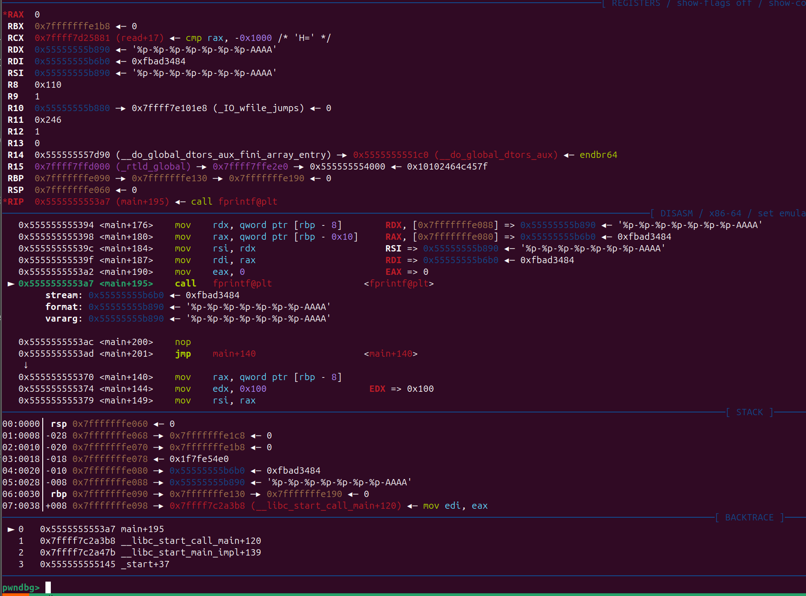
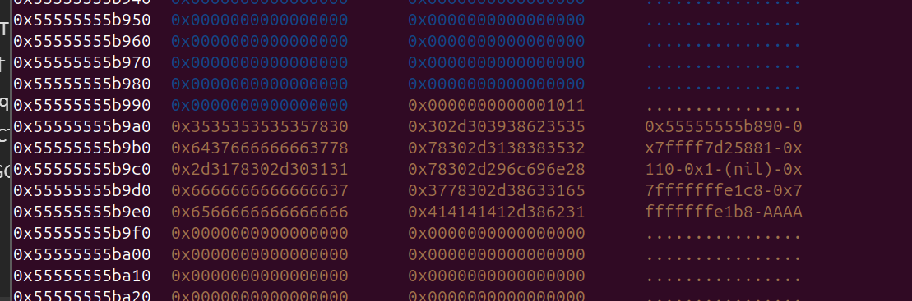
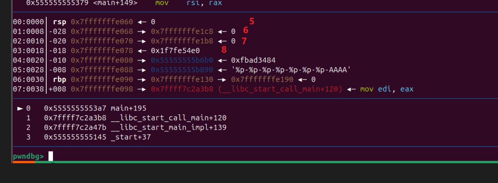

# 格式化字符串漏洞总结

‍

‍

‍

‍

```bash
%d      int             有符号10进制整数
%u      unsigned int    无符号10进制整数
%h      短型前缀，后接d(10进制整形)、x(16进制整形)、o(8进制整形)
%hd     short           有符号10进制短整形
%hu     unsigned short  无符号10进制短整形
%ld     long          
%lu     unsigned long   
%lld    long long
%llu    unsigned long long   
      
      
%o                      有符号8进制整数
%x 　　                 无符号的16进制数字，并以小写abcdef表示
%X 　                   无符号的16进制数字，并以大写ABCDEF表示
%f　　                  输入输出为浮点型 （%lf双精度浮点型）
%c                      输入输出为单个字符 
%s                      输入输出为字符串
```

‍

‍

 从stack 上的数据获取数据 然后写

```bash
%*{num}$d%{idx}$hn

```

```bash
常规得都会是printf ，nc 连接传输数据会太大，它这个题没有输出，就可以直接用，就相当于直接知道stack 上的数据了
'%*6$hu' 取得就是 0
'%*7$hu' 取得就是 0xad18
'%*7$d'  取得就是 0x5004ad18
以此类推
# pwndbg> stack                                                                                                                                     
# 00:0000│ rsp 0x7fff5004abb0 ◂— 0                        例如这里是 6              
# 01:0008│-028 0x7fff5004abb8 —▸ 0x7fff5004ad18 ◂— 0               7     
# 02:0010│-020 0x7fff5004abc0 —▸ 0x7fff5004ad08 ◂— 0               8     
# 03:0018│-018 0x7fff5004abc8 ◂— 0x1fd45e4e0                                                                                                        
# 04:0020│-010 0x7fff5004abd0 —▸ 0x59073a9dc6b0 ◂— 0xfbad3c84            
# 05:0028│-008 0x7fff5004abd8 —▸ 0x59073a9dc890 ◂— '%*31$hu%65368c%31$hn'                                                                           
# 06:0030│ rbp 0x7fff5004abe0 —▸ 0x7fff5004ac80 —▸ 0x7fff5004abd8 —▸ 0x59073a9dc890 ◂— '%*31$hu%65368c%31$hn'                                       
# 07:0038│+008 0x7fff5004abe8 —▸ 0x76ecfd22a3b8 (__libc_start_call_main+120) ◂— mov edi, eax
```

‍

## 例题1

‍

```c
#include <stdio.h>
#include <stdlib.h>
#include <string.h>
#include <fcntl.h>
#include <unistd.h>

#define BUF_SIZE    0x100

void init(char *argv[], char **envp) {
    for (int i = 0; argv[i]; i++) argv[i] = NULL;
    for (int i = 0; envp[i]; i++) envp[i] = NULL;

    setvbuf(stdin, NULL, _IONBF, 0);
    setvbuf(stdout, NULL, _IONBF, 0);
}

void main(int argc, char *argv[], char **envp)
{
    FILE *stream;
    char *buf;
  
    puts("Hello from the void");

    init(argv, envp);

    setbuf(stdout, NULL);
    setbuf(stdin, NULL);

    stream = fopen("/dev/null", "a");

    buf = malloc(BUF_SIZE);

    while (1) {
        buf[read(STDIN_FILENO, buf, BUF_SIZE) - 1] = '\0';
        fprintf(stream, buf);
    }
}
```

‍

‍





‍

- fprintf 大概是这样



PwnMeCTF 2.25

‍

```python

```

‍
